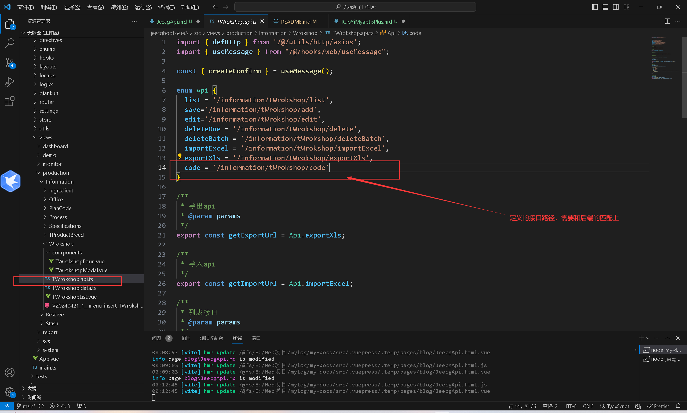
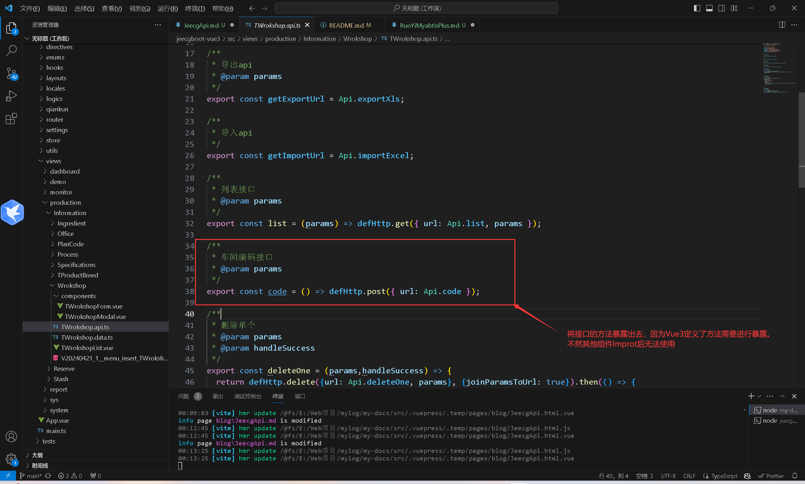
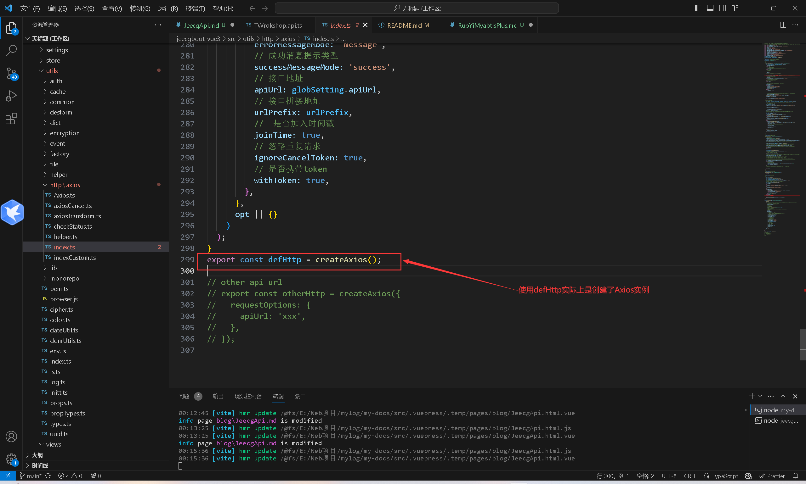
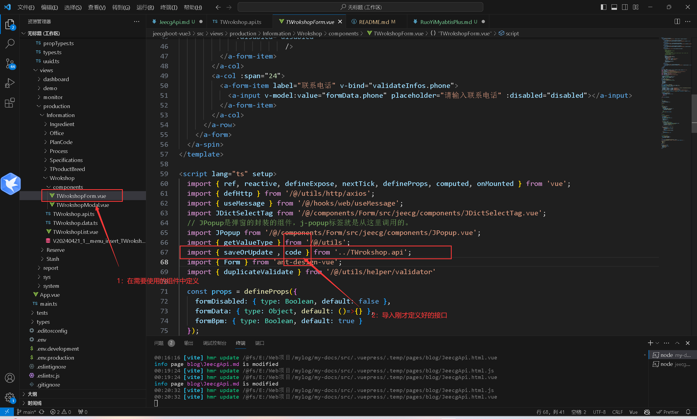
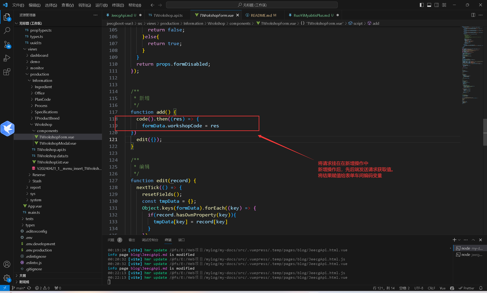
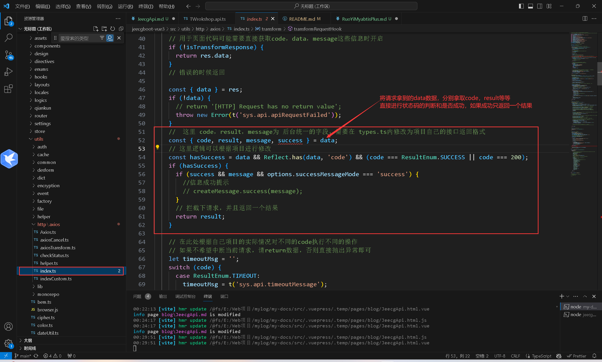
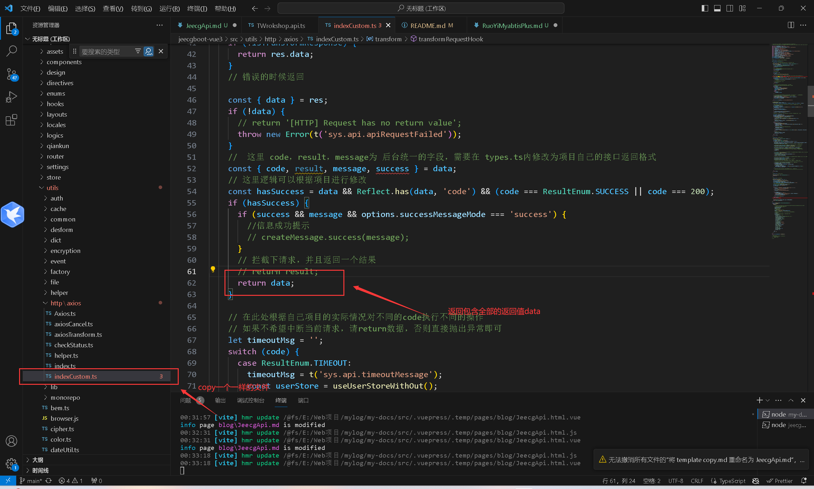

`more` Jeecg代码生成后，自定义接口进行访问
<!-- more -->

### 1：前端编写

1：首先在api.ts中定义自己的接口路径



2：暴露写好的Post接口方法，其中defHttp用的是Axios框架。可以点击源码进行查看。

PS：请求定义变量需要注意[Axios post 传参的params 与data 的两种形式](https://blog.csdn.net/yangyangkl123/article/details/109024222)

经过作者测试，Jeecg框架尽量使用params变量，不然使用data可能会出现不必要的问题





3：在Vue页面中，Improt定义的接口





**！！！！ 注意后端传回来的是一个对象，包含了返回码，但是使用接口后，res只有结果！！！**

实际上是因为项目中的，Axios中的index.ts进行了拦截。



**————————————————————————————————————**

为了避免拦截，可以复制一个相同的文件。对这段代码进行修改。请求成功后，返回data变量。这样就可以拿到所有的值了




### 2：后端编写

```java
@Api(tags="车间信息表")
@RestController
@RequestMapping("/information/tWrokshop")
@Slf4j
public class TWrokshopController extends JeecgController<TWrokshop, ITWrokshopService> {
	 @AutoLog(value = "车间-编码生成")
	 @PostMapping(value = "/code")
	 public Result<?> code(HttpServletRequest request, HttpServletResponse response) {
		 String code = tWrokshopService.WrokshopCode();
		 return Result.OK(code);
	 }
}
```

