`more` 关于Jeecg框架的使用心得，包含了表单开发控件使用，代码生成，一对一表格，一对多表格，Online报表的使用
<!-- more -->

[Jeecg的搭建](./JeecgIntro.md)

[Jeecg自定义接口](./JeecgApi.md)

### 1：Online表格创建，基础控件使用

> online表单字段的控件类型，支持 下拉、radio、checkbox、选择人、选择部门、popup、下拉搜索、省市县、下拉多选等，已经满足在线低代码开发需求 。

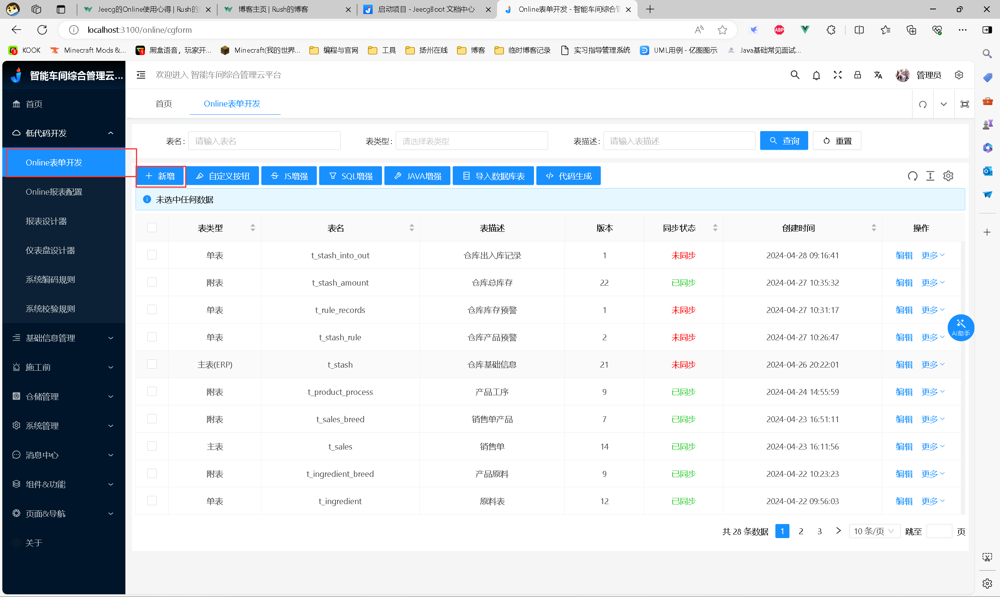

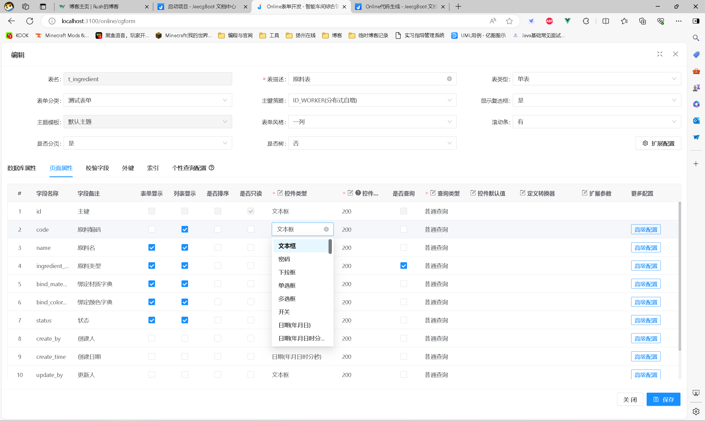

### 2：下拉框字典实现

1：系统创建字典

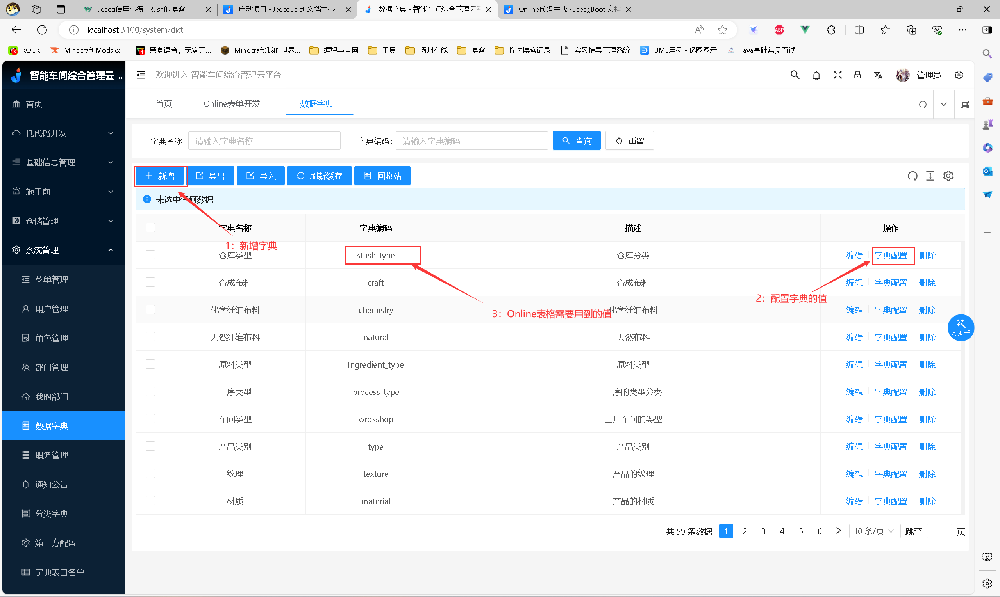

2：控件类型选择下拉框，并且校验字段中的**字典Code**写入上图的3。即可实现下拉字典功能。

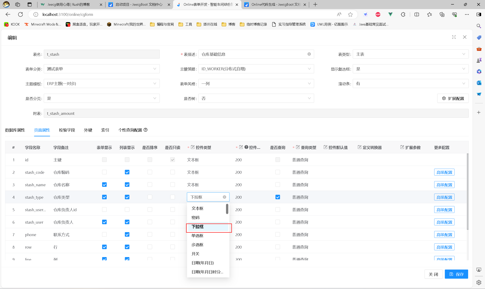

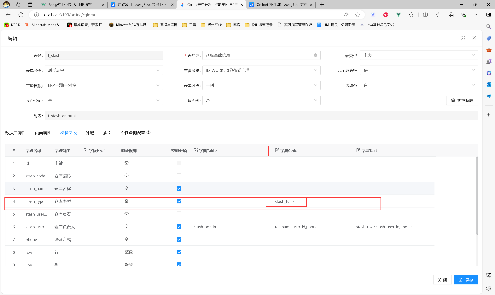

### 3：Online报表配置

在表单窗体中，可以通过Online报表配置。实现**自定义Sql语句结果查找**，并且进行选择。

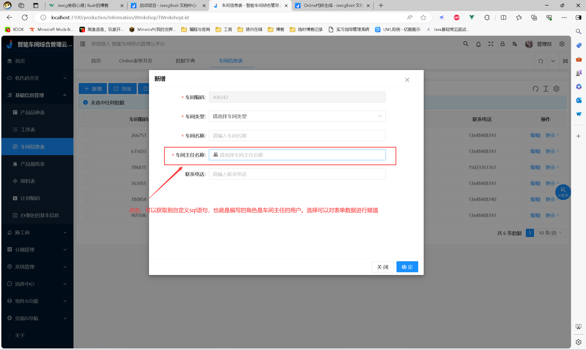

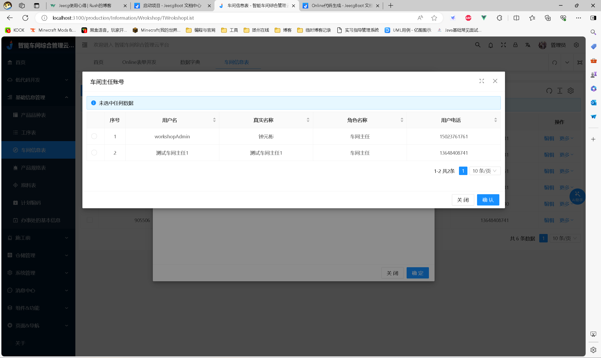

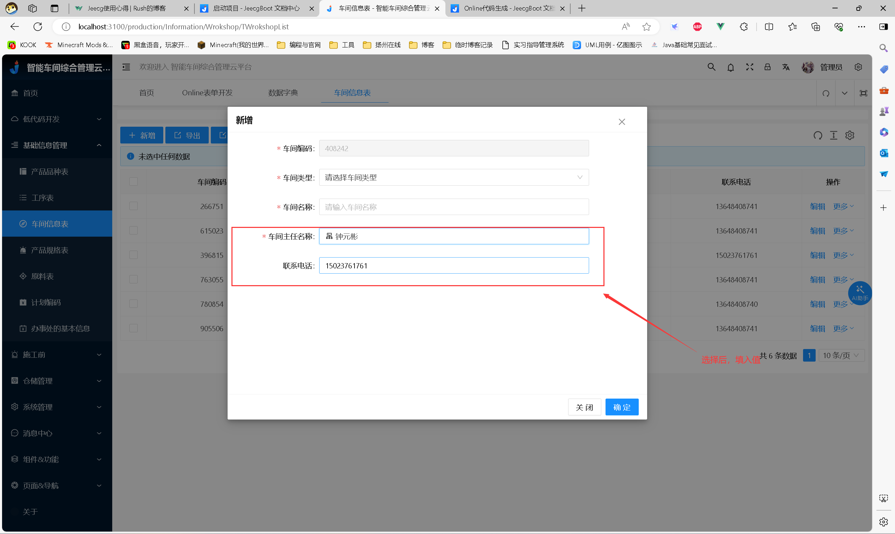

1：录入Online报表信息

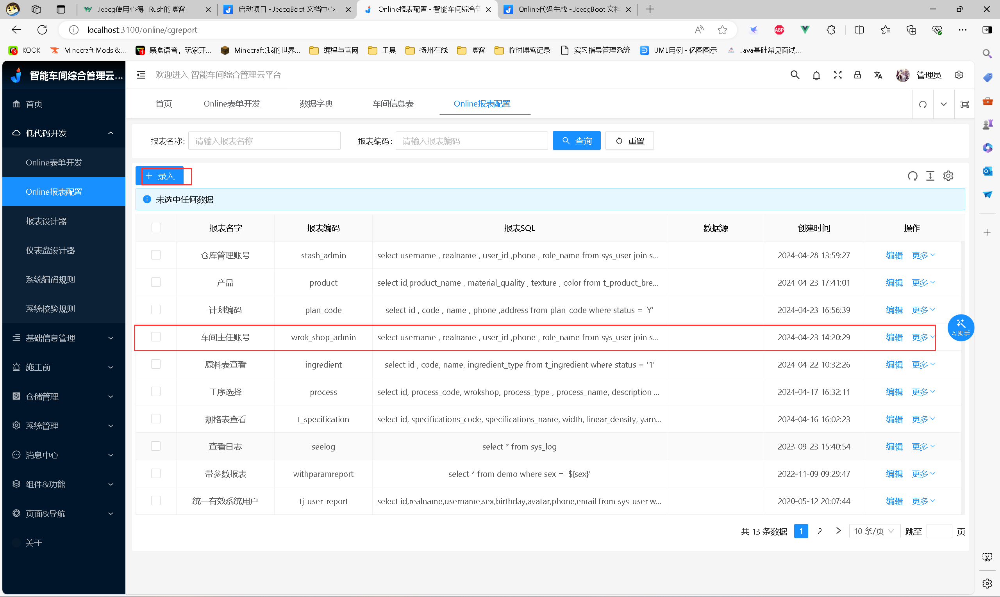

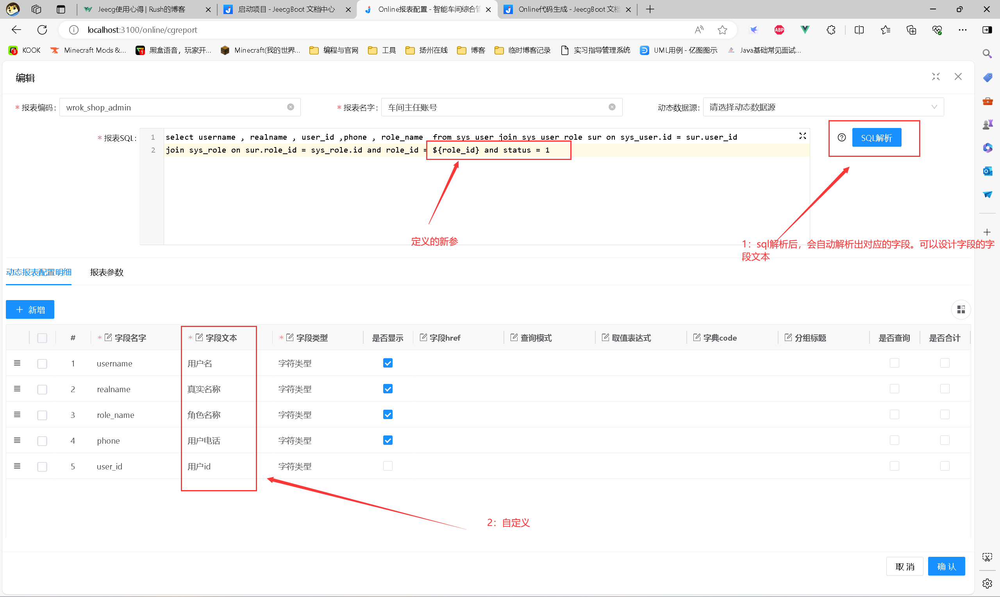

2：表单定义

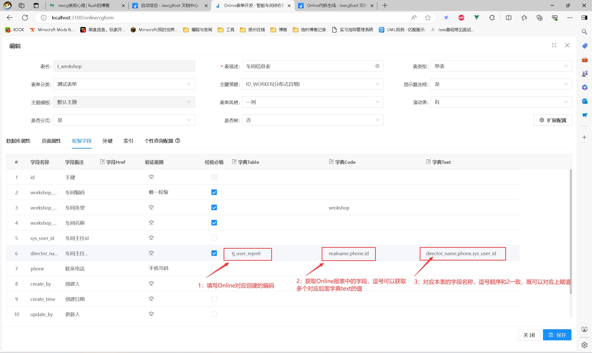

### 4：单表的代码生成

`当表设计完毕时，可以将代码生成出来。`

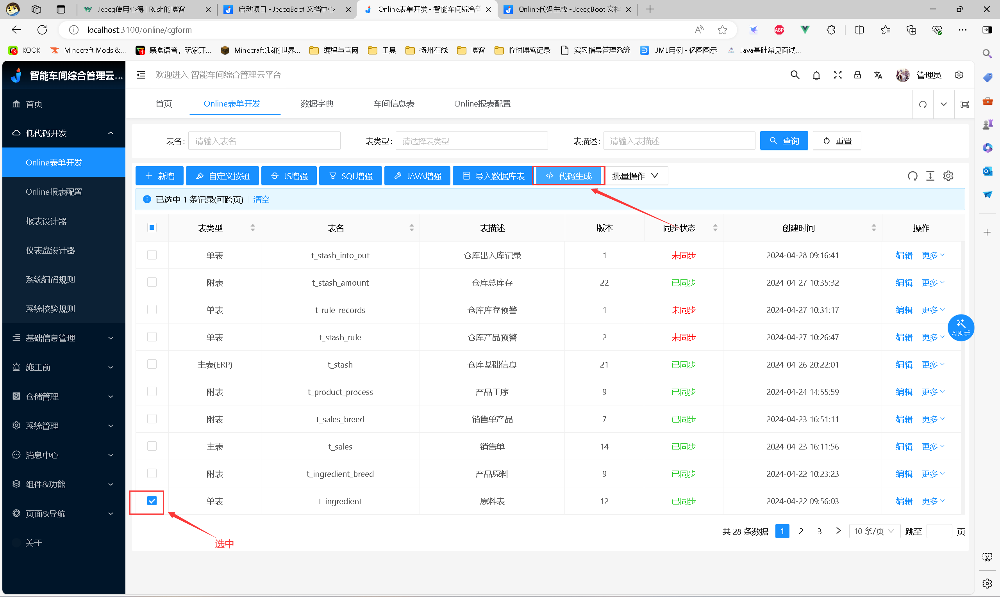

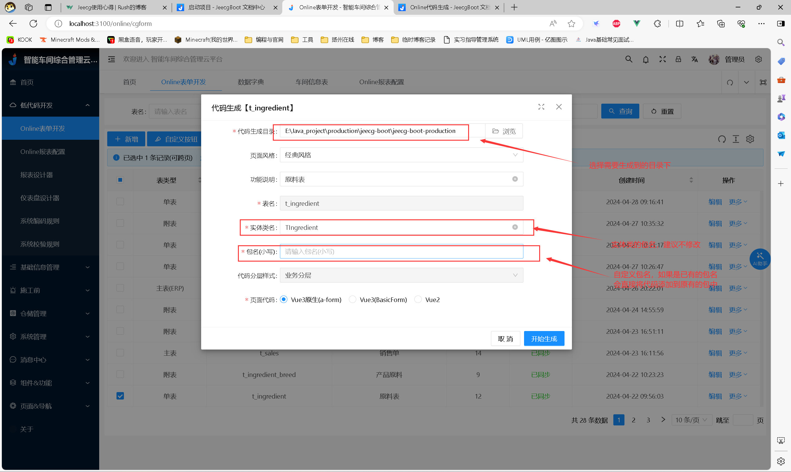

**重点！！！ 这个sql文件中需要修改前端的文件路径，修改完毕后，可以直接执行sql避免自己创建菜单和按钮权限**

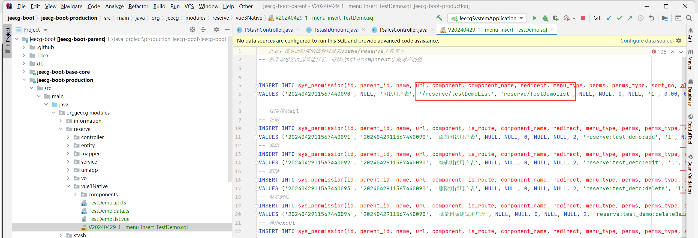

