`more` 关于作者对Jeecg框架的基础使用
<!-- more -->

## 1.Jeecg框架的介绍

拥有强大的Online在线代码生成功能。基础的字典，定时任务，报表，在线设计图设置等等。作者使用的最多的就是**一对一，一对多，报表功能**。以下会一一介绍。


[Jeecg框架基础用法](./JeecgBootBasicsUse.md)


## 2.框架的搭建

在搭建之前需要安装以下的**工具软件和版本号**

- ideaIU-2019.2.3.exe
- jdk-8u191-windows-x64.exe
- apache-maven-3.5.4.zip
- redis64-3.0.501
- mysql-5.7.26-winx64.zip、
- node 版本要求`Node 14.18+ / 16+ 版本`以上，不再支持 Node 12 / 13 / 15。
- pnpm


安装好工具后，访问Github的Jeecg仓库，对前后端的源码进行下载。

| 仓库   | 前端源码 Vue3版                                              | 后端JAVA源码                                          |
| ------ | ------------------------------------------------------------ | ----------------------------------------------------- |
| Github | [jeecgboot-vue3](https://github.com/jeecgboot/jeecgboot-vue3) | [jeecg-boot](https://github.com/jeecgboot/jeecg-boot) |
| 码云   | [jeecgboot-vue3](https://gitee.com/jeecg/jeecgboot-vue3)     | [jeecg-boot](https://gitee.com/jeecg/jeecg-boot)      |

#### 1.前端搭建命令

```
# 拉取代码
git clone https://gitee.com/jeecg/jeecgboot-vue3.git

# 安装依赖
pnpm install

# 运行项目
pnpm dev
```

####  2.后端搭建命令

```
# 拉取代码
git clone https://gitee.com/jeecg/jeecg-boot.git
```


**完成搭建后的项目**前后端分离

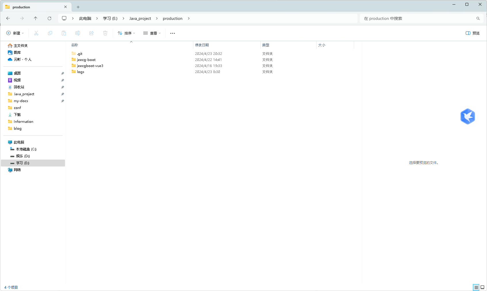


### 1.Jeecg-Boot后端配置

前后端源码下载完成后，可以对后端代码进行配置。分为以下三步。

- **初始化数据库数据**

>执行Sql脚本： jeecg-boot/db/jeecgboot-mysql-5.7.sql
>脚本作用：会自动创建库`jeecg-boot`, 并初始化数据 。
>
>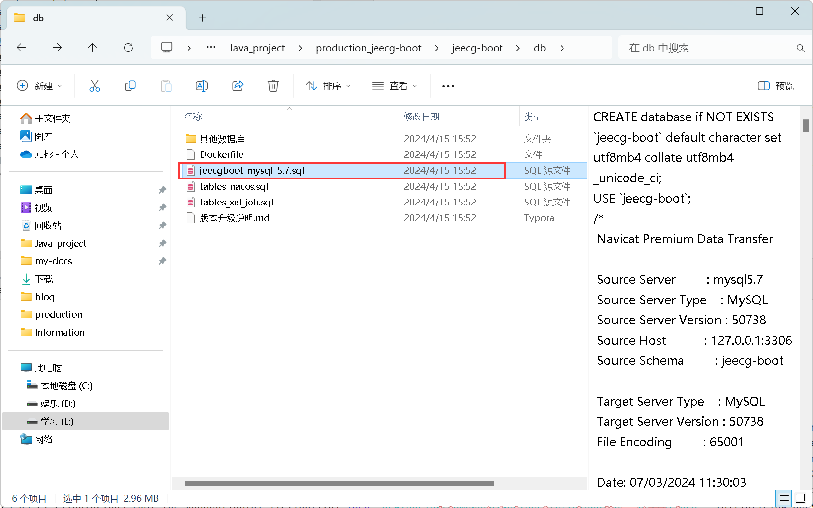

- 修改项目中**yml文件配置**，配置**mysql**数据库和**redis**等

> 配置文件： jeecg-module-system/jeecg-system-start/src/main/resources/application-dev.yml
>
> 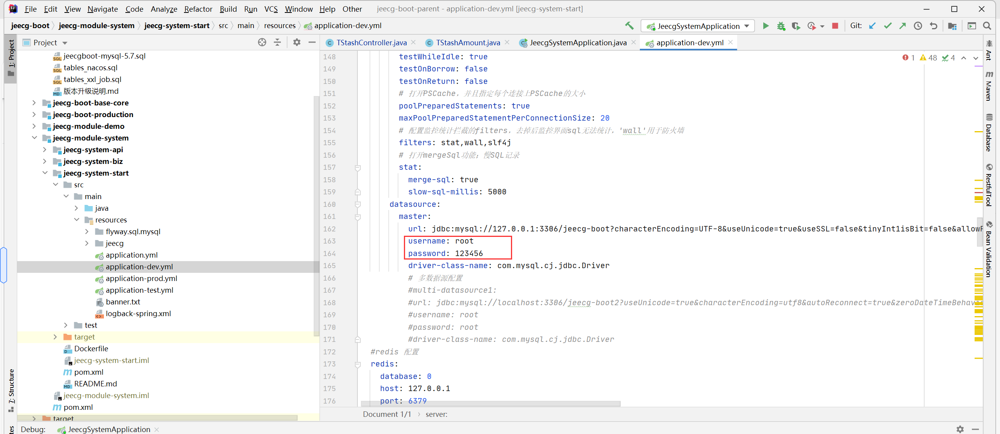
>
> PS：Redis默认安装是**没有密码**的，如果有密码需要在password上进行输入。**默认端口也是6379**
>
> 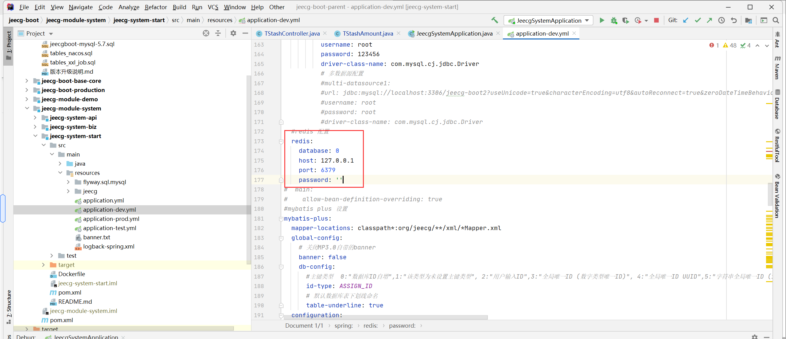

- **启动项目**

> 以上配置完成后，找到类 `jeecg-system-start/src/main/java/org/jeecg/JeecgSystemApplication.java` 右键执行启动；
>
> 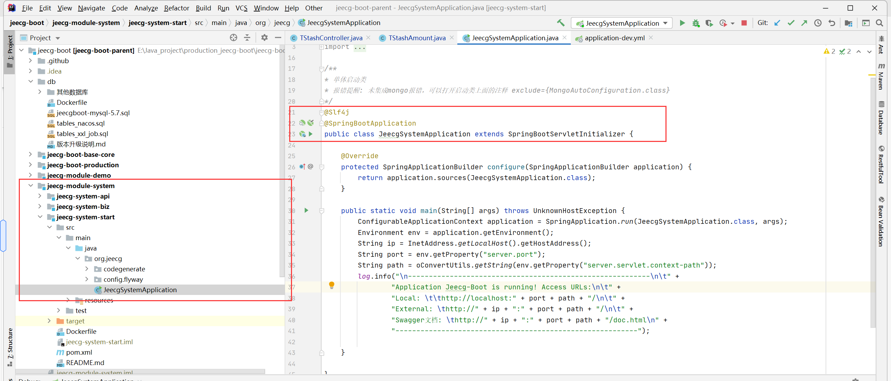


### 2.Jeecg-Boot前端配置

注意：框架只支持node 版本要求`Node 14.18+ / 16+ 版本`以上，不再支持 Node 12 / 13 / 15。

可以使用cmd查看node.js的版本， node -v

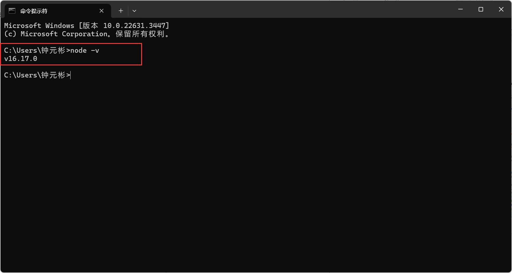

工具准备好后，准备下载**项目依赖**，这里使用的是**vscode**。

` pnpm install`下载依赖 

`pnpm dev`启动项目

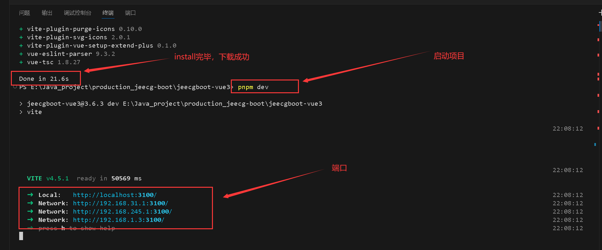

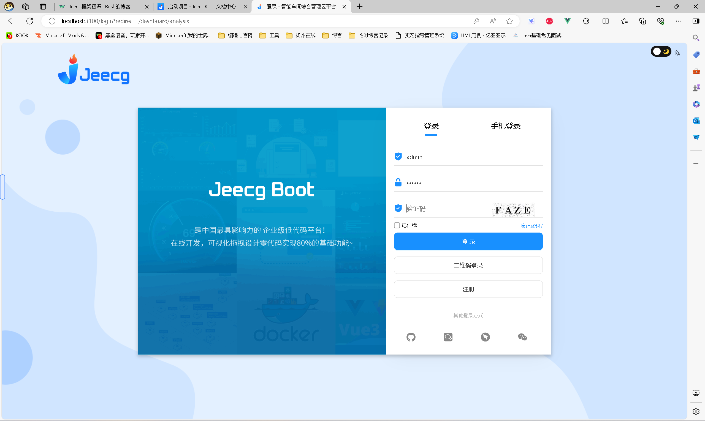


### 3.创建自定义模块

项目进行二次开发，需要新建模块。创建模块主要分为步

##### 1：在idea中，创建module，填入

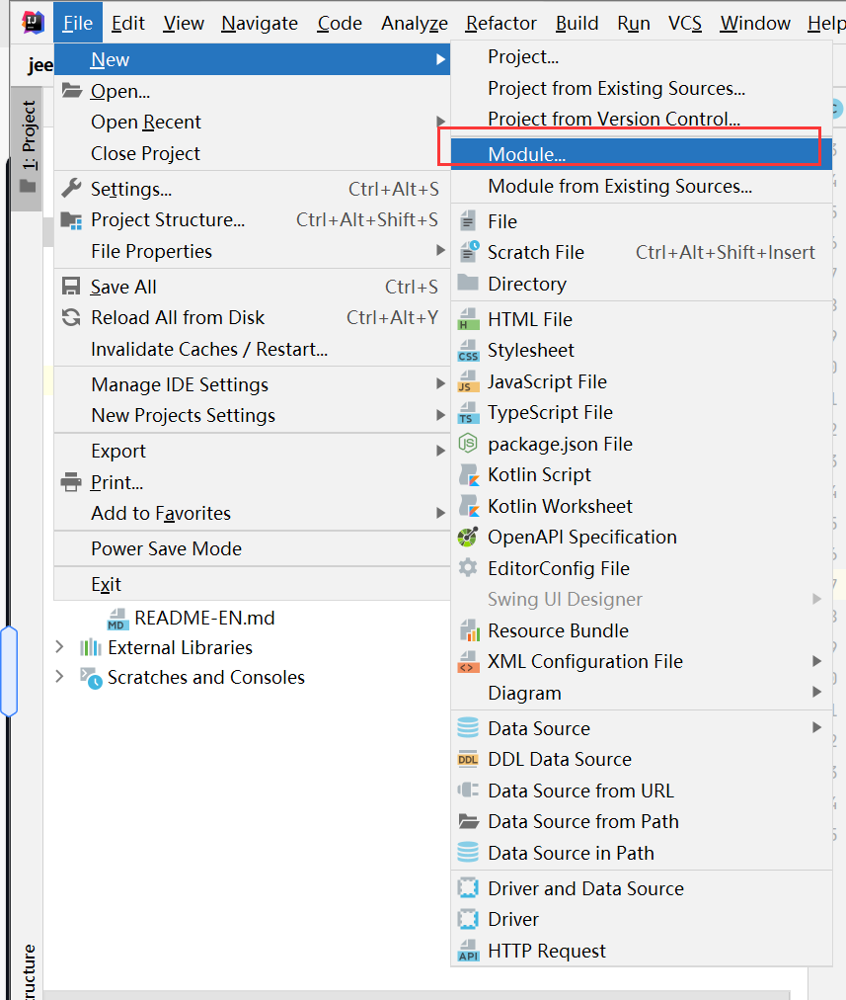

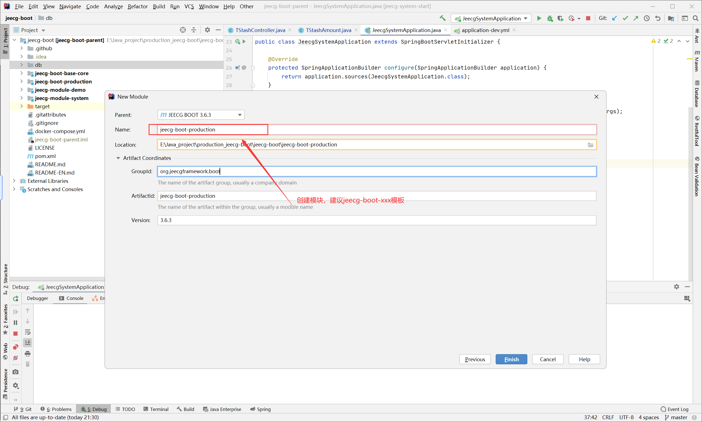

##### 2：在创建的新模块中的pom文件中，添加**jeecg-boot-base-core**模块的依赖

```xml
<dependency>
     <groupId>org.jeecgframework.boot</groupId>
     <artifactId>jeecg-boot-base-core</artifactId>
</dependency>
```


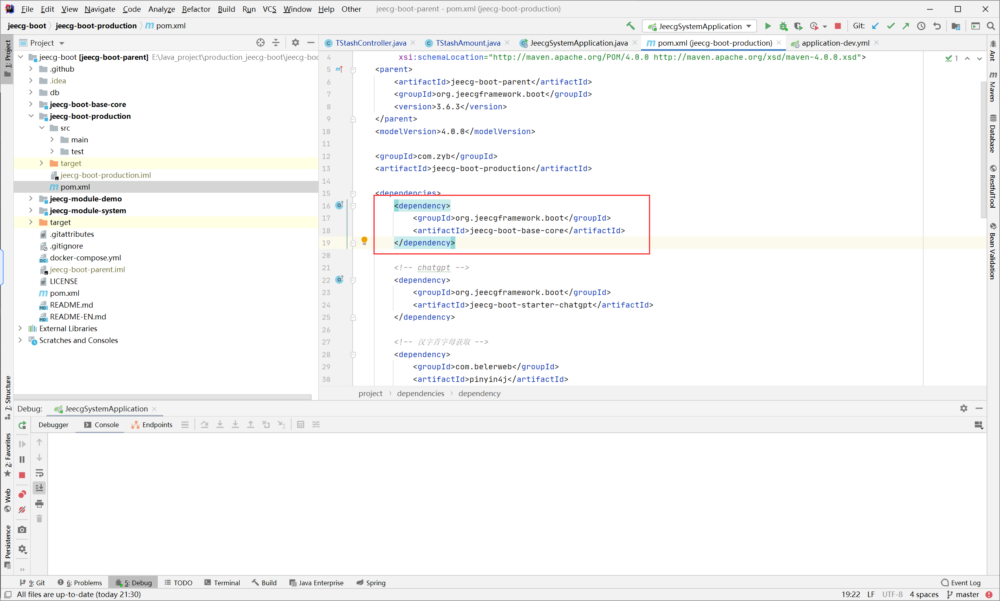


##### 3:在最外层的pom文件，加上添加的模块。就可以进行使用了

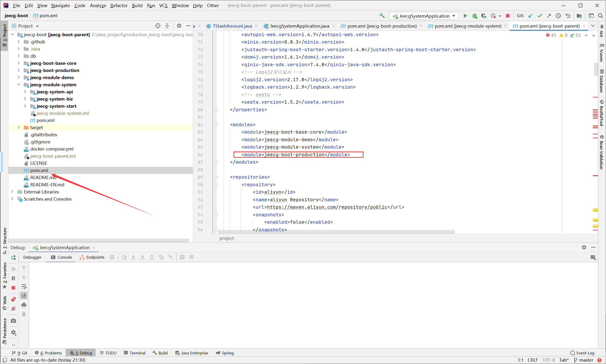


接下来就可以配合项目中的**低代码开发功能**进行生成代码到新建的模块。

##### 4：新建controller文件夹以及VoteController的class文件

```java
package org.jeecg.modules.vote.controller;


import io.swagger.annotations.Api;
import io.swagger.annotations.ApiOperation;
import lombok.extern.slf4j.Slf4j;
import org.jeecg.common.api.vo.Result;
import org.jeecg.common.aspect.annotation.AutoLog;
import org.jeecg.common.system.base.controller.JeecgController;
import org.springframework.beans.factory.annotation.Autowired;
import org.springframework.web.bind.annotation.GetMapping;
import org.springframework.web.bind.annotation.RequestMapping;
import org.springframework.web.bind.annotation.RestController;

@Slf4j
@Api(tags="投票")
@RestController
@RequestMapping("/vote")
public class VoteController  {
//    @Autowired

    @AutoLog(value="投票1")
    @ApiOperation("toupiao1")


//    extends JeecgController<Object,>
    @GetMapping(value = "/lookup")
    public Result<?> test() {
        return  Result.ok("111111");
    }

}
```


##### 5:更改过滤器shero（正式环境必须关闭此项——开启的话是高危漏洞）

在内部添加白名单

> jeecg-boot\jeecg-boot-base\jeecg-boot-base-core\src\main\java\org\jeecg\config\shiro\ShiroConfig.java

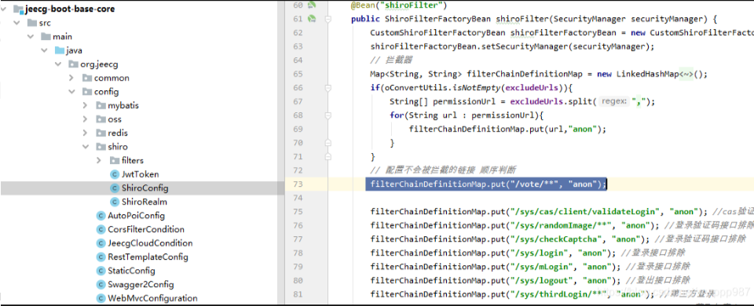


##### 6：运行swagger，发现后台接口已经出现。（正式环境请关闭此项，生产环境为中高危漏洞）

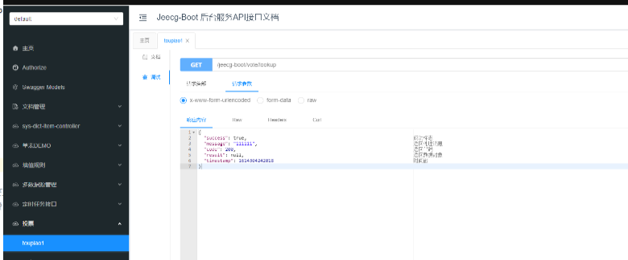
