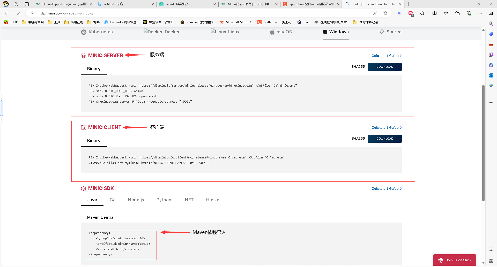
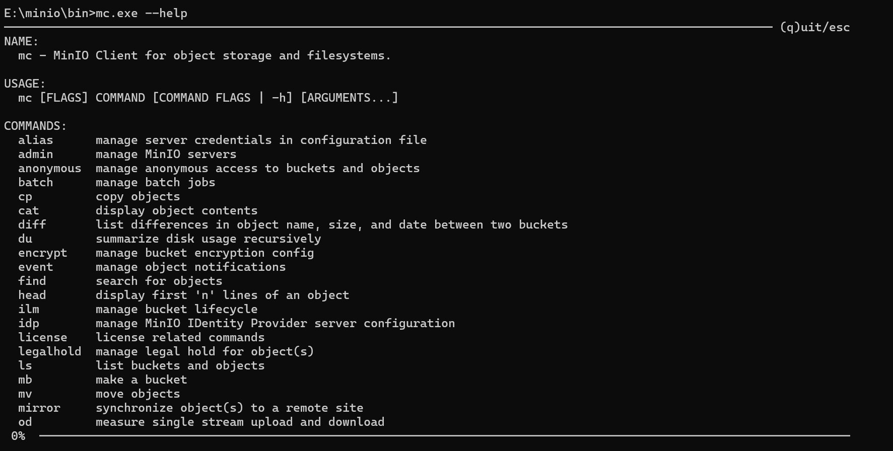
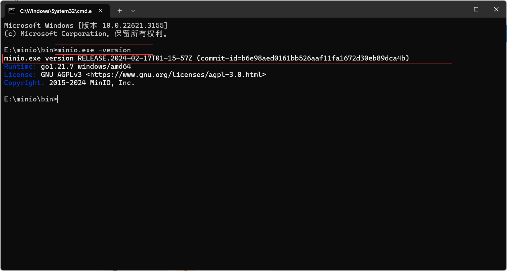
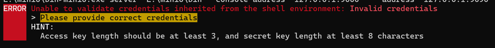
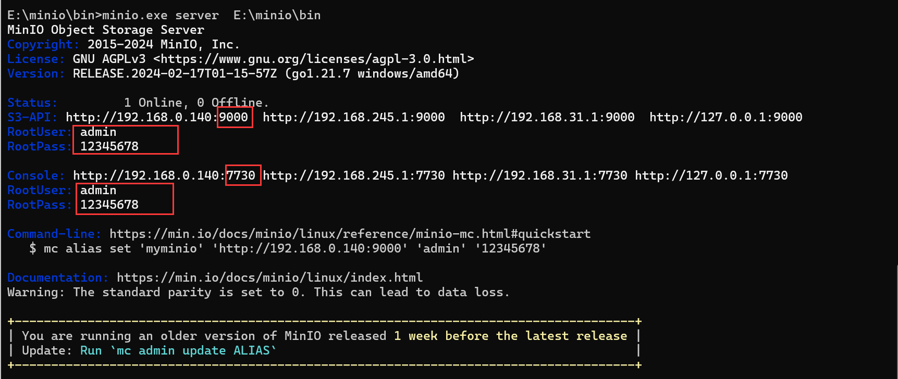
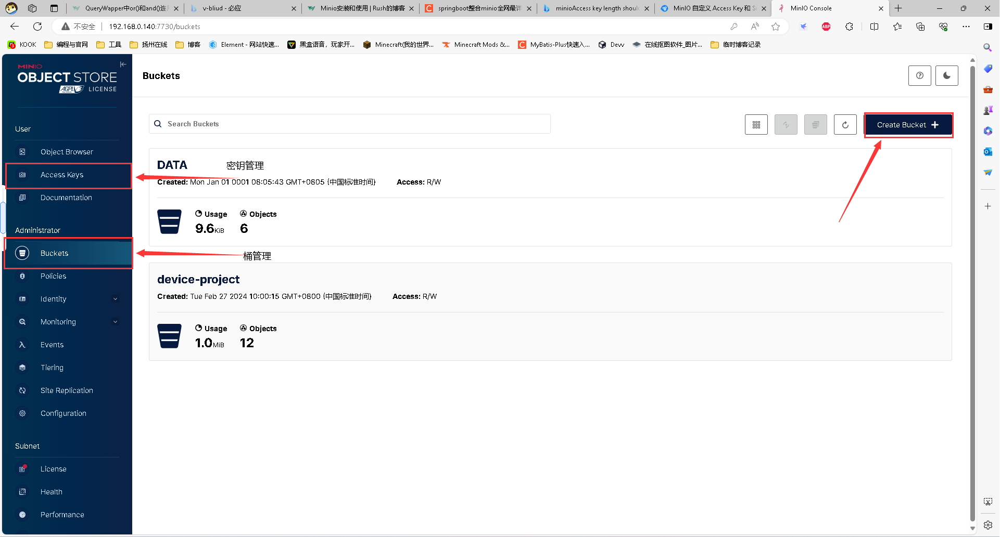
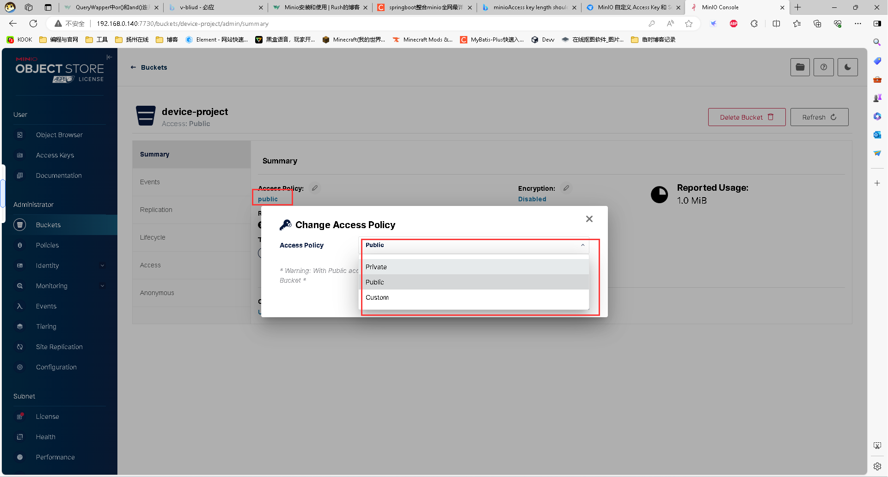

`more` 对于Minio的安装和使用，和一些报错信息的解决
<!-- more -->  Minio的安装和与SpringBoot项目结合使用*

[TOC]


### 1:Minio的安装

[MinIO官网下载 | Code and downloads to create high performance object storage](https://min.io/download#/windows)



图片包含了服务端和客户端，还有Maven的导入依赖

服务端：就是接下来要使用的，它可以在浏览器上以可视化的方式去进行对Minio文件服务器的操作

客户端：在官网下载了Mc.exe后。可以在控制台使用已Linux命令行的形式，进行操作。


#### 1.1:**客户端命令**

下载好客户端后，打开cmd控制台。输入`mc.exe --help`



- alias：管理配置文件中的服务器凭据。
- ls：列出存储桶和对象。
- mb：创建存储桶。
- rb：删除存储桶。
- cp：复制对象。
- mv：移动对象。
- rm：删除对象。
- mirror：将对象同步到远程站点。
- cat：显示对象内容。
- head：显示对象的前n行。
- pipe：将STDIN流传输到对象。
- find：搜索对象。
- sql：在对象上运行SQL查询。
- stat：显示对象元数据。
- tree：以树状格式列出存储桶和对象。
- du：递归地总结磁盘使用情况。
- retention：为对象设置保留。
- legalhold：管理对象的法律保留。
- support：与支持相关的命令。
- license：与许可相关的命令。
- share：生成临时访问对象的URL。
  

> 在日常的使用中，使用服务端还是要方便一些。接下来的介绍都是围绕着Minio服务端进行的


### 2:服务端配置


#### 2.1:**查看版本号**

下载服务端后，会有一个`Minio.exe`和`Minio.bat`文件。在同级目录下，使用cmd控制台。使用 `minio.exe -version`命令可以查看到版本号




**2.2:设置上传文件路径**

在cmd窗口中，命令行进行minio.exe所在的文件夹，输入如下命令 server后面的地址是你图片上传之后的存储目录

`Console`端口可以通过浏览器访问Minio的Web管理界面

`S3-API` 是使用用代码进行操作Minio的API接口

```shell
// 默认启动，不设置S3-API和Console端口
minio.exe server E:\minio\data
```


**可能会遇到的问题**

在启动的时候，提醒登录的账号密码必须满足系统的要求。所以设置登录的账号密码就可以了。




```shell
// 设置账号
set MINIO_ROOT_USER=admin

// 设置密码
set MINIO_ROOT_PASSWORD=12345678

// 启动，并且自定义console和S3-API端口
minio.exe server  E:\minio\bin --console-address "127.0.0.1:9000"  --address "127.0.0.1:9090"
```




> 在实际使用当中，一定要注意S3-API中的端口一定要和代码对接的端口一致。不然会出现401网页端报错的错误，配置错误。





**注意，创建桶后。建议把桶改为访问权限改为public(公开)，后续上传下载连接避免报错**




### 3：javaweb项目整合Minio

**3.1：Maven项目导入**

```xml
<!--minio-->
		<dependency>
			<groupId>io.minio</groupId>
			<artifactId>minio</artifactId>
			<version>8.0.3</version>
		</dependency>
```

**3.2：yal配置**

```yaml
minio:
  endpoint: http://127.0.0.1:9090
  accessKey: xTZHGOLGGRcPg1YmObwd
  secretKey: vpImQY3XN4NCfefV9xmsmKPQO47sIYXHkmjYy1HZ
  bucketName: device-project
```

- endpoint是启动Minio的时候的`S3-API`

- accessKey和secretKey：为密钥，在浏览器上可以进行创建设置生成。也可以直接使用账号和密码进行填写

- bucketName：需要访问桶的名称


**3.3:编写配置类**

```java
@Data
@Component
public class MinIoClientConfig {
    @Value("${minio.endpoint}")
    private String endpoint;
    @Value("${minio.accessKey}")
    private String accessKey;
    @Value("${minio.secretKey}")
    private String secretKey;

    /**
     * 注入minio 客户端
     * @return
     */
    @Bean
    public MinioClient minioClient(){
        return MinioClient.builder()
                .endpoint(endpoint)
                .credentials(accessKey, secretKey)
                .build();
    }
}
```


**3.4 实体类**

```java
@Data
public class ObjectItem {
    private String objectName;
    private Long size;
}

```

 **3.5:工具类**

其中包含了批量上传文件上传，桶创建，桶的删除，文件查看，文件批量删除

```java
package com.wedu.common.utils;
import com.amazonaws.util.IOUtils;
import com.wedu.modules.equi.entity.ObjectItem;
import io.minio.*;
import io.minio.messages.DeleteError;
import io.minio.messages.DeleteObject;
import io.minio.messages.Item;
import org.springframework.beans.factory.annotation.Autowired;
import org.springframework.beans.factory.annotation.Value;
import org.springframework.http.HttpHeaders;
import org.springframework.http.HttpStatus;
import org.springframework.http.MediaType;
import org.springframework.http.ResponseEntity;
import org.springframework.stereotype.Component;
import org.springframework.web.multipart.MultipartFile;

import java.io.ByteArrayOutputStream;
import java.io.IOException;
import java.io.InputStream;
import java.io.UnsupportedEncodingException;
import java.net.URLEncoder;
import java.util.ArrayList;
import java.util.Arrays;
import java.util.List;
import java.util.stream.Collectors;

/**
 * zyb创建
 * Minio的工具类
 * @description： minio工具类
 * @version：3.0
 */
@Component
public class MinioUtilS {
    @Autowired
    private MinioClient minioClient;


    @Value("${minio.bucketName}")
    private String bucketName;
    /**
     * description: 判断bucket是否存在，不存在则创建
     *
     * @return: void
     */
    public void existBucket(String name) {
        try {
            boolean exists = minioClient.bucketExists(BucketExistsArgs.builder().bucket(name).build());
            if (!exists) {
                minioClient.makeBucket(MakeBucketArgs.builder().bucket(name).build());
            }
        } catch (Exception e) {
            e.printStackTrace();
        }
    }

    /**
     * 创建存储bucket
     * @param bucketName 存储bucket名称
     * @return Boolean
     */
    public Boolean makeBucket(String bucketName) {
        try {
            minioClient.makeBucket(MakeBucketArgs.builder()
                    .bucket(bucketName)
                    .build());
        } catch (Exception e) {
            e.printStackTrace();
            return false;
        }
        return true;
    }

    /**
     * 删除存储bucket
     * @param bucketName 存储bucket名称
     * @return Boolean
     */
    public Boolean removeBucket(String bucketName) {
        try {
            minioClient.removeBucket(RemoveBucketArgs.builder()
                    .bucket(bucketName)
                    .build());
        } catch (Exception e) {
            e.printStackTrace();
            return false;
        }
        return true;
    }
    /**
     * description: 上传文件
     *
     * @param multipartFile
     * @return: java.lang.String

     */
    public List<String> upload(MultipartFile[] multipartFile) {
        // 创建一个
        List<String> names = new ArrayList<>();
        for (MultipartFile file : multipartFile) {
            String fileName = file.getOriginalFilename();
            String[] split = fileName.split("\\.");
            if (split.length > 1) {
                fileName = split[0] + "_" + System.currentTimeMillis() + "." + split[1];
            } else {
                fileName = fileName + System.currentTimeMillis();
            }
            InputStream in = null;
            try {
                in = file.getInputStream();
                minioClient.putObject(PutObjectArgs.builder()
                        .bucket(bucketName)
                        .object(fileName)
                        .stream(in, in.available(), -1)
                        .contentType(file.getContentType())
                        .build()
                );
            } catch (Exception e) {
                e.printStackTrace();
            } finally {
                if (in != null) {
                    try {
                        in.close();
                    } catch (IOException e) {
                        e.printStackTrace();
                    }
                }
            }
            names.add(fileName);
        }
        return names;
    }

    /**
     * description: 下载文件
     *
     * @param fileName
     * @return: org.springframework.http.ResponseEntity<byte [ ]>
     */
    public ResponseEntity<byte[]> download(String fileName) {
        ResponseEntity<byte[]> responseEntity = null;
        InputStream in = null;
        ByteArrayOutputStream out = null;
        try {
            in = minioClient.getObject(GetObjectArgs.builder().bucket(bucketName).object(fileName).build());
            out = new ByteArrayOutputStream();
            IOUtils.copy(in, out);
            //封装返回值
            byte[] bytes = out.toByteArray();
            HttpHeaders headers = new HttpHeaders();
            try {
                headers.add("Content-Disposition", "attachment;filename=" + URLEncoder.encode(fileName, "UTF-8"));
            } catch (UnsupportedEncodingException e) {
                e.printStackTrace();
            }
            headers.setContentLength(bytes.length);
            headers.setContentType(MediaType.APPLICATION_OCTET_STREAM);
            headers.setAccessControlExposeHeaders(Arrays.asList("*"));
            responseEntity = new ResponseEntity<byte[]>(bytes, headers, HttpStatus.OK);
        } catch (Exception e) {
            e.printStackTrace();
        } finally {
            try {
                if (in != null) {
                    try {
                        in.close();
                    } catch (IOException e) {
                        e.printStackTrace();
                    }
                }
                if (out != null) {
                    out.close();
                }
            } catch (IOException e) {
                e.printStackTrace();
            }
        }
        return responseEntity;
    }

    /**
     * 查看文件对象
     * @param bucketName 存储bucket名称
     * @return 存储bucket内文件对象信息
     */
    public List<ObjectItem> listObjects(String bucketName) {
        Iterable<Result<Item>> results = minioClient.listObjects(
                ListObjectsArgs.builder().bucket(bucketName).build());
        List<ObjectItem> objectItems = new ArrayList<>();
        try {
            for (Result<Item> result : results) {
                Item item = result.get();
                ObjectItem objectItem = new ObjectItem();
                objectItem.setObjectName(item.objectName());
                objectItem.setSize(item.size());
                objectItems.add(objectItem);
            }
        } catch (Exception e) {
            e.printStackTrace();
            return null;
        }
        return objectItems;
    }

    /**
     * 批量删除文件对象
     * @param bucketName 存储bucket名称
     * @param objects 对象名称集合
     */
    public Iterable<Result<DeleteError>> removeObjects(String bucketName, List<String> objects) {
        List<DeleteObject> dos = objects.stream().map(e -> new DeleteObject(e)).collect(Collectors.toList());
        Iterable<Result<DeleteError>> results = minioClient.removeObjects(RemoveObjectsArgs.builder().bucket(bucketName).objects(dos).build());
        return results;
    }


}
```


**3.6使用Controller层进行测试**

```
/*
 * 文件存储(OSS)
 * */
@PostMapping("/localityOss")
public R localityOss(MultipartFile file) throws IOException {
	// 返回图片的上传路径，访问这个url即可下载图片
    String url = aliOSSUtils.upload(file);  
    return R.ok().put("url" , url);
}
```