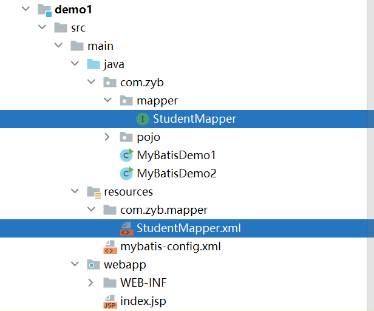
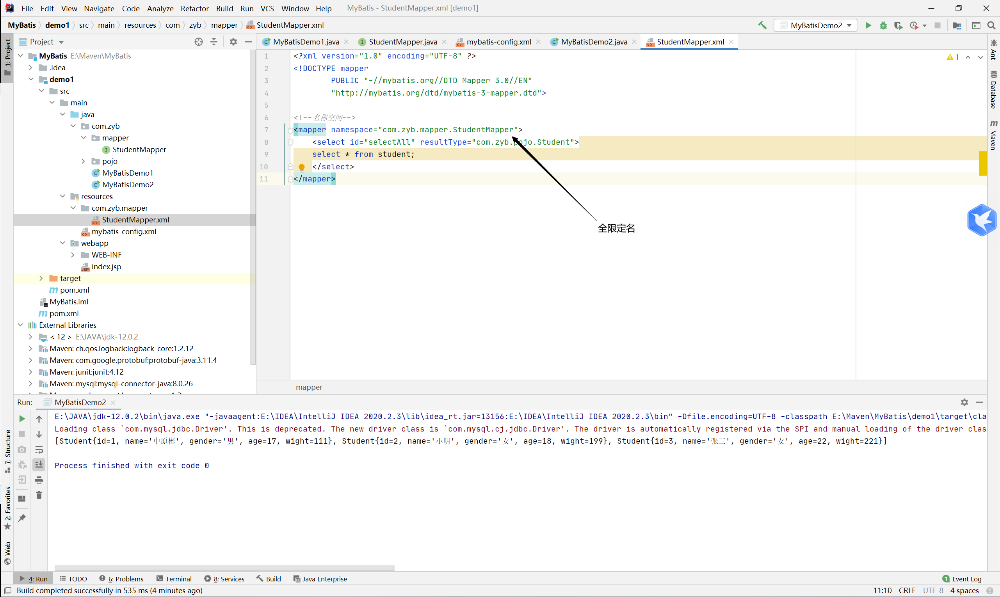
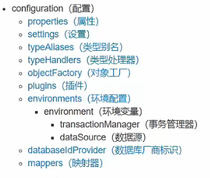

`more` MyBatis的配置与入门使用
<!-- more -->

 采用 ORM 思想解决了实体和数据库映射的问题，它内部封装了 jdbc，使开发者只需要关注 sql 语句本身，而不需要花费精力去处理加载驱动、创建连接、创建 statement 等繁杂的过程。


## logback日志配置

### pom配置

```xml
<!-- 添加slf4j日志api -->
<dependency>
    <groupId>org.slf4j</groupId>
    <artifactId>slf4j-api</artifactId>
    <version>1.7.20</version>
</dependency>
<!-- 添加logback-classic依赖 -->
<dependency>
    <groupId>ch.qos.logback</groupId>
    <artifactId>logback-classic</artifactId>
    <version>1.2.3</version>
</dependency>
<!-- 添加logback-core依赖 -->
<dependency>
    <groupId>ch.qos.logback</groupId>
    <artifactId>logback-core</artifactId>
    <version>1.2.3</version>
</dependency>
```
#### 项目文件配置

> src/main/resources/logback.xml
>
```xml
<?xml version="1.0" encoding="UTF-8"?>
<configuration>
 <!--
     CONSOLE ：表示当前的日志信息是可以输出到控制台的。
 -->
 <appender name="Console" class="ch.qos.logback.core.ConsoleAppender">
     <encoder>
         <pattern>[%level]  %cyan([%thread]) %boldGreen(%logger{15}) - %msg %n</pattern>
     </encoder>
 </appender>

 <logger name="com.zyb" level="DEBUG" additivity="false">
     <appender-ref ref="Console"/>
 </logger>
 <!--

   level:用来设置打印级别，大小写无关：TRACE, DEBUG, INFO, WARN, ERROR, ALL 和 OFF
  ， 默认debug
   <root>可以包含零个或多个<appender-ref>元素，标识这个输出位置将会被本日志级别控制。
   -->
 <root level="DEBUG">
     <appender-ref ref="Console"/>
 </root>
</configuration>
```

## Mybatis快速入门

### pom配置

```xml
<!-- https://mvnrepository.com/artifact/org.mybatis/mybatis -->
<dependency>
    <groupId>org.mybatis</groupId>
    <artifactId>mybatis</artifactId>
    <version>3.5.0</version>
</dependency>

<!-- 配置连接数据库配置 -->
<dependency>
    <groupId>mysql</groupId>
    <artifactId>mysql-connector-java</artifactId>
    <version>8.0.26</version>
</dependency>
```


### 编写SQL映射文件

**需要保持和mapper代理运行后在一个文件夹下**

> resources/com/zyb/mapper/StudentMapper.xml

```xml
<?xml version="1.0" encoding="UTF-8" ?>
<!DOCTYPE mapper
        PUBLIC "-//mybatis.org//DTD Mapper 3.0//EN"
        "http://mybatis.org/dtd/mybatis-3-mapper.dtd">

<!--名称空间-->
<mapper namespace="com.zyb.mapper.StudentMapper">
    <select id="selectAll" resultType="com.zyb.pojo.Student">
    select * from student;
    </select>
</mapper>
```

### Mapper 代理开发
- 定义与映射文件同名的Mapper接口，并且在编译后，保证Mapper接口和映射文件要在同一个目录下



- 设置SQL映射文件的namespace属性，需要是Mapper接口的**全限定名**




- Mapper中定义的方法，就是SQL映射文件中的sql语句的id，保持参数类型和返回值的一致

> 需要注意：接口的方法中的返回值根据业务需求，制定返回值类型。


- 编码

```java
import java.io.IOException;
import java.io.InputStream;
import java.util.List;

public class MyBatisDemo2 {
    public static void main(String[] args) throws IOException {
//        加载mybatis的核心配置文件，获取SqlSessionFactory
        String resource = "mybatis-config.xml";
        InputStream inputStream = Resources.getResourceAsStream(resource);
        SqlSessionFactory sqlSessionFactory = new SqlSessionFactoryBuilder().build(inputStream);

//        获取获取SqlSession对象，用来执行sql
        SqlSession sqlSession = sqlSessionFactory.openSession();

//        获取代理
        StudentMapper studentMapper = sqlSession.getMapper(StudentMapper.class);
//		  执行sql
        List<Student> students = studentMapper.selectAll();
        System.out.println(students);

//        释放资源
        sqlSession.close();
    }
}
```

### 配置文件

mybatis-config.xml文件的各个配置属性

配置时，需要按照以下**顺序**来进行配置，否则会**报错**



```xml
<?xml version="1.0" encoding="UTF-8" ?>
<!DOCTYPE configuration
        PUBLIC "-//mybatis.org//DTD Config 3.0//EN"
        "http://mybatis.org/dtd/mybatis-3-config.dtd">
<configuration>

<!--
    类形别名
-->
    <typeAliases>
        <package name="com.zyb.pojo"/>
    </typeAliases>
<!--
    environments：配置数据库连接环境信息，可以配置多个environment，可以通过default来进行选择
-->
    <environments default="development">
        <environment id="development">
            <transactionManager type="JDBC"/>
            <dataSource type="POOLED">
                <property name="driver" value="com.mysql.jdbc.Driver"/>
                <property name="url" value="jdbc:mysql:///db1?useSSL=false"/>
                <property name="username" value="root"/>
                <property name="password" value="123456"/>
            </dataSource>
        </environment>
    </environments>
    <mappers>
<!--        加载sql映射文件-->
<!--        可以使用包扫描加载Mapper接口-->
        <package name="com.zyb.mapper"/>
    </mappers>
</configuration>
```