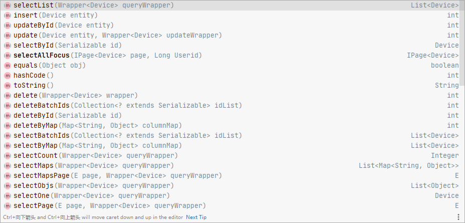
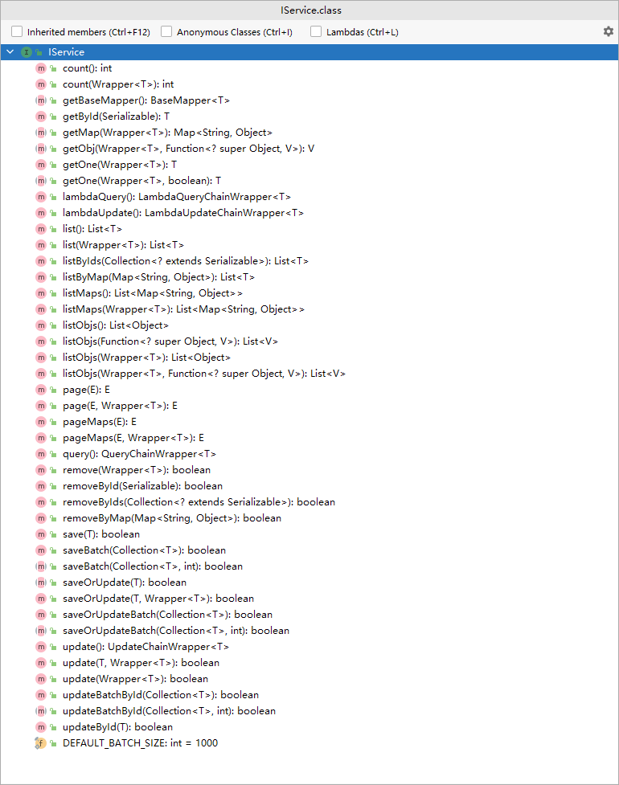

`more` 对于实现Iservice和的BaseMaper的一些个人理解
<!-- more -->


 **IService**和**BaseMaper**作为Mybatis-plus核心的接口，在Springboot项目中。因为三层架构设计模式，分为数据层，逻辑层，显示层。

**在数据层 `dao`层中**，可以使用`BaseMaper`接口。可以为实体类自动创建对应的数据操作方法，Mybatis-plus会提供一组通用的CRUD（创建、读取、更新、删除）方法。



**在逻辑层 service层中** ， 可以使用IService 接口进行创建，主要作用是定义业务层的服务方法，例如对多个表进行操作时的事务管理、业务逻辑的处理等。




[两个核心接口方法运用](./MyBatis-plus_comprehend.md)


### BaseMaper的使用

BaseMaper 接口是 MyBatis-Plus 提供的通用 Mapper 接口，它继承自 mybatis-plus 的 Mapper 接口，并扩展了一些常用的数据库操作方法。

- 通用 CRUD 封装 `BaseMapper` 接口，为 `Mybatis-Plus` 启动时自动解析实体表关系映射转换为 `Mybatis` 内部对象注入容器
- 泛型 `T` 为任意实体对象
- 参数 `Serializable` 为任意类型主键 `Mybatis-Plus` 不推荐使用复合主键约定每一张表都有自己的唯一 `id` 主键
- 对象 `Wrapper` 为 `条件构造器`

```java
@Mapper
public interface DeviceMapper extends BaseMapper<Device> {
    // 查看关注设备
    IPage<Device> selectAllFocus(IPage<Device> page, Long Userid);
}
```

> 1：自定义Mapper接口不要忘记加上@Mapper注解
>
> 2：泛型为实体类对象，自动映射出对数据库操作的CRUD方法。不推荐使用复合主键约定每一张表都有自己的唯一 `id` 主键
>
> 3：自定义SQL可以在Mapper方法中，自定义方法。进行编写。代码中的`selectAllFocus`方法就是自定义SQL语句。
>
> [自定义SQL语句](./Mybatis_xml.md)


### IService 的使用

IService 接口是 MyBatis-Plus 提供的通用 Service 接口。

手动在自己创建的Service层接口，继承 IService 接口。并且指定对应的实体类，进行自动装配。以下实例：

```java
public interface IDeviceService extends IService<Device> {
    // 需要实现的方法
    /*
    * 获取全部设备信息信息，分页查询
    * */
    PageUtils queryPage(Map<String, Object> params);
}
```

> 定义了一个IDeviceService的接口，`继承了IService<Device>接口`。Device是对应的实体类


### **ServiceImpl**

ServiceImpl是 IService 默认实现类，ServiceImpl 是针对业务逻辑层的实现，并调用 BaseMapper 来操作数据库。

创建接口后，需要对接口进行实现。如果没有继承ServiceImpl类的话，需要自己实现`IDeviceService`接口。也就是继承了IService 接口的接口。**可以通过继承ServiceImpl<T,V> **

- M：Mapper 接口类型
- T：对应实体类的类型

```java
public class DeviceServiceImpl extends ServiceImpl<DeviceMapper, Device> implements IDeviceService {
    @Override
    public PageUtils queryPage(Map<String, Object> params) {
        return new PageUtils(null);
    }
}
```


**BaseMapper 和 IService 主要区别： IService 提供批量处理操作（IService 和 BaseMapper 需一起使用），BaseMapper 则没有；**
