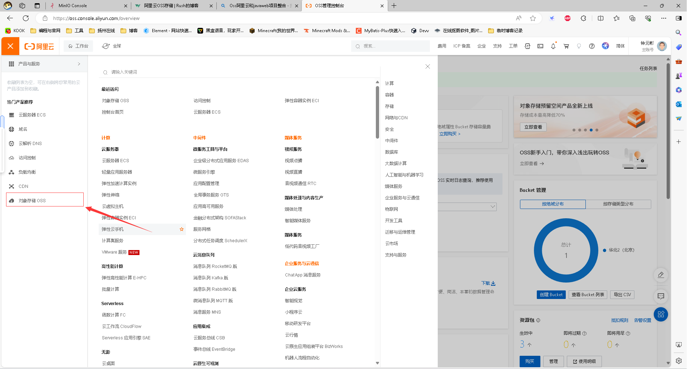
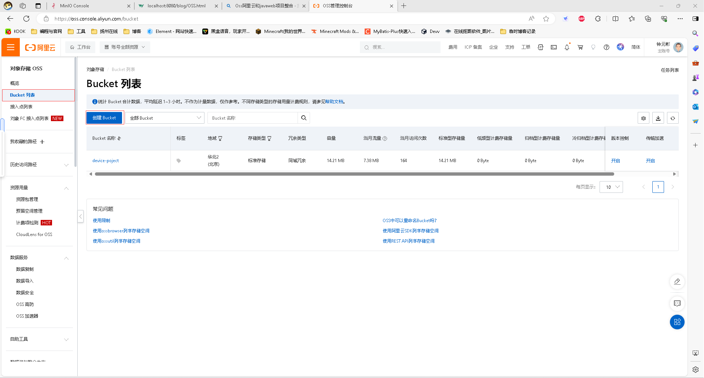
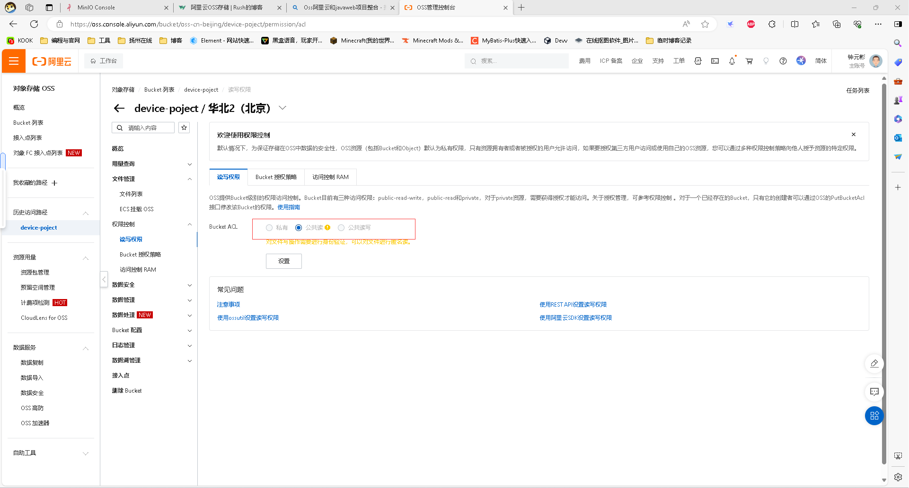
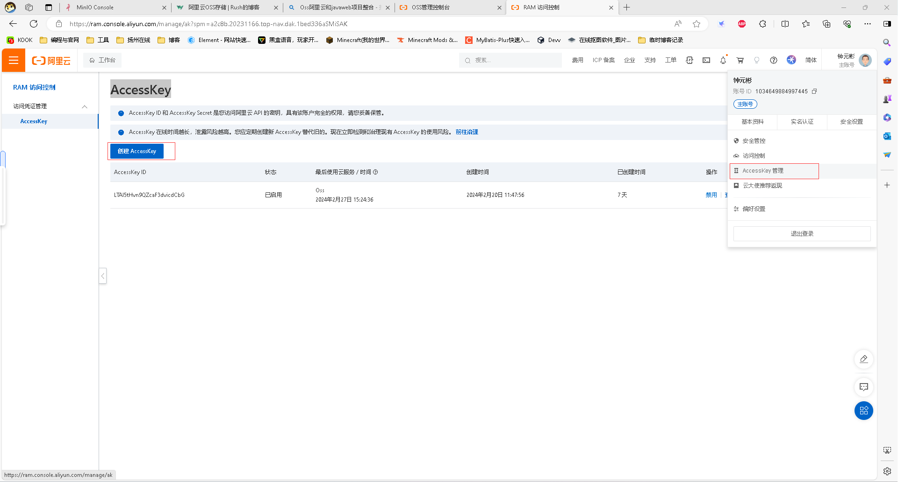
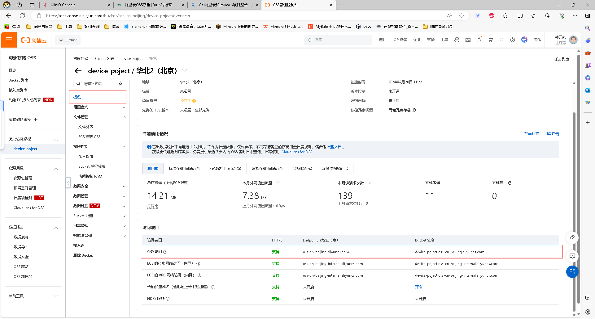

`more` 阿里云Oss存储和javaWeb的配合使用
<!-- more -->

### 代码实现

**准备工作**

1:导入项目依赖

```xml
<dependency>
    <groupId>com.aliyun.oss</groupId>
    <artifactId>aliyun-sdk-oss</artifactId>
    <version>3.15.1</version>
</dependency>
```


2:阿里云平台申请Oss服务

进入自己的账户 -> 对象存储Oss



**Bucket的设置和创建**





> 设置桶权限,如果是私有的那么后续上传成功后的链接不是所有人都能访问的

3:创建主账户的AccessKey 也可以设置 RAM账户的AccessKey



> 提醒:获得了accessKey和secretKey建议记录下来,因为secretKey只会在创建的时候显示出来.后续是无法查看的.


**javaweb项目**

### AliOSS工具类

在utils目录下新建一个类文件，将以下代码放入

```java
package com.ray.utils;

import com.aliyun.oss.OSS;
import com.aliyun.oss.OSSClientBuilder;
import lombok.Data;
import org.springframework.boot.context.properties.ConfigurationProperties;
import org.springframework.stereotype.Component;
import org.springframework.web.multipart.MultipartFile;

import java.io.IOException;
import java.io.InputStream;
import java.util.UUID;

/**
 * 阿里云 OSS 工具类
 */
@Data
@ConfigurationProperties(prefix = "aliyun.oss")
@Component
public class AliOSSUtils {
		// 这些成员变量等会在配置项中设置
    private String endpoint;
    private String accessKeyId;
    private String accessKeySecret;
    private String bucketName;

    /**
     * 实现上传图片到OSS
     */
    public String upload(MultipartFile file) throws IOException {
        // 获取上传的文件的输入流
        InputStream inputStream = file.getInputStream();

        // 避免文件覆盖（一面文件重名时，上传失败）
        String originalFilename = file.getOriginalFilename();
        String fileName = UUID.randomUUID().toString() + originalFilename.substring(originalFilename.lastIndexOf("."));

        //上传文件到 OSS
        OSS ossClient = new OSSClientBuilder().build(endpoint, accessKeyId, accessKeySecret);
        ossClient.putObject(bucketName, fileName, inputStream);

        //文件访问路径
        String url = endpoint.split("//")[0] + "//" + bucketName + "." + endpoint.split("//")[1] + "/" + fileName;
        // 关闭ossClient
        ossClient.shutdown();
        return url;// 把上传到oss的路径返回
    }

}
```


### controller类：接收请求，返回文件路径

在controller目录下，新建一个UploadController类，代码如下

```java
package com.ray.controller;

import com.ray.pojo.Result;
import com.ray.utils.AliOSSUtils;
import lombok.extern.slf4j.Slf4j;
import org.springframework.beans.factory.annotation.Autowired;
import org.springframework.web.bind.annotation.PostMapping;
import org.springframework.web.bind.annotation.RequestMapping;
import org.springframework.web.bind.annotation.RestController;
import org.springframework.web.multipart.MultipartFile;

import java.io.IOException;

@RestController
@RequestMapping("/upload")
@Slf4j
public class UploadController {

    @Autowired
    private AliOSSUtils aliOSSUtils;
    @PostMapping
    public Result upload(MultipartFile image) throws IOException {
        String url = aliOSSUtils.upload(image);  // 返回图片的上传路径，访问这个url即可下载图片
        return Result.success(url);
    }
}
```


### 更新配置

AliOSS工具类中的一些成员变量，需要在配置文件中设置，当信息需要修改时，直接到配置文件中更新即可。

application.yml

```xml
# 阿里云OSS配置 zyb配置
aliyun:
  oss:
    endpoint: http://{见下文解说}
    accessKeyId: 自己的KeyId
    accessKeySecret: 自己的KeySecret
    bucketName: 创建的bucket的名称
```


**endpoint**



> endpoint是仓库的外网访问地址


**accessKeyId和accessKeySecret**

> 用户在平台创建的accessKeyId填入进去


前端选择文件传入后端，后端接收提交给Oss。结束后返回一个Url链接，这个链接可以直接下载上传文件（前提是要桶的权限是公共读）。


不清楚前后端文件存储可以访问以下链接↓

[前后端的文件传输](./FileUpload.md)

