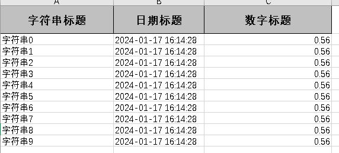

`more` 关于POL和EasyExcel的理论理解和基础入门使用
<!-- more -->


### POI是什么

> 开发中经常会设计到excel的处理，如导出Excel，导入Excel到数据库中!操作Excel目前比较流行的就是`Apache POI`和阿里巴巴的`easyExcel` ! 本次博客介绍的就是Apache POI库、
>
> Apache POI 是用Java编写的免费开源的跨平台的 Java API，Apache POI提供API给Java程式对Microsoft Office格式档案读和写的功能。

**官网**

> https://poi.apache.org/


### xls和xlsx区别

03和07版本的写，就是对象不同，方法一样

最大`行列得数量`不同：

  xls最大只有`65536行、256列`

  xlsx可以有`1048576行、16384列`

**poi `操作xls的`
poi-ooxml `操作xlsx的`**


### POI与Spring整合

#### 导入依赖

```xml
<dependencies>
    <!-- Apache POI -->
    <!-- POI操作xls	POI-ooxml操作xlsx -->
    <dependency>
        <groupId>org.apache.poi</groupId>
        <artifactId>poi</artifactId>
        <version>5.1.0</version>
    </dependency>
    <dependency>
        <groupId>org.apache.poi</groupId>
        <artifactId>poi-ooxml</artifactId>
        <version>5.1.0</version>
    </dependency>
    
    <!-- 时间的依赖,后续单元格导入时间会用到 -->
        <dependency>
            <groupId>joda-time</groupId>
            <artifactId>joda-time</artifactId>
            <version>2.10.11</version>
        </dependency>
</dependencies>
```


#### POI的基本使用

```java
@Test
    void selectFindId() throws IOException {
        log.info("开始创建工作簿");

        //  写道桌面上
        String PATH = "C:\\Users\\钟元彬\\Desktop\\";

        //    创建工作簿
        Workbook workbook = new SXSSFWorkbook();

        //    创建一个工作表
        Sheet sheet = workbook.createSheet("测试表格1");

        //    创建一行
        Row row1 = sheet.createRow(0);


        //    创建一个单元格
        Cell cell1 = row1.createCell(0);
        cell1.setCellValue("表头1");

        Cell cell2 = row1.createCell(1);
        cell2.setCellValue("表头2");

        Cell cell3 = row1.createCell(2);
        cell3.setCellValue("表头3（时间）");

        //    创建一行
        Row row2 = sheet.createRow(1);

        //    创建单元格
        Cell row2Cell1 = row2.createCell(0);
        Cell row2Cell2 = row2.createCell(1);
        Cell row2Cell3 = row2.createCell(2);

        row2Cell1.setCellValue("表头1的内容");
        row2Cell2.setCellValue("表头2的内容");

        //    写入一个日期类型
        String datetime = new DateTime().toString("yyyy-MM-dd HH:mm:ss");
        row2Cell3.setCellValue(datetime);

        //    生成一张IO表  xls是07之前的版本  这里直接选择写入xlsx文件，就能生成xlsx文件。
        FileOutputStream fos = new FileOutputStream(PATH + "测试.xls");
        //输出
        workbook.write(fos);
        //关闭流
        fos.close();
        System.out.println("文件生成完毕");

    }
```


**最后导出的效果图**


### 三种写入方式

#### HSSF

> 优点：过程中写入缓存，不操作磁盘，最后一次性吸入磁盘，速度快
>
> 缺点：最多只能处`理65536行`，否则会抛异常

#### XSSF

> 优点：可以写`较大数据量，如20万条`。
>
> 缺点：写数据时`速度非常慢，非常耗内存`，也会发生内存溢出，如100万条。

#### SXSSF

> 优点：可以写非常大的数据量，如100万条甚至更多条写数据速度快，占用更少的内存
>
> 注意：
>
> 1. `默认由100条记录被保存在内存中`，如果超过这数量，则最前面的数据被写入临时文件
> 1. 过程中会`产生临时文件`，需要清理临时文件
> 2. 如果想自定义内存中数据的数量，可以使用`new SXSSFWorkbook（数量）`
>
> 缺点：处理大量数据时的确会占用较多的内存空间。为了减少`SXSSF`模式下的内存占用，可以考虑通过合理控制`SXSSF`的参数和配置，或者采用分批次处理数据的方式，避免一次性操作过大的数据集。


**写入方式选择**

```java
// HSSF
Workbook workbook = new HSSFWorkbook();

// XSSF
Workbook workbook = new XSSFWorkbook();

// SXSS
Workbook workbook = new SXSSFWorkbook();
```


### 读取表格

```java
void Read() throws Exception{
        //  写道桌面上
        String PATH = "C:\\Users\\钟元彬\\Desktop\\";
        //获取文件流
        FileInputStream fis = new FileInputStream(PATH+"测试.xlsx");
        //获取一个工作簿
        Workbook workbook = new XSSFWorkbook(fis);
        //获取一个工作表
        Sheet sheet = workbook.getSheetAt(0);

        //获取表头内容（第一行内容）
        Row row = sheet.getRow(0);
        if (row != null){
            //获取所有的列    getPhysicalNumberOfCells返回非空的单元格数量
            int Cells = row.getPhysicalNumberOfCells();
            for (int col = 0;col < Cells;col++){
                //获取当前列
                Cell cell = row.getCell(col);
                if (cell != null){
                    //获取当前行的第 col 列的值
                    String cellValue = cell.getStringCellValue();
                    System.out.print(cellValue+" | ");
                }
            }
        }


        ////获取标准的内容
        ////获取有多少行
        int rowCount = sheet.getPhysicalNumberOfRows();
        ////从1开始，第一行是标题
        for (int rowNum = 1;rowNum < rowCount;rowNum++){
            Row rowData = sheet.getRow(rowNum);
            if (rowData != null){
                //获取当前行的列数
                int cellCount = rowData.getPhysicalNumberOfCells();
                System.out.println();
                for (int col = 0;col < cellCount;col++){
                    //获取当前列的值
                    Cell cellData = rowData.getCell(col);
                    //打印当前行当前列的值
                    //System.out.print("["+(rowNum+1)+"-"+(col+1)+"]");
                    //匹配列的类型
                    if (cellData != null){
                        //获取列的类型 创建的对象是一个枚举
                        CellType cellType = cellData.getCellType();
                        String cellValue = "";
                        switch (cellType){
                            case  STRING://字符串
                                System.out.print("[string]");
                                cellValue = cellData.getStringCellValue();
                                break;
                            case  BOOLEAN://布尔
                                System.out.print("[boolean]");
                                cellValue = String.valueOf(cellData.getBooleanCellValue());
                                break;
                            case  BLANK://空
                                System.out.print("[blank]");
                                break;
                            case  NUMERIC://数字（日期、普通数字）
                                System.out.print("[numeric]");
                                if (HSSFDateUtil.isCellDateFormatted(cellData)){
                                    //如果是日期
                                    System.out.print("[日期] ");
                                    Date date = cellData.getDateCellValue();
                                    cellValue = new  DateTime(date).toString("yyyy-MM-dd HH:mm:ss");
                                }
                                break;
                            case  ERROR://错误
                                System.out.print("[error]");
                                break;
                        }
                        System.out.print("["+cellValue+"]");
                    }
                }
            }
        }
        System.out.println();
        System.out.println("over");
        fis.close();
    }
```


**读取结果**


**表格内容**


### EasyExcel操作

#### 导入依赖

```xml
		<!--easyExcel-->
        <dependency>
            <groupId>com.alibaba</groupId>
            <artifactId>easyexcel</artifactId>
            <version>2.2.0-beta2</version>
        </dependency>
```


#### 写入Excel表格

**创建格式类**

```java
@Getter
@Setter
// 自动生成对应的equals和hashCode方法，简化了对象进行比较的哈希处理操作
@EqualsAndHashCode
public class DemoData {
    @ExcelProperty("字符串标题")
    private String string;
    @ExcelProperty("日期标题")
    private Date date;
    @ExcelProperty("数字标题")
    private Double doubleData;

    public DemoData(String string, Date date, Double doubleData) {
        this.string = string;
        this.date = date;
        this.doubleData = doubleData;
    }
}
```

**创建Data数据生成方法**

```java
// 增加data方法的实现
    private List<DemoData> data() {
        ArrayList<DemoData> arrayList = new ArrayList<>();
        for(int i = 0 ; i < 10 ; i++){
            arrayList.add(new DemoData("字符串"+i , new Date() , 0.56));
        }
        return arrayList;
    }
```

**写入Excel表格**

```java
@Test
    public  void simpleWrite(){
        //  写道桌面上
        String PATH = "C:\\Users\\钟元彬\\Desktop\\";
        // 写法1
        String fileName = PATH+"EasyTest.xlsx";
        //write(fileName,格式类)
        //sheet(表名)
        //doWrite(数据)
        EasyExcel.write(fileName, DemoData.class).sheet("模板").doWrite(data());
    }
```

**最终效果**




#### 读Excel表格（没弄明白，需要使用监听器）
