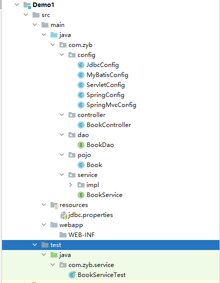

`more` SSM整合入门
<!-- more -->


## SSM整合

### 项目创建



### 配置文件

- pom.xml

  - 相关的依赖

  ```xml
  <dependencies>
    <dependency>
      <groupId>org.springframework</groupId>
      <artifactId>spring-webmvc</artifactId>
      <version>5.2.10.RELEASE</version>
    </dependency>
  
    <dependency>
      <groupId>org.springframework</groupId>
      <artifactId>spring-jdbc</artifactId>
      <version>5.2.10.RELEASE</version>
    </dependency>
  
    <dependency>
      <groupId>org.springframework</groupId>
      <artifactId>spring-test</artifactId>
      <version>5.2.10.RELEASE</version>
    </dependency>
  
    <dependency>
      <groupId>org.mybatis</groupId>
      <artifactId>mybatis</artifactId>
      <version>3.5.6</version>
    </dependency>
  
    <dependency>
      <groupId>org.mybatis</groupId>
      <artifactId>mybatis-spring</artifactId>
      <version>1.3.0</version>
    </dependency>
  
    <dependency>
      <groupId>mysql</groupId>
      <artifactId>mysql-connector-java</artifactId>
      <version>5.1.47</version>
    </dependency>
  
    <dependency>
      <groupId>com.alibaba</groupId>
      <artifactId>druid</artifactId>
      <version>1.1.16</version>
    </dependency>
  
    <dependency>
      <groupId>junit</groupId>
      <artifactId>junit</artifactId>
      <version>4.12</version>
      <scope>test</scope>
    </dependency>
  
    <dependency>
      <groupId>javax.servlet</groupId>
      <artifactId>javax.servlet-api</artifactId>
      <version>3.1.0</version>
      <scope>provided</scope>
    </dependency>
  
    <dependency>
      <groupId>com.fasterxml.jackson.core</groupId>
      <artifactId>jackson-databind</artifactId>
      <version>2.9.0</version>
    </dependency>
  </dependencies>
  ```

  - 导入插件

  ```xml
  <plugin>
    <groupId>org.apache.tomcat.maven</groupId>
    <artifactId>tomcat7-maven-plugin</artifactId>
    <version>2.1</version>
    <configuration>
      <port>80</port>
      <path>/</path>
    </configuration>
  </plugin>
  ```


- Spring

  - SpringConfig

  ```java
  @Configuration
  @ComponentScan({"com.zyb.service"})
  @PropertySource("classpath:jdbc.properties")
  @Import({JdbcConfig.class,MyBatisConfig.class})
  @EnableTransactionManagement
  public class SpringConfig {
  }
  ```

- MyBatis

  - MyBatisConfig

  ```java
  public class MyBatisConfig {
      @Bean
      public SqlSessionFactoryBean sqlSessionFactoryBean(DataSource dataSource){
          SqlSessionFactoryBean factoryBean = new SqlSessionFactoryBean();
          factoryBean.setDataSource(dataSource);
          factoryBean.setTypeAliasesPackage("com.zyb.pojo");
          return factoryBean;
      }
  
      @Bean
      public MapperScannerConfigurer mapperScannerConfigurer(){
          MapperScannerConfigurer configurer = new MapperScannerConfigurer();
          configurer.setBasePackage("com.zyb.dao");
          return configurer;
      }
  }
  ```

  - JdbcConfig

  ```java
  public class JdbcConfig {
      @Value("${jdbc.driver}")
      private String driver;
      @Value("${jdbc.url}")
      private String url;
      @Value("${jdbc.username}")
      private String username;
      @Value("${jdbc.password}")
      private String password;
  	// 数据库对象
      @Bean
      public DataSource dataSource(){
          DruidDataSource dataSource = new DruidDataSource();
          dataSource.setDriverClassName(driver);
          dataSource.setUrl(url);
          dataSource.setUsername(username);
          dataSource.setPassword(password);
          return dataSource;
      }
  	// 事务配置
      @Bean
      public PlatformTransactionManager transactionManager(DataSource dataSource){
          DataSourceTransactionManager rs = new DataSourceTransactionManager();
          rs.setDataSource(dataSource);
          return rs;
      }
  }
  ```

  - jdbc.properties

  ```properties
  jdbc.driver=com.mysql.jdbc.Driver
  jdbc.url=jdbc:mysql://localhost:3306/ssm_db
  jdbc.username=root
  jdbc.password=123456
  ```

- SpringMVC

  - ServletConfig(tomcat和mvc适配配置)
  
  ```java
  public class ServletConfig extends AbstractAnnotationConfigDispatcherServletInitializer {
      protected Class<?>[] getRootConfigClasses() {
          return new Class[]{SpringConfig.class};
      }
  
      protected Class<?>[] getServletConfigClasses() {
          return new Class[]{SpringMvcConfig.class};
      }
  
      protected String[] getServletMappings() {
          return new String[]{"/"};
      }
  }
  ```
  
  - SpringMvcConfig
  
  ```java
  @Configuration
  @ComponentScan("com.zyb.controller")
  @EnableWebMvc
  public class SpringMvcConfig {
  }
  ```


### Mybatis注解开发

对表格进行基础的增删改查

```java
public interface BookDao {
    @Insert("insert into tbl_book (type, name, description) VALUES (#{type}, #{name}, #{description})")
    void save(Book book);

    @Update("update tbl_book set type = #{type}, name = #{name}, description = #{description} where id = #{id}")
    void updata(Book book);

    @Delete("delete from tbl_book where id = #{id}")
    void delect(int id);

    @Select("select id, type, name, description from tbl_book where id = #{id}")
    Book getByid(int id);

    @Select("select id, type, name, description from tbl_book")
    List<Book> selectAll();
}
```


### Controller层

```java
@RestController
@RequestMapping("/books")
public class BookController {

    @Autowired
    private BookService bookService;

    @PostMapping
    public boolean save(@RequestBody Book book) {
        return bookService.save(book);
    }

    @PutMapping
    public boolean updata(@RequestBody Book book) {
        return bookService.updata(book);
    }

    @DeleteMapping("/{id}")
    public boolean delect(@PathVariable int id) {
        return bookService.delect(id);
    }

    @GetMapping("/{id}")
    public Book getByid(@PathVariable int id) {
        System.out.println("getbyid");
        return bookService.getByid(id);
    }

    @GetMapping
    public List<Book> selectAll() {
        return bookService.selectAll();
    }
}
```


### service层(接口和实现类)

#### 接口

```java
// 开启事务
@Transactional
public interface BookService {
    /**
     * 增加数据
     *
     * @param book
     * @return
     */
    boolean save(Book book);

    /**
     * 修改数据
     *
     * @param book
     * @return
     */
    boolean updata(Book book);

    /**
     * 根据id删除数据
     *
     * @param id
     * @return
     */
    boolean delect(int id);

    /**
     * 根据id查找数据
     *
     * @param id
     */
    Book getByid(int id);

    /**
     * 查找所有数据
     *
     * @return
     */
    List<Book> selectAll();
}
```


#### 实现类

```java
// 创建进IoC池子中
@Service
public class BookServiceImpl implements BookService {
	
    // 自动装配
    @Autowired
    private BookDao bookDao;


    public boolean save(Book book) {
        bookDao.save(book);
        return true;
    }

    public boolean updata(Book book) {
        bookDao.updata(book);
        return true;
    }

    public boolean delect(int id) {
        bookDao.delect(id);
        return true;
    }

    public Book getByid(int id) {
        return bookDao.getByid(id);
    }

    public List<Book> selectAll() {
        return bookDao.selectAll();
    }
}
```


### 测试类

```java
@RunWith(SpringJUnit4ClassRunner.class)
@ContextConfiguration(classes = SpringConfig.class)
public class BookServiceTest {

    @Autowired
    private BookService bookService;

    @Test
    public void testGetById(){
        Book book = bookService.getByid(1);
        System.out.println(book);
    }

    @Test
    public void testSelectAll(){
        List<Book> books = bookService.selectAll();
        System.out.println(books);
    }
}
```