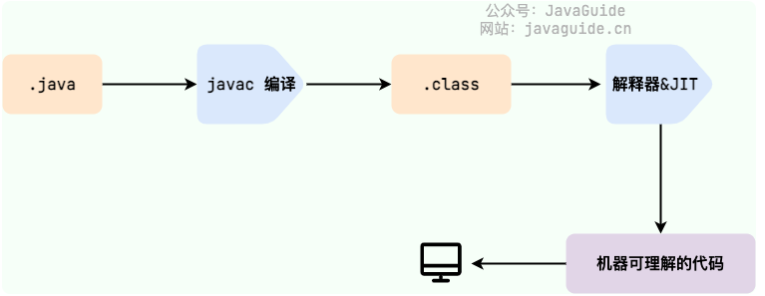
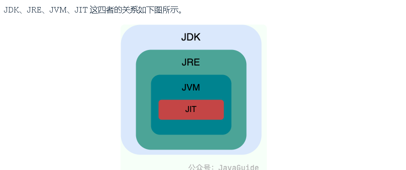

`more` 常见面试的解答

<!-- more -->


## JavaSE

### javaSE和JavaEE

**javaSE：**是Java的基础版本。跟家偏向于开发一些桌面应用程序，和简单的服务器程序。

**JavaEE：**是在SE的**基础上**进行了功能性的增强，比如有（Servlet、JSP、EJB、JDBC、JPA、JTA、JavaMail、JMS）。**用于开发复杂的业务和Web应用程序。**


### jdk jre jvm

jdk是开发工具类包，包含了运行环境和开发

jre是运行环境和核心类库

jvm是Java的虚拟机


### JVM

jvm是虚拟出来的计算机，所以也叫JVM虚拟机。

JVM负责将编译好的class文件，编译成机器码运行在各个系统程序上运行。达到了高可移植性，只有生成了.class文件，就可以在多个平台上运行




### JIT和AOT

为了加快代码的运行速度，JIT**会把热点代码**会在JVM编译class文件为机器码的时候给记录下来。下次运行可以直接运行机器码，速度会更加快。

> JIT采用的是延迟评估（Lazy Evaluation）的做法，**每次执行**的时候收集运行信息。把常用到的热点代码给记录下来，所以Java代码会越执行越快。
>
> AOT是JDK 9引入的一种新的编译模式，和JIT不同的是。他会在程序被**执行前就**将其编译成机器码。提高Java的启动速度，减少内存占用增强Java的安全性（AOT 编译后的代码不容易被反编译和修改）但它只是在系统执行之前进行操作的 




### 编译性语言和解释性语言区别

编译性语言：将代码全部转换为机器码，给设备进行运行。开发效率慢，运行速度快。比如：C，C++，Rust

解释性语言：将代码一句一句的解释为**机器代码**后在进行执行。开发效率快，运行速度慢。比如：Java，python，PHP

但是现在Java已经具备这两个的特征了。因为Java程序要**先编译**，生成.class文件。然后通过**JVM进行解释**。


### 标识符和关键字的区别

标识符：是指为类，方法名，变量取名的。这就叫标识符

关键字：系统中的有特殊含义和使用方法的名称，如IF，FOR等等。也被称作**特殊的标识符**


### JAVA和C++的区别

相同：Java 和 C++ 都是面向对象的语言，都支持封装、继承和多态

不同：

- Java不提供指针直接访问内存
- Java的类只能单继承，接口可以多继承。C++可以多继承
- Java有垃圾回收机制（GC）
- Java和C++都可以进行方法重载，C++多了一个操作符重载，可以重新定义运算符的规则

### 对类，方法，变量命名规则

类名大驼峰规则

方法是小驼峰规则

变量是是全小写，常量是全大写


### JDK版本区别

JDK8：

JDK9:在9往后，就不需要去区分JRE和JDK的关系了，取而代之的是**模块系统**


### Java跳出循环的三种方式

`break` 跳出循环

`retrun`  跳出方法

`continue`  结束本次循环


### 基本数据类型和引用数据类型

基本数据有**四大类**，分为字符型，布尔型，浮点型，整形

其中细分有byte，short，int,long(整形)，char，Boolean，float，double

为什么取值范围负数会多一个，其实就是符号位被用来做了个补充，用来代表多出来的那个负数！


### 基本类型和包装类型的区别

在介绍两个之间的区别之前，还有两个概念。**拆箱与装箱**，拆箱就是包装类型转换为基础类型过程。反之，装箱就是基础类型转换为包装类型的过程。

- **用途**：除去定义基本的变量以外，使用方法形参尽量使用包装类型。因为包装类型可以用于泛型。

- **存储方式**：基本类型的局部变量存放在栈中，成员变量存放在堆当中。而包装类型是对象类型**，所以存放在堆当中。
- **占用空间**：相比于包装类型（对象类型）， 基本数据类型占用的空间往往非常小。
- **默认值**：成员变量包装类型不赋值就是 `null` ，而基本类型有默认值且不是 `null`。
- **比较方式**：对于基本数据类型来说，`==` 比较的是值。对于包装数据类型来说，`==` 比较的是对象的内存地址。所有整型包装类对象之间值的比较，全部使用 `equals()` 方法。

> 1. `byte`：默认值是0
> 2. `short`：默认值是0
> 3. `int`：默认值是0
> 4. `long`：默认值是0L
> 5. `float`：默认值是0.0f
> 6. `double`：默认值是0.0d
> 7. `char`：默认值是'\u0000'，即空字符
> 8. `boolean`：默认值是`false`


### 包装类型的缓存机制

Java 基本数据类型的包装类型的大部分都用到了缓存机制来提升性能。

`Byte`,`Short`,`Integer`,`Long` 这 4 种包装类默认创建了数值 **[-128，127]** 的相应类型的缓存数据，`Character` 创建了数值在 **[0,127]** 范围的缓存数据，`Boolean` 直接返回 `True` or `False`。


### 类型的自动转换

当表达式中，混合多个变量类型。程序将会把所有变量编程容量最大的数据类型进行计算

精度大的变量赋值给小的会报错，反之转换

(byte,short)和char之间不会相互自动转换

boolean不参与转换


### 引用数据类型和基本数据类型

基本数据类型是直接存储在栈上的，本身就是数据。

引用数据类型，是在堆内存中。开辟了一片空间，对象进行数据的引用。使用了new实际上就是在堆内存中开辟了一片空间，等号位指向。

常见的引用数据类型有：类，数组，字符串


### 局部变量和成员变量的区别

局部变量创建于代码块中，也只会生效于该代码块中。代码块执行完毕会进行销毁。不会自动进行赋值。

成员变量是写在类内部，方法外面的变量，可以在类中进行使用，或者实例化类后，通过类名调用。如果没有被final修饰，不需要显示的赋值，系统会给默认值。


### 静态方法为什么不能调用非静态的成员

静态方法是属于类的，在类加载的时候。就会分配内存。可以直接通过类名去进行访问。而非静态的成员，需要跟着类的实例化才功能去进行访问和使用。


### 谈谈对String的理解

String的底层是一个被Final修饰的char数组

初始化String有三种初始化方法，一个直接赋值，一个是无参构造来赋值，一个用有参构造来赋值。存储在内存中的位置不同。

直接赋值看内存有无一样的字符串，没有会进行创建有会直接引用

使用无参构造创建，后续赋值会查看常量池里面是否有值

使用有参构造创建，必须分配内存空间。


### i++ 和 ++i

i++ 先执行再加 ++i 先加再执行


### 集合

集合分为单列集合和双列集合
List接口有ArrayList和LinkedList实现，是是有序可重复的

Set 无序集合，不能重复。实现类有HashSet和LinkedHashSet

Map 键值对集合，是双列集合。

Collection包含了 List和Set 其中Map没有继承


### IO

分别字节流和字符流，

字节流以二进制的方式是处理视频图片文字 InputStream 和 OutStream

字符流，处理文本类型，以便于处理字符码和字符集	Readear Write


### Java是什么

是面向对象的编程语言，

封装：把属性和方法封装到一个对象当中

继承：子类继承父类，但是不能继承父类中私有的方法和属性

多态：父类引用指向子类对象

### Hashcode

用于返回Java对象的哈希码值，是根据对象的地址计算出来的Int类型的值。


### GC垃圾回收

当在堆中实例化的对象，没有被程序使用的时候。

常见的回收机制有：

当实例化新对象的时候，无法分配新空间的时候。会对程序没有引用的对象进行回收。

在空闲的时候，会周期性的对没有引用的对象进行回收


### 重载和重写

重载是在同一个类中，方法名必须相同，参数类型不同、个数不同、顺序不同，方法返回值和访问修饰符可以不同。不止构造器有重载，**所有的方法都可以进行重载。**

重写是要有继承关系的前提下，子类方法对父类相同名称的方法进行重写。

**方法的重写要遵循“两同两小一大”**

- “两同”即方法名相同、形参列表相同；
- “两小”指的是子类方法返回值类型应比父类方法返回值类型更小或相等，子类方法声明抛出的异常类应比父类方法声明抛出的异常类更小或相等；
- “一大”指的是子类方法的访问权限应比父类方法的访问权限更大或相等。


### 可变长参数

Java5开始，就可以支持可变长度的形参。所谓可变长参数就是允许在调用方法时传入不定长度的参数。

当遇到方法重写的时候，会**优先匹配固定参数的方法**，因为固定参数的方法匹配度更高。

```java
/**
 * 微信搜 JavaGuide 回复"面试突击"即可免费领取个人原创的 Java 面试手册
 *
 * @author Guide哥
 * @date 2021/12/13 16:52
 **/
public class VariableLengthArgument {

    public static void printVariable(String... args) {
        for (String s : args) {
            System.out.println(s);
        }
    }

    public static void printVariable(String arg1, String arg2) {
        System.out.println(arg1 + arg2);
    }

    public static void main(String[] args) {
        printVariable("a", "b");
        printVariable("a", "b", "c", "d");
    }
}

```


### static

在类加载的时候，就会加载到堆中。可以不用进行实例化使用

修饰方法和成员变量的时候，在类加载的时候，就会直接加载到方法区中。


### 面向过程编程

强调于程序的执行过程，着重于每一步的实现。而不是像面向对象一样将一个程序分解为对象来及逆行业务的实现。


## 数据库

### 事务四大特征

原子性：要么都成功，要么都失败

一致性：事务完成，所有数据保持一致

隔离性：事务和事务时相互独立的

持久性：一旦数据修改，是永久的

### 数据库的范式

第一范式  列中的数据，不能在分割。对应的一列数据只能是这一列的属性

第二范式  非主键的字段要完全依赖于主键

第三范式  不存在依赖传递，如果存在需要把依赖传递的表分为两个表格

在实际设计中需要权衡学习范式化设计和反范式设计之间的平衡。

### 隔离级别

读未提交

读已提交

可重复读

可串行化

Mysql默认使用的是可重复读

### Redis

Redis是运行在内存上的键值对高性能数据库，是介于用户和mysql数据库之间的数据库。其目的是为了更快的响应数据和缓解Mysql访问压力。


### Spring是什么

是一个开源的Java框架，有三个主要的特性依赖注入（DI），控制反转（IoC），切面编程（AOP）。可以将主流框架于Spring框架进行整合。

依赖注入（DI）	通过xml文件方式或者注解动态注入到对象当中，可以使用set方法，构造方法，自动装配

控制反转（IoC）	不再是用户自己new对象了，而是交给Ioc容器来进行管理。管理对象叫Bean

切面编程（AOP）可以无侵入式的对代码进行增强，通过切点切面切片


### SpringMVC是什么

是一个基于Java的mvc架构的轻量级框架，用于处理web的请求和响应。


### SpringBoot

可以对之前学过的Spring和SpringMVC进行加速开发，不用过多的关心文件配置上。而是着重于编写MVC架构层的内容编写。

内嵌了Tomcat，简化了Web开发的部署过程。在使用的时候，只需要把起步依赖配置好，能省很多事。

