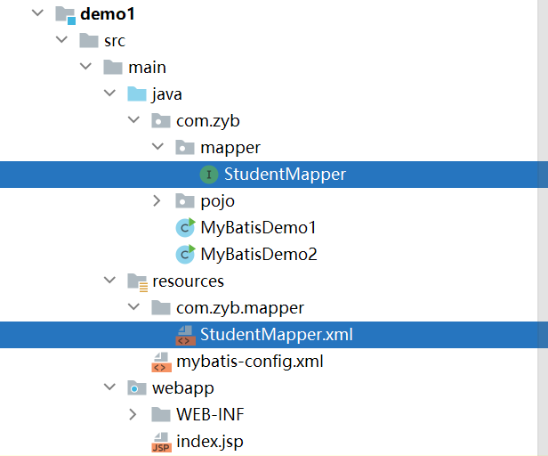
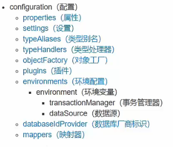

`more` JavaWeb核心的实际使用

<!-- more -->


# Web核心技术

## Http协议

超文本传输协议，规定了浏览器和服务器之间传输的规则  


### Http请求数据格式

#### 请求行

请求数据的第一行（请求方式 资源路径 协议）

#### 请求头

第二行开始的键值对数据，格式key:value


#### 请求体

**post**请求，存放请求数据的


**POST和GET的区别**

GET请求的数据是存在链接中的，没有请求体。格式：链接?key=value&key=value，GET请求是有大小限制的

POST请求的数据，是存放在请求体当中的。是没有大小限制的。 


### 响应协议

#### 响应行

响应数据的第一行（协议 状态码 描述）

**状态码：**


#### 响应头

第二行开始的键值对数据，格式：key:value


#### 响应体

最后一部分，存放响应数据


### 协议解析

浏览器自带响应协议，自动解析Http数据


## Web服务器-Tomcat

### 文件目录


### 启动Tomcat服务器

- 启动bin目录下的`startup.bat`文件
- 访问对应的端口号，既可以访问

**解决乱码**

> 修改conf/logging.properties文件，修改为GBK与控制台编码一致。


**修改端口号**

> `conf/server.xml`文件，修改


## Servlet

是JavaEE中的一种规范，是一个接口。


### 使用步骤已经注意事项

- maven文件 .pom文件下添加依赖（dependency）

```html
<dependency>
      <groupId>javax.servlet</groupId>
      <artifactId>javax.servlet-api</artifactId>
      <version>3.1.0</version>
      <!-- 生效于编译环境和测试环境有效，运行环境无效 ，达成war包里面没有，因为 Tomcat已经有，不然后续会报错 -->
      <scope>provided</scope>
    </dependency>
```

- Java实现Servlet类（需要实现中的五个方法）

```java
@WebServlet("/dome1")
public class ServletDome1 implements Servlet {
    @Override
    public void service(ServletRequest servletRequest, ServletResponse servletResponse) throws ServletException, IOException {
//	每次访问的时候，都会调用service方法。
        System.out.println("Servlet hello world~~~~");
    }

    @Override
    public String getServletInfo() {
        //	获取servletInfo对象
        return null;
    }

    @Override
    public void destroy() {
//	当servlet被销毁的时候，执行
    }
    @Override
    public void init(ServletConfig servletConfig) throws ServletException {
//	第一次初始化的时候，会执行，只会执行一次
    }

    @Override
    public ServletConfig getServletConfig() {
        //	获取servletConfig对象
        return null;
    }
```


**Tomcat的导入**

在`bulid`坐标中：

```html
<plugins>
  <plugin>
    <groupId>org.apache.tomcat.maven</groupId>
    <artifactId>tomcat7-maven-plugin</artifactId>
    <version>2.1</version>
  </plugin>
</plugins>
```


### Servlet 执行流程 

1：Servlet 由谁创建？Servlet方法由谁调用

> servlet由web服务器创建（Tomcat），方法也是由服务器调用（Tomcat）

2：服务器怎么自动Servlet中由service方法

> 因为我们Java定义的类，是实现的Servlet接口。必然会有service方法的实现。 


### webServlet参数

- urlPatterns	配置多个路由分支
  - 精确匹配："/user/index"
  - 目录匹配："/user/*"
  - 扩展名匹配："/user/*.do"
  - 任意匹配："/"或者"/*"
  - 优先级：精确匹配 > 目录匹配  > /* > /

**注意**

使用了/或者/*后，会把Tomcat7中的defaultServlet，无法自动访问到静态的网页了


**使用web.xml配置Servlet**

没有使用注解方式方便，了解即可

```java
<!--  Servlect全类名-->
  <servlet>
    <servlet-name>demo4</servlet-name>
    <servlet-class>com.zyb.ServletDome4</servlet-class>
  </servlet>
<!--  指定的访问路径-->
  <servlet-mapping>
    <servlet-name>demo4</servlet-name>
    <url-pattern>/demo4</url-pattern>
  </servlet-mapping>
```


## Request


### 获取请求数据

```Java
//        获取请求的方式
        String method = req.getMethod();

//        获取虚拟路径，可以动态获取，降低维护难度，降低耦合性
        String contextPath = req.getContextPath();

//        获取URL（绝对）
        StringBuffer requestURL = req.getRequestURL();

//        获取URL（相对）
        String requestURI1 = req.getRequestURI();

//        获取GET的请求体
        String queryString = req.getQueryString();

//        获取请求头
        String header = req.getHeader("User-Agent");


        System.out.println("方式是：" + method + "虚拟路径是：" + contextPath + "绝对路径" + requestURI1.toString() + "相对路径:" + requestURI1 + "GET请求体是"+queryString);

//        获取post的请求体
        ServletInputStream inputStream = req.getInputStream();

//        读取数据，使用的是字符流
        byte[] bytes = new byte[1024];
        int len = 0 ;
        StringBuffer sb = new StringBuffer();
        while ((len = inputStream.read(bytes)) != -1){
            sb.append(new String(bytes , 0 , len));
        }
        System.out.println("请求的数据是："+sb.toString());

//        使用字节流获取数据（方便，但是只能获取纯文本内容）
        BufferedReader reader = req.getReader();
        String s = reader.readLine();
        System.out.println("请求的post请求体是："+s);

//        获取GET请求体的map集合
        Map<String, String[]> map = req.getParameterMap();

        for(String key : map.keySet()){
            System.out.print(key + ":");

//        获取值
            String[] strings = map.get(key);
            for (String string : strings) {
                System.out.print(string +" ");
            }
            System.out.println();
        }

//        获取单个属性的数组集合
        String[] strings = req.getParameterValues("hobby");

        System.out.print("hobby:");
        for (String string : strings) {
            System.out.print(string + " ");
        }

//        获取单个属性的值
        String userpass = req.getParameter("userpass");
        String username = req.getParameter("username");

        System.out.println("userpass:"+userpass + "\n username:"+username);
```


#### 解决获取数据的中文乱码问题

##### POST

> 因为获取POST的请求体的原理使用的是流的方式获取的，那么设置获取流的编码为网页编码，可以解决乱码的问题
>
> ```java
> //        解决POST乱码问题
>         req.setCharacterEncoding("UTF-8");
> ```

##### GET

> 本地提交到Tomcat7服务器是将，中文字符以UTF-8的方式以URL的编码形式传入到服务器中，但是服务器的解码时以ISO_8859_1，所以以ISO_8859_1编码再次编码，再次使用UTF-8解码可以完美解决。GET和POST都可以使用
>
> ```java
> //            被ISO-8859-1编码所解码的字符串
>             String username = req.getParameter("username");
> 
> //            第一种方法：
> //            1.1：将乱码的字符串以ISO-8859-1编码
>             String encode = URLEncoder.encode(username, "ISO-8859-1");
> //            1.2:得到发送请求，被UTF-8编码的指定请求体，使用UTF-8进行解码
>             String decode = URLDecoder.decode(encode, "UTF-8");
>             System.out.println(decode);
> 
> //            第二种方法：
>             username = req.getParameter("username");
> //            2.1 将乱码的字符串转换为二进制数组
>             byte[] bytes = username.getBytes(StandardCharsets.ISO_8859_1);
> //            2.2 将二进制数组转换为字符串
>             String string = new String(bytes, StandardCharsets.UTF_8);
>             System.out.println(string);
> ```


### 请求转发

可以将req和res中的数据以形参的方式，传递给其他处理路径进行处理

```java
//        设置一个req的编写变量
        req.setAttribute("msg" , "hello");
        req.getRequestDispatcher("/demo2").forward(req , res);
        System.out.println("这是来自demo3的"+req.getAttribute("msg"));
        req.removeAttribute("msg");
        System.out.println("这是来自demo3的"+req.getAttribute("msg"));
```


## Response


### 重定向

浏览器向服务器发送请求后，指定路径无法处理，响应代码302，指定目录位置。（去指定位置进行处理）为重定向。

```java
//        设置响应码，为302
        response.setStatus(302);
//        设置响应路径
        response.setHeader("Location" , "/resp2");

//        简化完成重定向
        response.sendRedirect("/resp2");
```


### 请求转发和重定向的区别

- 请求转发
  - 地址栏不会发生变化
  - 只能访问内部资源
  - 可以再request共享数据
- 重定向
  - 地址栏发生变化
  - 可以访问外部资源
  - 不能再多个资源中使用request共享数据


### 响应字符数据

通过Response对象获取字符的输出流，写入数据进去。其中可能会遇到无法识别HTML的标签和中文乱码，以下代码已解决

```Java
//        这是识别为html，且将流的编码格式设置为UTF-8
        response.setContentType("text/html;charset=utf-8");
        PrintWriter writer = response.getWriter();

        writer.write("aaa");
        writer.write("<h1>你好</h1>");
```


### 响应字节数据

道理同上，字节一般是图片，视频等等。先读取本地的文件，进行字节流的读取。copy到response的字节输出流。

**IOUtils工具包**

```HTML
<dependency>
  <groupId>commons-io</groupId>
  <artifactId>commons-io</artifactId>
  <version>2.4</version>
</dependency>
```


**读取步骤**

```java
//        使用字符流，将图片的数据获取
        FileInputStream fileInputStream = new FileInputStream("C:\\Users\\钟元彬\\AppData\\Roaming\\Typora\\typora-user-images\\image-20231115150940983.png");

//        获取response的输出流
        ServletOutputStream outputStream = response.getOutputStream();
//        使用工具包，将读取到的图片字符，复制到响应输出流中，从而达到图片再网页的目的
        IOUtils.copy(fileInputStream , outputStream);

//        将读取图片的流给关掉
        fileInputStream.close();
```


## JSP

- Java server pages ， Java端的服务页面
- 动态的网页技术，可以定义HTML,JS,CSS等静态内容，还可以定义Java的动态内容
- JPS = HTML + JAVA

   本质就是servlet ，在jsp被访问的时候，由容器（Tomcat）转换为Java文件（servlet），再由容器对其进行编译，运行成为字节码文件。提供服务的最后是这个字节码文件

底层源码：

```Java
try {
  response.setContentType("text/html;charset=UTF-8");
  pageContext = _jspxFactory.getPageContext(this, request, response,
         null, true, 8192, true);
  _jspx_page_context = pageContext;
  application = pageContext.getServletContext();
  config = pageContext.getServletConfig();
  session = pageContext.getSession();
  out = pageContext.getOut();
  _jspx_out = out;

  out.write("\r\n");
  out.write("\r\n");
  out.write("<html>\r\n");
  out.write("<head>\r\n");
  out.write("    <title>啦啦啦</title>\r\n");
  out.write("</head>\r\n");
  out.write("<body>\r\n");
  out.write("    <h1>hello world</h1>\r\n");
  out.write("    ");

    System.out.println("hello world");

  out.write("\r\n");
  out.write("</body>\r\n");
  out.write("</html>\r\n");
} catch (java.lang.Throwable t) {
  if (!(t instanceof javax.servlet.jsp.SkipPageException)){
    out = _jspx_out;
    if (out != null && out.getBufferSize() != 0)
      try { out.clearBuffer(); } catch (java.io.IOException e) {}
    if (_jspx_page_context != null) _jspx_page_context.handlePageException(t);
    else throw new ServletException(t);
  }
} finally {
  _jspxFactory.releasePageContext(_jspx_page_context);
}
```


### JSP脚本

- <%....%>	内容直接放在_jspService方法中

- <%=.....%>	内容跟放在out.print()中，作为out.print()的参数
- <%!.....%>	内容作为成员变量，方法存在


### JSP优化使用

Java代码与前端代码书写到一起，臃肿不堪。可以将部分Java代码分到servlet中，servlet负责逻辑和数据的获取，把数据**存放在req和resp中**。JSP中的Java代码负责Java的获取到的数据**动态显示**到网页中。

#### EL表达式

直接使用域中的数据

```java
//        将数据存在再当前请求域中
        request.setAttribute("brands" , list);
//        转发到指定的jsp文件中
        request.getRequestDispatcher("demo1.jsp").forward(request , response);

//			jsp文件，使用el表达式可以直接进行访问。
			${brands}
```

#### JSTL标签


##### 环境准备

###### pom.xml配置

```html
<dependency>
    <groupId>jstl</groupId>
    <artifactId>jstl</artifactId>
    <version>1.2</version>
</dependency>

<dependency>
    <groupId>taglibs</groupId>
    <artifactId>standard</artifactId>
    <version>1.1.2</version>
</dependency>
```

###### JSP头文件导入

```java
<%@ page contentType="text/html;charset=UTF-8" language="java" isELIgnored="false" %>
<%@ taglib prefix="c" uri="http://java.sun.com/jsp/jstl/core" %>
```


##### if语句

```java
<c:if test="${status ==1}">
    禁用
</c:if>
```

##### for循环

```java
<c:forEach items="${brands}" var="brand" varStatus="statu">
    <tr align="center">
        <td>${statu.count}</td>
        <td>${brand.name}</td>
        <td>${brand.gender}</td>
        <td>${brand.age}</td>
        <td>${brand.wight}</td>
    </tr>
</c:forEach>
```

```
// 类似于for循环
<c:forEach begin="0" end="10" step="1" var="i">
    <a href="#">${i}</a>
</c:forEach>
```


## MVC

分层开发 

- M：Model，业务模型已经处理
- V：View，视图，界面展示
- C：Controller，控制器，调用模型和视图


## 三层架构

- 表现层
- 业务逻辑层
- 数据访问层（持久层）


## 会话跟踪技术

- 在浏览器访问web资源的时候，会创建一个回话。一个会话中有**多次**请求和响应。直到有一方断开的时候，那么会话结束。
- 在一次请求的会话中的多次请求共享数据。服务器**识别**多次请求是否来自同一个浏览器，来进行数据共享
- 因为HTTP请求都是无状态的（独立的），每次请求都会被识别为一个新的请求。需要使用**会话跟踪**来进行数据的共享
- 实现方案：
  - Cookie：客户端
  - Session：服务端


### Cookie

#### 基本使用

- 创建cookie

```java
Cookie cookie = new Cookie("username" , "zhangsan");
response.addCookie(cookie);
```

- 获取cookie

```java
Cookie[] cookies = request.getCookies();

for(Cookie cookie : cookies){
    String name = cookie.getName();
    if(name.equals("username")){
        String value = cookie.getValue();
        System.out.println("name:"+name + "value:"+value);
        break;
    }
}
```


#### cookie使用细节

##### 存活时间

- 默认情况是在浏览器关闭的时候，就会直接关闭。存放在内存当中。
- setMaxAge(int seconds) ：设置Cookie存活时间
  - 整数：存活的秒数
  - 负数：默认情况
  - 0：删除cookie

##### 存放中文

- 中文部分编码

```java
URLEncoder.encode("张三" , "UTF-8");
```

- 获取的时候解码

```java
URLDecoder.decode(value , "UTF-8");
```


### session

存放在session中的

##### 基本使用

- 创建session

```java
// 获取发来请求的Session对象，没有的话就进行获取
HttpSession session = request.getSession();
session.setAttribute("username" , "zs");
```

- 读取session

```java
HttpSession session = request.getSession();
Object username = session.getAttribute("username");
```

- 删除session中的数据

```java
HttpSession session = request.getSession();
session.removeAttribute("username");
```


#### 使用细节

- 钝化和活化

> 服务器**正常**进行重启以后
>
> 钝化：tomcat7会将session序列化的存放在硬盘当中。
>
> 活化：再次启动的时候，会将文件加载到session当中，可以再次进行读取。

- 销毁

> 默认情况是30分钟自动销毁
>
> ```java
> // 可以在web.xml中进行对session的销毁时间配置
> <session-config>
>     <session-timeout>100</session-timeout>
> </session-config>
> ```
>
> 手动代码销毁
>
> ```java
> // 删除session
> session.invalidate();
> ```


## Filter

实际上是一个过滤器，是JavaWeb三大组件之一（Servlet ， Filter ， Listener）。可以把请求拦截下来，进行一些特殊功能的实现和通用功能的操作，比如：权限控制，统一编码处理，敏感字符处理等等。


### 基本使用

实现的**Filter**接口，其中三个方法需要被实现

- init

> 初始化的时候，会执行

- destroy

> 会话被销毁的时候，会执行

- doFilter

> 过滤器的主题内容方法

使用注解，对指定访问目录进行拦截

```Java
// 拦截全部访问的路径
@WebFilter("/*")

// 拦截具体的资源
@WebFilter("/index.jsp")

// 拦截目录后所有的文件
@WebFilter("/user/*")

// 后缀名拦截
@WebFilter("*.jsp")

```

### 执行流程


### 使用细节

过滤器链


运行顺序是按照，文件名字字符串自然排序


## Listener

表示是监听器，可以监听application,session ,request三个对象的创建，销毁，或者数据的修改。自动执行对应的代码。

一共提供了**八个**监听器


**常用的监听器**

> 对ServletContext对象监听（创建和销毁）

```java
public void contextInitialized(ServletContextEvent sce) {
    System.out.println("监听器监听到浏览器已经被初始化完毕，开始加载资源");
}
```


## AJAX

- 作用：
  - 可以和服务器进行数据的的交换，通过ajax可以想服务器发起请求。并且获得响应服务器的数据。
  - 使用HTML+AJAX替代了JSP网页，实现了**前后端分离**
  - 异步交互：可以不刷新整个网页，更新部分网页数据的技术。例如：搜索联想，用户名校验


### 基础使用

> 使用xml对象对指定服务器发送请求，获取响应操作。可选择异步或者同步

```javascript
<script>
    //  创建核心对象
    var xmlhttp;
    if (window.XMLHttpRequest)
    {// code for IE7+, Firefox, Chrome, Opera, Safari
        xmlhttp=new XMLHttpRequest();
    }
    else
    {// code for IE6, IE5
        xmlhttp=new ActiveXObject("Microsoft.XMLHTTP");
    }

    // 发送请求
    xmlhttp.open("GET","http://localhost:8080/demo1/ajaxdemo1",true);
    xmlhttp.send();
    // 获取响应
    xmlhttp.onreadystatechange = function(){
        if (xmlhttp.readyState === 4 && xmlhttp.status === 200) {
            alert(xmlhttp.responseText);
        }
    }
</script>
```


### XMLHttpRequest对象的属性

ajax的核心就是使用的xml对象进行异步同步的处理操作，实现了网页不刷新也可以更新数据的功能。


### Axios

将ajax封装成为一个**框架**进行使用


#### 使用准备

- 导入框架：

```javascript
<script src="https://unpkg.com/axios/dist/axios.min.js"></script>
```

- Get请求

```JavaScript
axios({
    method:"get",
    url:"http://localhost:8080/demo1"
}).then(function (resp){
	// 响应后，操作逻辑
	// 获取响应数据
	resp.data
}
```

- Post请求

```JavaScript
axios({
    method:"post",
    url:"http://localhost:8080/demo1",
    // post携带的数据
    data:""
}).then(function (resp){
	// 响应后，操作逻辑
	// 获取响应数据
	resp.data
}
```


## MyBatis 

优秀持久层框架，简化JDBC开发

### logback日志配置

#### mavne的pom配置

```html
<!-- 添加slf4j日志api -->
<dependency>
    <groupId>org.slf4j</groupId>
    <artifactId>slf4j-api</artifactId>
    <version>1.7.20</version>
</dependency>
<!-- 添加logback-classic依赖 -->
<dependency>
    <groupId>ch.qos.logback</groupId>
    <artifactId>logback-classic</artifactId>
    <version>1.2.3</version>
</dependency>
<!-- 添加logback-core依赖 -->
<dependency>
    <groupId>ch.qos.logback</groupId>
    <artifactId>logback-core</artifactId>
    <version>1.2.3</version>
</dependency>
```
#### 项目文件配置

> src/main/resources/logback.xml
>
> ```html
> <?xml version="1.0" encoding="UTF-8"?>
> <configuration>
>     <!--
>         CONSOLE ：表示当前的日志信息是可以输出到控制台的。
>     -->
>     <appender name="Console" class="ch.qos.logback.core.ConsoleAppender">
>         <encoder>
>             <pattern>[%level]  %cyan([%thread]) %boldGreen(%logger{15}) - %msg %n</pattern>
>         </encoder>
>     </appender>
> 
>     <logger name="com.zyb" level="DEBUG" additivity="false">
>         <appender-ref ref="Console"/>
>     </logger>
> 
> 
>     <!--
> 
>       level:用来设置打印级别，大小写无关：TRACE, DEBUG, INFO, WARN, ERROR, ALL 和 OFF
>      ， 默认debug
>       <root>可以包含零个或多个<appender-ref>元素，标识这个输出位置将会被本日志级别控制。
>       -->
>     <root level="DEBUG">
>         <appender-ref ref="Console"/>
>     </root>
> </configuration>
> ```


### 快速入门

#### 依赖配置

```java
<!-- https://mvnrepository.com/artifact/org.mybatis/mybatis -->
<dependency>
    <groupId>org.mybatis</groupId>
    <artifactId>mybatis</artifactId>
    <version>3.5.0</version>
</dependency>
```

#### 步骤

##### 编写Mybatis核心配置文件

> /resources/mybatis-config.xml

```html
<?xml version="1.0" encoding="UTF-8" ?>
<!DOCTYPE configuration
        PUBLIC "-//mybatis.org//DTD Config 3.0//EN"
        "http://mybatis.org/dtd/mybatis-3-config.dtd">
<configuration>
    <environments default="development">
        <environment id="development">
            <transactionManager type="JDBC"/>
            <dataSource type="POOLED">
                <property name="driver" value="com.mysql.jdbc.Driver"/>
                <property name="url" value="jdbc:mysql:///db1?useSSL=false"/>
                <property name="username" value="root"/>
                <property name="password" value="123456"/>
            </dataSource>
        </environment>
    </environments>
    <mappers>
<!--        加载sql映射文件-->
        <mapper resource="StudentMapper.xml"/>
    </mappers>
</configuration>
```


##### 编写SQL映射文件

**需要保持和mapper代理运行后在一个文件夹下**

> resources/com/zyb/mapper/StudentMapper.xml

```html
<?xml version="1.0" encoding="UTF-8" ?>
<!DOCTYPE mapper
        PUBLIC "-//mybatis.org//DTD Mapper 3.0//EN"
        "http://mybatis.org/dtd/mybatis-3-mapper.dtd">

<!--名称空间-->
<mapper namespace="com.zyb.mapper.StudentMapper">
    <select id="selectAll" resultType="com.zyb.pojo.Student">
    select * from student;
    </select>
</mapper>
```


**注意：实际开发需要用到mapper代理，请移步下一边**

##### 编码

- 定义pojo类
- 加载核心配置文件，获取sqlSessionFactory对象
- 获取SqlSession对象，执行sql语句
- 释放资源

```java
public class MyBatisDemo1 {
    public static void main(String[] args) throws IOException {
//        加载mybatis的核心配置文件，获取SqlSessionFactory
        String resource = "mybatis-config.xml";
        InputStream inputStream = Resources.getResourceAsStream(resource);
        SqlSessionFactory sqlSessionFactory = new SqlSessionFactoryBuilder().build(inputStream);

//        获取获取SqlSession对象，用来执行sql
        SqlSession sqlSession = sqlSessionFactory.openSession();
		StudentMapper studentMapper = sqlSession.getMapper(StudentMapper.class);
//        执行sql
        List<Student> list = sqlSession.selectList("test.selectAll");
        System.out.println(list);

//        释放资源
        sqlSession.close();
    }
}
```


### Mapper 代理开发

- 定义与映射文件同名的Mapper接口，并且在编译后，保证Mapper接口和映射文件要在同一个目录下



- 设置SQL映射文件的namespace属性，需要是Mapper接口的**全限定名**


- Mapper中定义的方法，就是SQL映射文件中的sql语句的id，保持参数类型和返回值的一致

> 需要注意：接口的方法中的返回值根据业务需求，制定返回值类型。

- 编码

```java
import java.io.IOException;
import java.io.InputStream;
import java.util.List;

public class MyBatisDemo2 {
    public static void main(String[] args) throws IOException {
//        加载mybatis的核心配置文件，获取SqlSessionFactory
        String resource = "mybatis-config.xml";
        InputStream inputStream = Resources.getResourceAsStream(resource);
        SqlSessionFactory sqlSessionFactory = new SqlSessionFactoryBuilder().build(inputStream);

//        获取获取SqlSession对象，用来执行sql
        SqlSession sqlSession = sqlSessionFactory.openSession();

//        获取代理
        StudentMapper studentMapper = sqlSession.getMapper(StudentMapper.class);
//		  执行sql
        List<Student> students = studentMapper.selectAll();
        System.out.println(students);

//        释放资源
        sqlSession.close();
    }
}
```


### 配置文件

mybatis-config.xml文件的各个配置属性

配置时，需要按照以下**顺序**来进行配置，否则会**报错**



```html
<?xml version="1.0" encoding="UTF-8" ?>
<!DOCTYPE configuration
        PUBLIC "-//mybatis.org//DTD Config 3.0//EN"
        "http://mybatis.org/dtd/mybatis-3-config.dtd">
<configuration>

<!--
    类形别名
-->
    <typeAliases>
        <package name="com.zyb.pojo"/>
    </typeAliases>
<!--
    environments：配置数据库连接环境信息，可以配置多个environment，可以通过default来进行选择
-->
    <environments default="development">
        <environment id="development">
            <transactionManager type="JDBC"/>
            <dataSource type="POOLED">
                <property name="driver" value="com.mysql.jdbc.Driver"/>
                <property name="url" value="jdbc:mysql:///db1?useSSL=false"/>
                <property name="username" value="root"/>
                <property name="password" value="123456"/>
            </dataSource>
        </environment>
    </environments>
    <mappers>
<!--        加载sql映射文件-->
<!--        可以使用包扫描加载Mapper接口-->
        <package name="com.zyb.mapper"/>
    </mappers>
</configuration>
```


### 增删改查功能

#### 配置文件实现

##### 查

- 查所有数据

  - 当数据库和实体类的属性名称不一样，不能自动封装数据，需要进行手动封装

    - 方法一：在select语句中，起别名

    > ```sql
    > select id,user_name as name ,user_gender as gender,age,wight from student;
    
    - 方法二：mapper中，定义sql片段
    
    > sql片段：
    >
    > ```xml
    > <sql id="student_column">
    >     select id,user_name as name ,user_gender as gender,age,wight from student;
    > </sql>
    > ```
    >
    > 使用sql片段
    >
    > ```xml
    > <select id="selectAll" resultType="student">
    >     // 使用在对应的mapper代理中
    >     <include refid="student_column"></include>
    > </select>
    > ```
    
    - 方法三：使用resultMap映射，动态替换
    
    > ```xml
    > <!--
    >     id：唯一标识
    >     type：映射类型，支持类别名。
    > -->
    > <resultMap id="studentResultMap" type="student">
    >     <!--
    >         id：完成主键字段的映射
    >         result：完成一般字段的映射
    >      -->
    >     <id column="user_id" property="id"></id>
    >     <result column="user_name" property="name"></result>
    >     <result column="user_gender" property="gender"></result>
    > </resultMap>
    > ```

- 查看详情

  - 在接口中,定义方法.传递**形参**进去.在select语句中,可以使用#{}和${}进行字符串的替换
    - #{}:?占位符,预编译,防止sql注入
    - ${}:sql语句直接进行拼接,不能防止sql注入
  - 特殊字符处理
    - 转义字符
    - `<![CDATA[内容]]>`

- 条件查询

  - 多个参数接收

    - 散装参数:需要使用@Param("sql参数占位符名称")

    ```java
    List<Student> selectByCondition(@Param("name")String name , @Param("gender") String gender , @Param("age") int age);
    ```

    - 对象参数

    ```java
    List<Student> selectByCondition(Student student);
    ```

    - map集合参数:需要保证.,map上的键要和sql设置的参数名保持一致,设置成功.

    ```java
    List<Student> students = studentMapper.selectByCondition(map);
    ```

  - **动态SQL**

    - where语句

    ```xml
    <where>
    
    </where>
    ```

    - if语句

    ```xml
    <if test="name != null ">
        and user_name like #{name}
    </if>
    ```

    - choose(when,otherwise)语句

    ```xml
    <where>
        <choose>
            <when test="name != null and name !='' ">
                user_name like #{name}
            </when>
            <when test="gender !=null">
                user_gender = #{gender}
            </when>
            <when test="age !=0">
                age = #{age}
            </when>
            <otherwise>
                1=-1
            </otherwise>
        </choose>
    </where>
    ```

  

##### 增

- 基本操作i

  - mapper代理

  ```java
  //    添加
  void add(Student student);
  ```

  - sql映射文件

  ```java
  <insert id="add" useGeneratedKeys="true" keyProperty="id">
      insert into student (user_name, user_gender, age, wight)
      VALUES (#{name} ,#{gender} ,#{age} ,#{wight});
  </insert>
  ```

- 返回添加后数据的主键,直接访问对象的主键变量的get方法

  ```xml
  <insert id="add" useGeneratedKeys="true" keyProperty="id">
      insert into student (user_name, user_gender, age, wight)
      VALUES (#{name} ,#{gender} ,#{age} ,#{wight});
  </insert>
  ```


##### 改

- 修改全部字段

  - mapper代理

  ```java
  //    修改 返回值为int是返回影响的行数
  int updata(Student student);
  ```

  - sql映射文件

  ```java
  <!--    修改数据sql映射-->
  <update id="updata">
      update student
      set user_name   = #{name},
          user_gender = #{gender},
          age         = #{age},
          wight       = #{wight}
      where user_id = #{id}
  </update>
  ```

- 修改动态字段

``` xml
<set>
    <if test="">
    </if>
</set>
```


##### 删

- 删除一个

  - mapper代理

  ```java
  //    删除一个记录
  void delete(Student student);
  ```

  - sql映射文件

  ```java
  <!--    根据id删除一条数据-->
  <delete id="delete">
      delete from student where user_id = ${id}
  </delete>
  ```

- 批量删除 接收到id的一个数组，利用数组来进行删除

  - mapper代理

  ```xml
  //    删除多条数据
  int deletes(int[] ids);
  ```

  - sql映射文件

  ```xml
  <!--    collection默认是array，或者使用mapper代理中@Param("ids") separator：分隔符 open：开始拼接字符串 close：结束拼接字符串 -->
  <delete id="deletes">
      delete from student where user_id in
      <foreach collection="array" item="id" separator="," open="(" close=")">
          #{id}
      </foreach>
  </delete>
  ```


#### 注解实现

可以使用注解来进行一些简单的sql语句实现。但是做复杂的方式尽量使用xml配置文件实现。


## VUE

- 前端框架，免除原生JavaScript的DOM操作。
- 基于**MVVM**思想，实现数据的**双向绑定**


### 快速入门

```html
<!DOCTYPE html>
<html lang="en">
<head>
    <meta charset="UTF-8">
    <title>Title</title>
</head>
<body>
<div id="app">
    <input v-model="username">
    <!-- 插值表达式-->
    {{username}}
</div>
<script src="js/vue.js"></script>
<script>
    // 创建vue核心对象
    new Vue({
        el:"#app",
        data() {
            return {
                username: ""
            }
        }
    })
</script>
</body>
</html>
```

### 常用指令

| **指令**  | **作用**                                            |
| --------- | --------------------------------------------------- |
| v-bind    | 为HTML标签绑定属性值，如设置  href , css样式等      |
| v-model   | 在表单元素上创建双向数据绑定                        |
| v-on      | 为HTML标签绑定事件                                  |
| v-if      | 条件性的渲染某元素，判定为true时渲染,否则不渲染     |
| v-else    |                                                     |
| v-else-if |                                                     |
| v-show    | 根据条件展示某元素，区别在于切换的是display属性的值 |
| v-for     | 列表渲染，遍历容器的元素或者对象的属性              |


#### v-bind

绑定数据模型，这样模型发生变化，标签属性也发生变化

```html
  <a v-bind:href="url">百度一下</a>
```

上面的 `v-bind:"`  可以简化写成 `:`  ，如下：

  ```html
  <!--
  	v-bind 可以省略
  -->
  <a :href="url">百度一下</a>
  ```


#### v-model

给**表单**绑定一个指定的数据模型，可以实现**动态**的双向绑定。

 ```html
  <input name="username" v-model="username">
 ```


#### v-on

为元素绑定事件

```html
<input type="button" value="一个按钮" v-on:click="show()">
```

而使用 `v-on` 时还可以使用简化的写法，将 `v-on:` 替换成 `@`，html代码如下

```html
<input type="button" value="一个按钮" @click="show()">
```

上面代码绑定的 `show()` 需要在 Vue 对象中的 `methods` 属性中定义出来

`methods`:定义Vue实例的方法。

```js
new Vue({
    el: "#app",
    methods: {
        show(){
            alert("我被点了");
        }
    }
});
```

> ==注意==：`v-on:` 后面的事件名称是之前原生事件属性名去掉on。==
>
> 例如：
>
> * 单击事件 ： 事件属性名是 onclick，而在vue中使用是 `v-on:click`
> * 失去焦点事件：事件属性名是 onblur，而在vue中使用时 `v-on:blur`


#### 条件判断（if）

数据模型（count）进行判断

```js
//1. 创建Vue核心对象
new Vue({
    el:"#app",
    data(){
        return {
            count:3
        }
    }
});
```

```html
<div id="app">
    <div v-if="count == 3">div1</div>
    <div v-else-if="count == 4">div2</div>
    <div v-else>div3</div>
    <hr>
    <input v-model="count">
</div>
```


#### for循环

循环遍历渲染，需要循环渲染哪一个标签就在哪一个标签上添加

```html
<标签 v-for="(变量名,索引变量) in 集合模型数据">
    <!--索引变量是从0开始，所以要表示序号的话，需要手动的加1-->
   {{索引变量 + 1}} {{变量名}}
</标签>
```


### 生命周期

生命周期的八个阶段：每触发一个生命周期事件，会自动执行一个生命周期方法，这些生命周期方法也被称为钩子方法。


如图所示，下面是各个各个阶段运行的方法


### Element

饿了吗公司前端团队开发出来的基于Vue的网站组件库


#### 快速入门

- 资源导入

  - 引入element的css，js和Vue.js

  ```html
  <script src="js/vue.js"></script>
  <script src="element-ui/lib/index.js"></script>
  <link rel="stylesheet" href="element-ui/lib/theme-chalk/index.css">
  ```

  - 创建Vue核心对象

  ```javascript
  new Vue({
      el: "#app",
  })
  ```

  - 官网复制对应代码

  [element组件]: https://element.eleme.cn/#/zh-CN/component/quickstart

  

