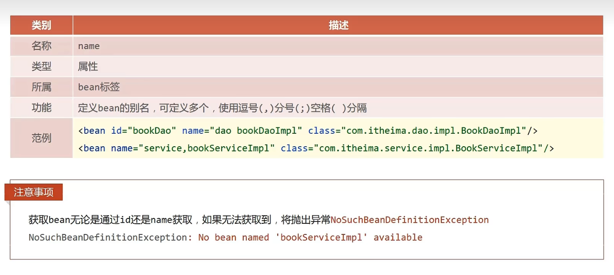

`more` 主流框架的学习笔记

<!-- more -->


# 基础框架


## Spring Framework

在Spring家族当中，所有的框架都是基于Spring Framework基础上所构建的。


### 系统架构


### 容器（Core Container）

#### 核心概念

###### IoC（控制反转）

现在写代码现状，在类里面写其他类的创建。会导致代码耦合度的增加。**IoC（控制反转）**在使用对象的时候，不再需要程序主动使用new创建对象，转换为**由外部提供**对象

- IoC容器

在Spring中，对IoC思想进行了实现。提供了一个容器，叫做**IoC**容器。

- Bean

其中IoC容器负责对象的创建，被创建或被管理的对象在IoC容器中称为**Bean**

- 依赖注入（DI）

在容器中，建立bean和bean之间的依赖关系的整个过程，叫做**依赖注入**


#### IoC容器 代码实现

- pom导入坐标

```xml
<dependency>
  <groupId>org.springframework</groupId>
  <artifactId>spring-context</artifactId>
  <version>5.2.10.RELEASE</version>
</dependency>
```

- 在src/main/resources 添加Spring-config的xml文件，添加自己的Bean

```xml
<bean id="bookDao" class="com.zyb.dao.impl.BookDaoImpl"></bean>
<bean id="BookService" class="com.zyb.service.impl.BookServiceLipl"></bean>
```

- 在Java代码中，创建出IoC容器。使用Bean来进行获取对象

```java
//        创建IoC容器,加载配置文件。获得容器对象
        ApplicationContext applicationContext = new ClassPathXmlApplicationContext("applicationContext.xml");
//        获取资源
        BookService bookService = (BookService) applicationContext.getBean("BookService");
        bookService.save();
```


#### DI（依赖导入 ）代码实现

- 基于IoC管理bean
- 所需要绑定的bean中，提供一个set对象的方法，等待容器将bean中的对象写入进去

```java
public void setBookDao(BookDao bookDao) {
    this.bookDao = bookDao;
}
```

- 使用配置的方法，将对象写入进去

```xml
<bean id="BookService" class="com.zyb.service.impl.BookServiceLipl">
    <!--
        使用property配置servlet和dao的关系
    -->
    <property name="bookDao" ref="bookDao"></property>
</bean>
```


#### bean

###### bean的别名

可以通过在`bean`标签下，使用name关键字，去定义新的名字，有效范围大。在property中也可以使用别名获取

如果没有获取到指定的bean，那么会报错。`NoSuchBeanDefinitionException`



###### bean的作用范围

在默认情况下，Spring创建对象是**单例**的。可以在配置文件中，使用scope进行修改。

默认`singleton`单例，`prototype`多例

- Spring理论来说，bean都是存放一些可以服用的对象。是单例也是可以的。
  - 表现层对象
  - 业务层对象
  - 数据层对象
  - 工具类对象
  - 封装实体类的对象（不适合进行Bean进行管理）


###### 实例化Bean的方法

```java
// 以下实例化Bean的方法，都是用的是该IoC容器
ApplicationContext ctx = new ClassPathXmlApplicationContext("applicationContext.xml");
```


- 构造方法（常用）

  - 配置文件Bean配置

  ```xml
  <!--方式一：构造方法实例化bean-->
  <bean id="bookDao" class="com.itheima.dao.impl.BookDaoImpl"/>
  ```

  - 创建Bean

  ```java
  BookDao bookDao = (BookDao) ctx.getBean("bookDao");
  ```

- 静态工厂(了解)

  - 静态工厂

  ```java
  //静态工厂创建对象
  public class OrderDaoFactory {
      public static OrderDao getOrderDao(){
          System.out.println("factory setup....");
          return new OrderDaoImpl();
      }
  }
  ```

  - 配置Bean

  ```xml
  <!--方式二：使用静态工厂实例化bean-->
  <bean id="orderDao" class="com.itheima.factory.OrderDaoFactory" factory-method="getOrderDao"/>
  ```

  - 使用Bean获取对象

  ```java
  OrderDao orderDao = (OrderDao) ctx.getBean("orderDao");
  ```

  

- 实例工厂(通过实现FacoryBean接口，来进行实例操作和修改创建出来时否时单例多例)

  - 在工厂中，实现FacoryBean接口

  ```java
  //FactoryBean创建对象
  public class UserDaoFactoryBean implements FactoryBean<UserDao> {
      //代替原始实例工厂中创建对象的方法
      public UserDao getObject() throws Exception {
          return new UserDaoImpl();
      }
  
      public Class<?> getObjectType() {
          return UserDao.class;
      }
  
  }
  ```
  
  - 配置文件中，可以直接对Bean进行配置。相对于普通的方式来说
  
  ```java
  <!--方式四：使用FactoryBean实例化bean-->
  <bean id="userDao" class="com.itheima.factory.UserDaoFactoryBean"/>
  ```
  
  - 创建Bean
  
  ```java
  // 默认指向同一个地址
  UserDao userDao1 = (UserDao) ctx.getBean("userDao");
  UserDao userDao2 = (UserDao) ctx.getBean("userDao");
  System.out.println(userDao1);
  System.out.println(userDao2);
  ```
  
  

###### Bean的生命周期

Bean的生命周期分为init（初始化），destory（销毁）


**在实现类中定义init和destory方法**

```java
public void init(){
        System.out.println("BookDao Bean Init....");
    }

public void destory(){
        System.out.println("BookDao Bean destory....");
    }
```


**通过配置Bean来进行指向**

```java
<bean id="bookDao" class="com.itheima.dao.impl.BookDaoImpl" init-method="init" destroy-method="destory" />
```


**配置运行需要注册注销钩子或者手动关闭容器，才能够执行destory方法**

```java
// 注册钩子，让虚拟机知道在虚拟机关闭的时候，需要关闭容器
ctx.registerShutdownHook();

// 手动关闭容器，需要使用ClassPathXmlApplicationContext创建容器，因ApplicationContext中没有close方法
ctx.close();
```


**使用Spirng接口，就不用在配置Bean自己指向init和destroy方法**

```java
// 使用InitializingBean , DisposableBean接口，并实现他们的方法。
public void destroy() throws Exception {
        System.out.println("Servlet destroy...");
    }

public void afterPropertiesSet() throws Exception {
        System.out.println("Servlet Init....");
    }
```


#### 依赖注入

为Spring中管理对象之间的依赖关系，是一个设计模式。可以使用以下的注入方式进行注入。**两个本质是就是property和constructor-arg**。自己开发还是推荐使用Setter注入

###### Setter和构造方法注入

- Setter（需要在实现类中，提供对应的setter方法）

  - 引用类型

  ```java
  // 对id为bookService，实现类为BookServielceImpl注入依赖
  <bean id="bookService" class="com.itheima.service.impl.BookServiceImpl">
      	// name后面指向的是Set方法，ref指向的是Bean
          <property name="bookDao" ref="bookDao" />
          <property name="userDao" ref="bookUser"/>
  </bean>
  ```

  - 普通类型

  ```java
  // 对id为bookDao，实现类为BookDaoImpl注入依赖
  <bean id="bookDao" class="com.itheima.dao.impl.BookDaoImpl">
      // name同理，指向的是实现类中，Set的方法。value直接是注入的值
      <property name="connectionNum" value="10"></property>
      <property name="databaseName" value="mysql"></property>
  </bean>
  ```

- 构造方法（在实现类通过构造方法进行注入）

  - 引用类型

  ```java
  <bean id="bookService" class="com.itheima.service.impl.BookServiceImpl">
          <constructor-arg name="bookDao" ref="bookDao"></constructor-arg>
          <constructor-arg name="userDao" ref="userDao"></constructor-arg>
  </bean>
  ```

  - 普通类型

  ```java
  <bean id="bookDao" class="com.itheima.dao.impl.BookDaoImpl">
          <constructor-arg name="connectionNum" value="10"></constructor-arg>
          <constructor-arg name="databaseName" value="mysql"></constructor-arg>
  </bean>
  ```

  

###### 自动注入

对Bean进行设置的时候，使用autowire属性自动进行装配。可根据类型（byType）或者根据名称（byName）

```java
// 自行对Bean进行注入，根据类型进行
<bean id="bookService" class="com.itheima.service.impl.BookServiceImpl" autowire="byType">
```


###### 集合注入

以下举例都是通过的Setter方法进行实现，其中**name**和Setter方法名字一致。

- 数组注入、

```java
<property name="array">
    <array>
        <value>100</value>
        <value>200</value>
        <value>300</value>
    </array>
</property>
```

- 集合注入

```java
<property name="list">
    <list>
        <value>itcast</value>
        <value>itheima</value>
        <value>boxuegu</value>
        <value>chuanzhihui</value>
    </list>
</property>
```

- Set集合注入

```java
<property name="set">
    <set>
        <value>itcast</value>
        <value>itheima</value>
        <value>boxuegu</value>
        <value>boxuegu</value>
    </set>
</property>
```

- Map集合注入

```java
<property name="map">
    <map>
        <entry key="country" value="china"/>
        <entry key="province" value="henan"/>
        <entry key="city" value="kaifeng"/>
    </map>
</property>
```

- Properties注入

```java
<property name="properties">
    <props>
        <prop key="country">china</prop>
        <prop key="province">henan</prop>
        <prop key="city">kaifeng</prop>
    </props>
</property>
```


#### 实际运用

###### 使用Spring中的Bean管理druid和c3p0

######## pom文件导入

```xml
<dependency>
            <groupId>org.springframework</groupId>
            <artifactId>spring-context</artifactId>
            <version>5.2.10.RELEASE</version>
        </dependency>
        <dependency>
            <groupId>com.alibaba</groupId>
            <artifactId>druid</artifactId>
            <version>1.1.16</version>
        </dependency>
        <dependency>
            <groupId>c3p0</groupId>
            <artifactId>c3p0</artifactId>
            <version>0.9.1.2</version>
        </dependency>
        <dependency>
            <groupId>mysql</groupId>
            <artifactId>mysql-connector-java</artifactId>
            <version>5.1.47</version>
</dependency>
```

######## Bean配置

```java
<bean id="dataSource" class="com.alibaba.druid.pool.DruidDataSource">
    <property name="driverClassName" value="com.mysql.jdbc.Driver"></property>
    <property name="url" value="jdbc:mysql://localhost:3306/spring_db"></property>
    <property name="username" value="root"></property>
    <property name="password" value="123456"></property>
</bean>
<bean id="c3p0" class="com.mchange.v2.c3p0.ComboPooledDataSource">
    <property name="driverClass" value="com.mysql.jdbc.Driver"></property>
    <property name="jdbcUrl" value="jdbc:mysql://localhost:3306/spring_db"></property>
    <property name="user" value="root"></property>
    <property name="password" value="123456"></property>
</bean>
```

######## main方法的使用

```java
// 创建一个容器
ApplicationContext ctx = new ClassPathXmlApplicationContext("applicationContext.xml");
// 使用配置好的Bean进行实例化
DataSource dataSource = (DataSource) ctx.getBean("dataSource");
DataSource dataSource1 = (DataSource) ctx.getBean("c3p0");
// 输出对应的值
System.out.println(dataSource);
System.out.println(dataSource1);
```


###### 加载properties文件

**properties**文件是存放在resources目录下的配置文件

- 开启context命名空间


- 使用context加载指定的properties文件

```xml
// system-properties-mode是不加载系统的变量，有时候会冲突。比如username是你Windows的用户名
<context:property-placeholder location="jdbc.properties" system-properties-mode="NEVER"/>
// 加载所有包括项目其他jar包中的的properties的文件，去掉前面那个*，就只是在当前的项目中读取
<context:property-placeholder location="classpath*:*.properties" system-properties-mode="NEVER"/>
```

- 使用${}读取加载的属性值

```xml
<bean id="dataSource" class="com.alibaba.druid.pool.DruidDataSource">
    <property name="driverClassName" value="${jdbc.driver}"/>
    <property name="url" value="j${jdbc.url}"/>
    <property name="username" value="${jdbc.username}"/>
    <property name="password" value="${jdbc.password}"/>
</bean>
```


#### 内容补充（了解）


###### 加载容器的两个方式

```java
//1.加载类路径下的配置文件
ApplicationContext ctx = new ClassPathXmlApplicationContext("applicationContext.xml");
//2.从文件系统下加载配置文件 绝对路径
ApplicationContext ctx = newFileSystemXmlApplicationContext("D:\\workspace\\spring\\spring_10_container\\src\\main\\resources\\applicationContext.xml");
```

 

###### 获取Bean

```java
// 需要强转，繁琐
BookDao bookDao = (BookDao) ctx.getBean("bookDao");
// 把强转的步骤放到了后面
BookDao bookDao = ctx.getBean("bookDao",BookDao.class);
// 自动装配，直接指定class
BookDao bookDao = ctx.getBean(BookDao.class);
```


###### 关于容器类的层级关系


> 使用BeanFactory接口创建的容器，Bean都是懒加载。不会在**创建容器的时候实例化对象**。所有Bean**延迟加载**
>
> 在使用ClassPathXmlApplicationContext创建容器的时候，在创建容器的时候，就会进行对象的实例化。


#### 注解开发（重点）

使用注解的方法去进行开发

###### 自定义Bean

可以在实现类的上放直接使用注解进行定义

- @Component
  - @Controller（业务层）
  - @Service（服务层）
  - @Repository（数据层）

- <context:component-scan />（定义在配置文件中，base-package扫描包下的 注解）

```java
@Service
public class BookServiceImpl implements BookService {
	// 以上注解使用时需要指定到.class类型
}

@Repository("bookDao")
public class BookDaoImpl implements BookDao {
	// 以上注解可以指定到指定自己定义的内容
}
```


###### 纯注解开发

- 编写一个类，作用就是替代了之前的配置文件（applicationContext.xml）

```java
//声明当前类为Spring配置类
@Configuration
//设置bean扫描路径，多个路径书写为字符串数组格式
@ComponentScan({"com.itheima.service","com.itheima.dao"})
public class SpringConfig {
	
}
```


- 创建容器（使用的是AnnotationConfigApplicationContext实现类）

```java
// 使用纯注解的方式去创建一个容器
ApplicationContext ctx = new AnnotationConfigApplicationContext(SpringConfig.class);
```


- Bean的生命周期和作用范围

```java
@Repository
//@Scope设置bean的作用范围
@Scope("singleton")
public class BookDaoImpl implements BookDao {
    public void save() {
        System.out.println("book dao save ...");
    }
    //@PostConstruct设置bean的初始化方法
    @PostConstruct
    public void init() {
        System.out.println("init ...");
    }
    //@PreDestroy设置bean的销毁方法
    @PreDestroy
    public void destroy() {
        System.out.println("destroy ...");
    }
}
```


- **依赖注入**
  - 无需提供Setter方法了，使用的是反射，进行暴力访问私有属性的值。
  - 注入引用类型的时候，需要提供对应的无参构造方法

```java
//@Autowired：注入引用类型，自动装配模式，默认按类型装配
@Autowired
//@Qualifier：自动装配bean时按bean名称装配
@Qualifier("bookDao")
private BookDao bookDao;
```

```java
@Repository("bookDao")
public class BookDaoImpl implements BookDao {
    //@Value：注入简单类型（无需提供set方法），${name}来源于properties文件，具体如何加载看下一节点。加载后可以直接进行使用
    @Value("${name}")
    private String name;
    public void save() {
        System.out.println("book dao save ..." + name);
    }
}
```


- 加载properties文件

```java
@Configuration
@ComponentScan("com.itheima")
//@PropertySource加载properties配置文件，不支持通配符
@PropertySource({"jdbc.properties"})
public class SpringConfig {
}
```


- 第三方Bean管理

在配置目录下，创建一个类。里面使用properties数据读取的方式。**@Bean注解**，创建一个方法将创建好的对象返回出来。类似于工厂的形式。建议使用独立的配置类管理配置类进行管理

**依赖注入**

引用类型：直接使用形参的方式

简单类型：成员变量

```java
public class JdbcConfig {
    //1.定义一个方法获得要管理的对象
    @Value("com.mysql.jdbc.Driver")
    private String driver;
    @Value("jdbc:mysql://localhost:3306/spring_db")
    private String url;
    @Value("root")
    private String userName;
    @Value("root")
    private String password;
    //2.添加@Bean，表示当前方法的返回值是一个bean
    //@Bean修饰的方法，形参根据类型自动装配
    @Bean
    public DataSource dataSource(BookDao bookDao){
        System.out.println(bookDao);
        DruidDataSource ds = new DruidDataSource();
        ds.setDriverClassName(driver);
        ds.setUrl(url);
        ds.setUsername(userName);
        ds.setPassword(password);
        return ds;
    }
}
```


在Spring配置类中，导入这个类。

@Import加载具体的类信息只能够书写一次，需要导入多个使用数组的形式进行编写。

@ComponentScan扫描指定包下的配置文件，**不推荐使用**。看不出具体使用的类有哪些，并且使用Bean需要添加@Configuration注解

```java
// 加载itheima的包，加载对应的bean，上面的形参才能自动装配
@Configuration
@ComponentScan("com.itheima")
//@Import:导入配置信息
@Import({JdbcConfig.class})
public class SpringConfig {
    
}
```


#### Mybatis整合

要使用Spring进行结合，那么就要使用Bean来管理**SqlSessionFactoryBean**和**MapperScannerConfigurer**。

###### pom导入依赖

```xml
<dependency>
  <groupId>org.springframework</groupId>
  <artifactId>spring-context</artifactId>
  <version>5.2.10.RELEASE</version>
</dependency>
<dependency>
    
  <groupId>com.alibaba</groupId>
  <artifactId>druid</artifactId>
  <version>1.1.16</version>
</dependency>

<dependency>
  <groupId>org.mybatis</groupId>
  <artifactId>mybatis</artifactId>
  <version>3.5.6</version>
</dependency>

<dependency>
  <groupId>mysql</groupId>
  <artifactId>mysql-connector-java</artifactId>
  <version>5.1.47</version>
</dependency>

<dependency>
  <groupId>org.springframework</groupId>
  <artifactId>spring-jdbc</artifactId>
  <version>5.2.10.RELEASE</version>
</dependency>

<!-- 用于整合Spring和Mybatis的快速整合，可以快速创建SqlSessionFactoryBean和MapperScannerConfigurer-->
<dependency>
  <groupId>org.mybatis</groupId>
  <artifactId>mybatis-spring</artifactId>
  <version>1.3.0</version>
</dependency>
```


###### Spring开发配置

- 创建对应的配置类

  - SpringConfig（配置类，用来加载其他配置类和读取properties文件的，扫描包中的Bean）

  ```java
  @Configuration
  @ComponentScan("com.itheima")
  @PropertySource("jdbc.properties")
  @Import({JdbcConfig.class , MybatisConfig.class})
  public class SpringConfig {
  
  }
  ```

  - JdbcConfig（定义返回DataSourceBean对象）

  ```java
  public class JdbcConfig {
      @Value("${jdbc.driver}")
      private String driver;
      @Value("${jdbc.url}")
      private String url;
      @Value("${jdbc.username}")
      private String userName;
      @Value("${jdbc.password}")
      private String password;
  
      @Bean
      public DataSource dataSource() {
          DruidDataSource ds = new DruidDataSource();
          ds.setDriverClassName(driver);
          ds.setUrl(url);
          ds.setUsername(userName);
          ds.setPassword(password);
          return ds;
      }
  }
  ```

  - MybatisConfig（定义返回SqlSessionFactoryBean和MapperScannerConfigurer对象的两个Bean）

  ```java
  public class MybatisConfig {
      //定义bean，SqlSessionFactoryBean，用于产生SqlSessionFactory对象
      @Bean
      public SqlSessionFactoryBean sqlSessionFactory(DataSource dataSource){
          SqlSessionFactoryBean ssfb = new SqlSessionFactoryBean();
          ssfb.setTypeAliasesPackage("com.itheima.domain");
          // 将创建好返回DataSource的Bean注入里面，进行使用
          ssfb.setDataSource(dataSource);
          return ssfb;
      }
      //定义bean，返回MapperScannerConfigurer对象
      @Bean
      public MapperScannerConfigurer mapperScannerConfigurer(){
          MapperScannerConfigurer msc = new MapperScannerConfigurer();
          msc.setBasePackage("com.itheima.dao");
          return msc;
      }
  }
  ```

  - 在主函数中，直接创建IoC池。进行使用。

```java
public class App2 {
    public static void main(String[] args) {
        ApplicationContext ctx = new AnnotationConfigApplicationContext(SpringConfig.class);
        AccountService bean = ctx.getBean(AccountService.class);
        System.out.println(bean.findById(2));
    }
}
```


#### JUnit整合

###### pom导入依赖

```
// 导入JUnit
<dependency>
      <groupId>junit</groupId>
      <artifactId>junit</artifactId>
      <version>4.12</version>
      <scope>test</scope>
</dependency>

// Spring整合JUnit的包
<dependency>
  <groupId>org.springframework</groupId>
  <artifactId>spring-test</artifactId>
  <version>5.2.10.RELEASE</version>
</dependency>
```

###### 创建测试类

```java
// 设置类运行器
@RunWith(SpringJUnit4ClassRunner.class)
//设置Spring环境对应的配置类
@ContextConfiguration(classes = SpringConfig.class)
public class text {
	// 支持自动装配注入bean
    @Autowired
    private AccountService accountService;

    @Test
    public void testFindById(){
        System.out.println(accountService.findById(1));
    }
}
```


### AOP

#### 简介

> 面向切面编程，一种编程范式。指导开发者如何组织结构。
>
> **在不惊动原有的设计的基础上，为其增加功能**
>
> 
