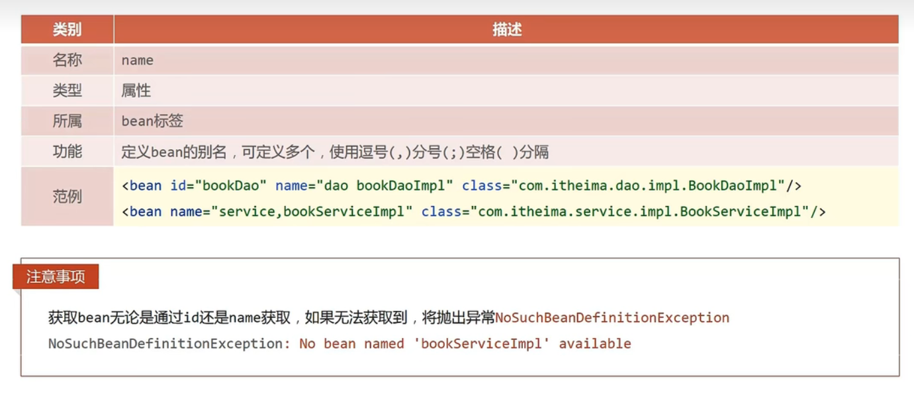
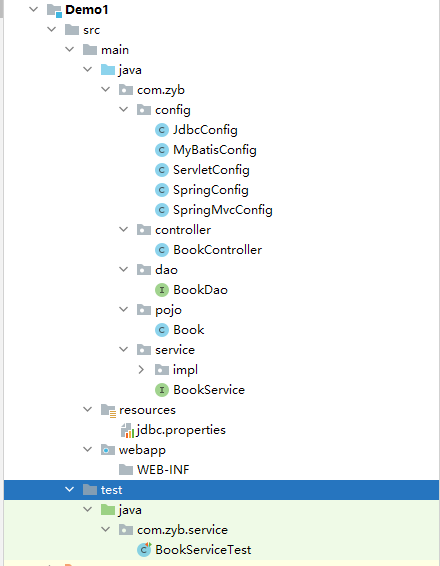

`more` 主流框架的学习笔记

<!-- more -->


# 基础框架


## Spring Framework

在Spring家族当中，所有的框架都是基于Spring Framework基础上所构建的。


### 系统架构


### 容器（Core Container）

#### 核心概念

 ###### IoC（控制反转）

现在写代码现状，在类里面写其他类的创建。会导致代码耦合度的增加。**IoC（控制反转）**在使用对象的时候，不再需要程序主动使用new创建对象，转换为**由外部提供**对象

- IoC容器

在Spring中，对IoC思想进行了实现。提供了一个容器，叫做**IoC**容器。

- Bean

其中IoC容器负责对象的创建，被创建或被管理的对象在IoC容器中称为**Bean**

- 依赖注入（DI）

在容器中，建立bean和bean之间的依赖关系的整个过程，叫做**依赖注入**


#### IoC容器 代码实现

- pom导入坐标

```xml
<dependency>
  <groupId>org.springframework</groupId>
  <artifactId>spring-context</artifactId>
  <version>5.2.10.RELEASE</version>
</dependency>
```

- 在src/main/resources 添加Spring-config的xml文件，添加自己的Bean

```xml
<bean id="bookDao" class="com.zyb.dao.impl.BookDaoImpl"></bean>
<bean id="BookService" class="com.zyb.service.impl.BookServiceLipl"></bean>
```

- 在Java代码中，创建出IoC容器。使用Bean来进行获取对象

```java
//        创建IoC容器,加载配置文件。获得容器对象
        ApplicationContext applicationContext = new ClassPathXmlApplicationContext("applicationContext.xml");
//        获取资源
        BookService bookService = (BookService) applicationContext.getBean("BookService");
        bookService.save();
```


#### DI（依赖导入 ）代码实现

- 基于IoC管理bean
- 所需要绑定的bean中，提供一个set对象的方法，等待容器将bean中的对象写入进去

```java
public void setBookDao(BookDao bookDao) {
    this.bookDao = bookDao;
}
```

- 使用配置的方法，将对象写入进去

```xml
<bean id="BookService" class="com.zyb.service.impl.BookServiceLipl">
    <!--
        使用property配置servlet和dao的关系
    -->
    <property name="bookDao" ref="bookDao"></property>
</bean>
```


#### bean

###### bean的别名

可以通过在`bean`标签下，使用name关键字，去定义新的名字，有效范围大。在property中也可以使用别名获取

如果没有获取到指定的bean，那么会报错。`NoSuchBeanDefinitionException`


###### bean的作用范围

在默认情况下，Spring创建对象是**单例**的。可以在配置文件中，使用scope进行修改。

默认`singleton`单例，`prototype`多例

- Spring理论来说，bean都是存放一些可以服用的对象。是单例也是可以的。
  - 表现层对象
  - 业务层对象
  - 数据层对象
  - 工具类对象
  - 封装实体类的对象（不适合进行Bean进行管理）




###### 实例化Bean的方法

```java
// 以下实例化Bean的方法，都是用的是该IoC容器
ApplicationContext ctx = new ClassPathXmlApplicationContext("applicationContext.xml");
```


- 构造方法（常用）

  - 配置文件Bean配置

  ```xml
  <!--方式一：构造方法实例化bean-->
  <bean id="bookDao" class="com.itheima.dao.impl.BookDaoImpl"/>
  ```

  - 创建Bean

  ```java
  BookDao bookDao = (BookDao) ctx.getBean("bookDao");
  ```

- 静态工厂(了解)

  - 静态工厂

  ```java
  //静态工厂创建对象
  public class OrderDaoFactory {
      public static OrderDao getOrderDao(){
          System.out.println("factory setup....");
          return new OrderDaoImpl();
      }
  }
  ```

  - 配置Bean

  ```xml
  <!--方式二：使用静态工厂实例化bean-->
  <bean id="orderDao" class="com.itheima.factory.OrderDaoFactory" factory-method="getOrderDao"/>
  ```

  - 使用Bean获取对象

  ```java
  OrderDao orderDao = (OrderDao) ctx.getBean("orderDao");
  ```

  

- 实例工厂(通过实现FacoryBean接口，来进行实例操作和修改创建出来时否时单例多例)

  - 在工厂中，实现FacoryBean接口

  ```java
  //FactoryBean创建对象
  public class UserDaoFactoryBean implements FactoryBean<UserDao> {
      //代替原始实例工厂中创建对象的方法
      public UserDao getObject() throws Exception {
          return new UserDaoImpl();
      }
  
      public Class<?> getObjectType() {
          return UserDao.class;
      }
  
  }
  ```
  
  - 配置文件中，可以直接对Bean进行配置。相对于普通的方式来说
  
  ```java
  <!--方式四：使用FactoryBean实例化bean-->
  <bean id="userDao" class="com.itheima.factory.UserDaoFactoryBean"/>
  ```
  
  - 创建Bean
  
  ```java
  // 默认指向同一个地址
  UserDao userDao1 = (UserDao) ctx.getBean("userDao");
  UserDao userDao2 = (UserDao) ctx.getBean("userDao");
  System.out.println(userDao1);
  System.out.println(userDao2);
  ```
  
  

###### Bean的生命周期

Bean的生命周期分为init（初始化），destory（销毁）


**在实现类中定义init和destory方法**

```java
public void init(){
        System.out.println("BookDao Bean Init....");
    }

public void destory(){
        System.out.println("BookDao Bean destory....");
    }
```


**通过配置Bean来进行指向**

```java
<bean id="bookDao" class="com.itheima.dao.impl.BookDaoImpl" init-method="init" destroy-method="destory" />
```


**配置运行需要注册注销钩子或者手动关闭容器，才能够执行destory方法**

```java
// 注册钩子，让虚拟机知道在虚拟机关闭的时候，需要关闭容器
ctx.registerShutdownHook();

// 手动关闭容器，需要使用ClassPathXmlApplicationContext创建容器，因ApplicationContext中没有close方法
ctx.close();
```


**使用Spirng接口，就不用在配置Bean自己指向init和destroy方法**

```java
// 使用InitializingBean , DisposableBean接口，并实现他们的方法。
public void destroy() throws Exception {
        System.out.println("Servlet destroy...");
    }

public void afterPropertiesSet() throws Exception {
        System.out.println("Servlet Init....");
    }
```


#### 依赖注入

为Spring中管理对象之间的依赖关系，是一个设计模式。可以使用以下的注入方式进行注入。**两个本质是就是property和constructor-arg**。自己开发还是推荐使用Setter注入

###### Setter和构造方法注入

- Setter（需要在实现类中，提供对应的setter方法）

  - 引用类型

  ```java
  // 对id为bookService，实现类为BookServielceImpl注入依赖
  <bean id="bookService" class="com.itheima.service.impl.BookServiceImpl">
      	// name后面指向的是Set方法，ref指向的是Bean
          <property name="bookDao" ref="bookDao" />
          <property name="userDao" ref="bookUser"/>
  </bean>
  ```

  - 普通类型

  ```java
  // 对id为bookDao，实现类为BookDaoImpl注入依赖
  <bean id="bookDao" class="com.itheima.dao.impl.BookDaoImpl">
      // name同理，指向的是实现类中，Set的方法。value直接是注入的值
      <property name="connectionNum" value="10"></property>
      <property name="databaseName" value="mysql"></property>
  </bean>
  ```

- 构造方法（在实现类通过构造方法进行注入）

  - 引用类型

  ```java
  <bean id="bookService" class="com.itheima.service.impl.BookServiceImpl">
          <constructor-arg name="bookDao" ref="bookDao"></constructor-arg>
          <constructor-arg name="userDao" ref="userDao"></constructor-arg>
  </bean>
  ```

  - 普通类型

  ```java
  <bean id="bookDao" class="com.itheima.dao.impl.BookDaoImpl">
          <constructor-arg name="connectionNum" value="10"></constructor-arg>
          <constructor-arg name="databaseName" value="mysql"></constructor-arg>
  </bean>
  ```

  

###### 自动注入

对Bean进行设置的时候，使用autowire属性自动进行装配。可根据类型（byType）或者根据名称（byName）

```java
// 自行对Bean进行注入，根据类型进行
<bean id="bookService" class="com.itheima.service.impl.BookServiceImpl" autowire="byType">
```


###### 集合注入

以下举例都是通过的Setter方法进行实现，其中**name**和Setter方法名字一致。

- 数组注入、

```java
<property name="array">
    <array>
        <value>100</value>
        <value>200</value>
        <value>300</value>
    </array>
</property>
```

- 集合注入

```java
<property name="list">
    <list>
        <value>itcast</value>
        <value>itheima</value>
        <value>boxuegu</value>
        <value>chuanzhihui</value>
    </list>
</property>
```

- Set集合注入

```java
<property name="set">
    <set>
        <value>itcast</value>
        <value>itheima</value>
        <value>boxuegu</value>
        <value>boxuegu</value>
    </set>
</property>
```

- Map集合注入

```java
<property name="map">
    <map>
        <entry key="country" value="china"/>
        <entry key="province" value="henan"/>
        <entry key="city" value="kaifeng"/>
    </map>
</property>
```

- Properties注入

```java
<property name="properties">
    <props>
        <prop key="country">china</prop>
        <prop key="province">henan</prop>
        <prop key="city">kaifeng</prop>
    </props>
</property>
```


#### 实际运用

###### 使用Spring中的Bean管理druid和c3p0

######## pom文件导入

```xml
<dependency>
            <groupId>org.springframework</groupId>
            <artifactId>spring-context</artifactId>
            <version>5.2.10.RELEASE</version>
        </dependency>
        <dependency>
            <groupId>com.alibaba</groupId>
            <artifactId>druid</artifactId>
            <version>1.1.16</version>
        </dependency>
        <dependency>
            <groupId>c3p0</groupId>
            <artifactId>c3p0</artifactId>
            <version>0.9.1.2</version>
        </dependency>
        <dependency>
            <groupId>mysql</groupId>
            <artifactId>mysql-connector-java</artifactId>
            <version>5.1.47</version>
</dependency>
```

######## Bean配置

```java
<bean id="dataSource" class="com.alibaba.druid.pool.DruidDataSource">
    <property name="driverClassName" value="com.mysql.jdbc.Driver"></property>
    <property name="url" value="jdbc:mysql://localhost:3306/spring_db"></property>
    <property name="username" value="root"></property>
    <property name="password" value="123456"></property>
</bean>
<bean id="c3p0" class="com.mchange.v2.c3p0.ComboPooledDataSource">
    <property name="driverClass" value="com.mysql.jdbc.Driver"></property>
    <property name="jdbcUrl" value="jdbc:mysql://localhost:3306/spring_db"></property>
    <property name="user" value="root"></property>
    <property name="password" value="123456"></property>
</bean>
```

######## main方法的使用

```java
// 创建一个容器
ApplicationContext ctx = new ClassPathXmlApplicationContext("applicationContext.xml");
// 使用配置好的Bean进行实例化
DataSource dataSource = (DataSource) ctx.getBean("dataSource");
DataSource dataSource1 = (DataSource) ctx.getBean("c3p0");
// 输出对应的值
System.out.println(dataSource);
System.out.println(dataSource1);
```


###### 加载properties文件

**properties**文件是存放在resources目录下的配置文件

- 开启context命名空间


- 使用context加载指定的properties文件

```xml
// system-properties-mode是不加载系统的变量，有时候会冲突。比如username是你Windows的用户名
<context:property-placeholder location="jdbc.properties" system-properties-mode="NEVER"/>
// 加载所有包括项目其他jar包中的的properties的文件，去掉前面那个*，就只是在当前的项目中读取
<context:property-placeholder location="classpath*:*.properties" system-properties-mode="NEVER"/>
```

- 使用${}读取加载的属性值

```xml
<bean id="dataSource" class="com.alibaba.druid.pool.DruidDataSource">
    <property name="driverClassName" value="${jdbc.driver}"/>
    <property name="url" value="j${jdbc.url}"/>
    <property name="username" value="${jdbc.username}"/>
    <property name="password" value="${jdbc.password}"/>
</bean>
```


#### 内容补充（了解）


###### 加载容器的两个方式

```java
//1.加载类路径下的配置文件
ApplicationContext ctx = new ClassPathXmlApplicationContext("applicationContext.xml");
//2.从文件系统下加载配置文件 绝对路径
ApplicationContext ctx = newFileSystemXmlApplicationContext("D:\\workspace\\spring\\spring_10_container\\src\\main\\resources\\applicationContext.xml");
```

 

###### 获取Bean

```java
// 需要强转，繁琐
BookDao bookDao = (BookDao) ctx.getBean("bookDao");
// 把强转的步骤放到了后面
BookDao bookDao = ctx.getBean("bookDao",BookDao.class);
// 自动装配，直接指定class
BookDao bookDao = ctx.getBean(BookDao.class);
```


###### 关于容器类的层级关系


> 使用BeanFactory接口创建的容器，Bean都是懒加载。不会在**创建容器的时候实例化对象**。所有Bean**延迟加载**
>
> 在使用ClassPathXmlApplicationContext创建容器的时候，在创建容器的时候，就会进行对象的实例化。


#### 注解开发（重点）

使用注解的方法去进行开发

###### 自定义Bean

可以在实现类的上放直接使用注解进行定义

- @Component
  - @Controller（业务层）
  - @Service（服务层）
  - @Repository（数据层）

- <context:component-scan />（定义在配置文件中，base-package扫描包下的 注解）

```java
@Service
public class BookServiceImpl implements BookService {
	// 以上注解使用时需要指定到.class类型
}

@Repository("bookDao")
public class BookDaoImpl implements BookDao {
	// 以上注解可以指定到指定自己定义的内容
}
```


###### 纯注解开发

- 编写一个类，作用就是替代了之前的配置文件（applicationContext.xml）

```java
//声明当前类为Spring配置类
@Configuration
//设置bean扫描路径，多个路径书写为字符串数组格式
@ComponentScan({"com.itheima.service","com.itheima.dao"})
public class SpringConfig {
	
}
```


- 创建容器（使用的是AnnotationConfigApplicationContext实现类）

```java
// 使用纯注解的方式去创建一个容器
ApplicationContext ctx = new AnnotationConfigApplicationContext(SpringConfig.class);
```


- Bean的生命周期和作用范围

```java
@Repository
//@Scope设置bean的作用范围
@Scope("singleton")
public class BookDaoImpl implements BookDao {
    public void save() {
        System.out.println("book dao save ...");
    }
    //@PostConstruct设置bean的初始化方法
    @PostConstruct
    public void init() {
        System.out.println("init ...");
    }
    //@PreDestroy设置bean的销毁方法
    @PreDestroy
    public void destroy() {
        System.out.println("destroy ...");
    }
}
```


- **依赖注入**
  - 无需提供Setter方法了，使用的是反射，进行暴力访问私有属性的值。
  - 注入引用类型的时候，需要提供对应的无参构造方法

```java
//@Autowired：注入引用类型，自动装配模式，默认按类型装配
@Autowired
//@Qualifier：自动装配bean时按bean名称装配
@Qualifier("bookDao")
private BookDao bookDao;
```

```java
@Repository("bookDao")
public class BookDaoImpl implements BookDao {
    //@Value：注入简单类型（无需提供set方法），${name}来源于properties文件，具体如何加载看下一节点。加载后可以直接进行使用
    @Value("${name}")
    private String name;
    public void save() {
        System.out.println("book dao save ..." + name);
    }
}
```


- 加载properties文件

```java
@Configuration
@ComponentScan("com.itheima")
//@PropertySource加载properties配置文件，不支持通配符
@PropertySource({"jdbc.properties"})
public class SpringConfig {
}
```


- 第三方Bean管理

在配置目录下，创建一个类。里面使用properties数据读取的方式。**@Bean注解**，创建一个方法将创建好的对象返回出来。类似于工厂的形式。建议使用独立的配置类管理配置类进行管理

**依赖注入**

引用类型：直接使用形参的方式

简单类型：成员变量

```java
public class JdbcConfig {
    //1.定义一个方法获得要管理的对象
    @Value("com.mysql.jdbc.Driver")
    private String driver;
    @Value("jdbc:mysql://localhost:3306/spring_db")
    private String url;
    @Value("root")
    private String userName;
    @Value("root")
    private String password;
    //2.添加@Bean，表示当前方法的返回值是一个bean
    //@Bean修饰的方法，形参根据类型自动装配
    @Bean
    public DataSource dataSource(BookDao bookDao){
        System.out.println(bookDao);
        DruidDataSource ds = new DruidDataSource();
        ds.setDriverClassName(driver);
        ds.setUrl(url);
        ds.setUsername(userName);
        ds.setPassword(password);
        return ds;
    }
}
```


在Spring配置类中，导入这个类。

@Import加载具体的类信息只能够书写一次，需要导入多个使用数组的形式进行编写。

@ComponentScan扫描指定包下的配置文件，**不推荐使用**。看不出具体使用的类有哪些，并且使用Bean需要添加@Configuration注解

```java
// 加载itheima的包，加载对应的bean，上面的形参才能自动装配
@Configuration
@ComponentScan("com.itheima")
//@Import:导入配置信息
@Import({JdbcConfig.class})
public class SpringConfig {
    
}
```


#### Mybatis整合

要使用Spring进行结合，那么就要使用Bean来管理**SqlSessionFactoryBean**和**MapperScannerConfigurer**。

###### pom导入依赖

```xml
<dependency>
  <groupId>org.springframework</groupId>
  <artifactId>spring-context</artifactId>
  <version>5.2.10.RELEASE</version>
</dependency>
<dependency>
    
  <groupId>com.alibaba</groupId>
  <artifactId>druid</artifactId>
  <version>1.1.16</version>
</dependency>

<dependency>
  <groupId>org.mybatis</groupId>
  <artifactId>mybatis</artifactId>
  <version>3.5.6</version>
</dependency>

<dependency>
  <groupId>mysql</groupId>
  <artifactId>mysql-connector-java</artifactId>
  <version>5.1.47</version>
</dependency>

<dependency>
  <groupId>org.springframework</groupId>
  <artifactId>spring-jdbc</artifactId>
  <version>5.2.10.RELEASE</version>
</dependency>

<!-- 用于整合Spring和Mybatis的快速整合，可以快速创建SqlSessionFactoryBean和MapperScannerConfigurer-->
<dependency>
  <groupId>org.mybatis</groupId>
  <artifactId>mybatis-spring</artifactId>
  <version>1.3.0</version>
</dependency>
```


###### Mybatis配置

在Java目录下，创建以下三个文件夹

- dao（访问数据库的接口方法）

```java
public interface BrandDao {
    // 指定绑定对应的对象映射变量和数据库列名
    @Results({
            @Result(property = "brandName", column = "brand_name"),
            @Result(property = "companyName", column = "company_name")
    })
    @Select("select * from tb_brand")
    List<Brand> selectAll();
}
```

- service（业务逻辑层，实现业务的逻辑）


- pojo（数据图结构映射对象）
- controller（接受用户的请求和响应）


###### Spring开发配置

- 创建对应的配置类

  - SpringConfig（配置类，用来加载其他配置类和读取properties文件的，扫描包中的Bean）

  ```java
  @Configuration
  @ComponentScan("com.itheima")
  @PropertySource("jdbc.properties")
  @Import({JdbcConfig.class , MybatisConfig.class})
  public class SpringConfig {
  	
  }
  ```

  - JdbcConfig（定义返回DataSourceBean对象）

  ```java
  public class JdbcConfig {
      @Value("${jdbc.driver}")
      private String driver;
      @Value("${jdbc.url}")
      private String url;
      @Value("${jdbc.username}")
      private String userName;
      @Value("${jdbc.password}")
      private String password;
  
      @Bean
      public DataSource dataSource() {
          DruidDataSource ds = new DruidDataSource();
          ds.setDriverClassName(driver);
          ds.setUrl(url);
          ds.setUsername(userName);
          ds.setPassword(password);
          return ds;
      }
  }
  ```

  - JDbc.properties文件的书写
  
  ```properties
  jdbc.driver=com.mysql.jdbc.Driver
  jdbc.url=jdbc:mysql://localhost:3306/spring_db?useSSL=false
  jdbc.username=root
  jdbc.password=123456
  ```
  
  - MybatisConfig（定义返回SqlSessionFactoryBean和MapperScannerConfigurer对象的两个Bean）
  
  ```java
  public class MybatisConfig {
      //定义bean，SqlSessionFactoryBean，用于产生SqlSessionFactory对象
      @Bean
      public SqlSessionFactoryBean sqlSessionFactory(DataSource dataSource){
          SqlSessionFactoryBean ssfb = new SqlSessionFactoryBean();
          ssfb.setTypeAliasesPackage("com.itheima.domain");
          // 将创建好返回DataSource的Bean注入里面，进行使用
          ssfb.setDataSource(dataSource);
          return ssfb;
      }
      //定义bean，返回MapperScannerConfigurer对象
      @Bean
      public MapperScannerConfigurer mapperScannerConfigurer(){
          MapperScannerConfigurer msc = new MapperScannerConfigurer();
          msc.setBasePackage("com.itheima.dao");
          return msc;
      }
  }
  ```
  
  - 在主函数中，直接创建IoC池。进行使用。
  
  ```java
  public class App2 {
      public static void main(String[] args) {
          ApplicationContext ctx = new AnnotationConfigApplicationContext(SpringConfig.class);
          AccountService bean = ctx.getBean(AccountService.class);
          System.out.println(bean.findById(2));
      }
  }
  ```
  
  


#### JUnit整合

###### pom导入依赖

```
// 导入JUnit
<dependency>
      <groupId>junit</groupId>
      <artifactId>junit</artifactId>
      <version>4.12</version>
      <scope>test</scope>
</dependency>

// Spring整合JUnit的包
<dependency>
  <groupId>org.springframework</groupId>
  <artifactId>spring-test</artifactId>
  <version>5.2.10.RELEASE</version>
</dependency>
```

###### 创建测试类

```java
// 设置类运行器
@RunWith(SpringJUnit4ClassRunner.class)
//设置Spring环境对应的配置类
@ContextConfiguration(classes = SpringConfig.class)
public class text {
	// 支持自动装配注入bean
    @Autowired
    private AccountService accountService;

    @Test
    public void testFindById(){
        System.out.println(accountService.findById(1));
    }
}
```


### AOP 

#### 简介

> 面向切面编程，一种编程范式。指导开发者如何组织结构。
>
> **在不惊动原有的设计的基础上，为其增加功能**


#### AOP基本入门

##### pom文件依赖导入

```xml
// 导入springframework自动导入AOP依赖，不需要再次导入
<dependency>
  <groupId>org.springframework</groupId>
  <artifactId>spring-context</artifactId>
  <version>5.2.10.RELEASE</version>
</dependency>
<dependency>
  <groupId>org.aspectj</groupId>
  <artifactId>aspectjweaver</artifactId>
  <version>1.9.4</version>
</dependency>
```

##### 创建AOP类

定义切入点和通知，熟悉AOP的注解开发

```java
@Component
// 该类为AOP类
@Aspect
public class MyAdvice {
//    定义切入点
    @Pointcut("execution(void com.itheima.dao.BookDao.update())")
    private void pt(){

    }

//    定义通知，使用注解绑定切入点
    @Before("pt()")
    public void method(){
        System.out.println(System.currentTimeMillis());
    }
}
```

##### 在SpringConfig中开启注解驱动支持

```java
@EnableAspectJAutoProxy
```


#### AOP工作流程

- Spring容器启动
- 读取所有切面配置中的切入点
- 初始化Bean，判定Bean对应的类中方法是否匹配到任意切入点
  - 匹配失败，创建对象
  - 匹配成功，创建原始对象**（目标对象）**，的**代理**对象
- 获取Bean的执行方法
  - 获取Bean，调用方法完成执行，完成操作
  - 获取的Bean是代理对象的时候，根据代理对象的运行模式运行原始方法与增强的内容，完成操作。


#### AOP切点表达式

- 切入点：要进行增强的方法
- 切入点表达式：要进行增强方法的描述方式

##### 基本格式 

- execution(void com.itheima.dao.BookDao.update())
  - 动作关键词
  - 访问修饰符（可省略）
  - 返回值
  - 包名
  - 类名，接口名（尽量使用接口，降低耦合）
  - 方法名
  - 参数
  - 异常名：方法定义抛出指定异常，可以省略


##### 通配符，连续符，匹配子类

- *：至少有一个的任意
- ..：多个连续任意符号，可以独立出现，也可以没有
- +：专用于子类类型


##### 观察书写技巧

看不太明白，可以从后面进行观察


#### 通知类型

- 前置 Before
- 后置 After
- 环绕 Around（重点）

```java
@Around("pt()")
//    依赖于形参ProceedingJoinPoint才能实现对原始方法的调用
    public void aourd(ProceedingJoinPoint proceedingJoinPoint) throws Throwable {
        System.out.println("start");
//    proceedingJoinPoint.proceed();调用原始方法，如有返回值，需要使用Object对象进行接收，并且通过环绕通知return出去
        Object proceed = proceedingJoinPoint.proceed();
        System.out.println("end");
        System.out.println(proceed);
    }
```

- 退出 
- 抛出异常后

**通过ProceedingJoinPoint对象获取到他对应的类型和方法名**

```java
        Signature signature = proceedingJoinPoint.getSignature();
//        类型
        String className = signature.getDeclaringTypeName();
//        方法名 
        String methodName = signature.getName();
```


#### AOP获取通知数据

使用AOP通知方式获取原始通知的**形参，返回值，异常**

- 获取形参（获取出来的形参是一个数组，并且在Around里面可以进行修改，再次将参数传入到主题内容去。程序具有更好的健壮性）

  - Around（ProceedingJoinPoint对象）

  - 其他通知类型 (JoinPoint)

- 获取返回值

  - Around （ProceedingJoinPoint对象中的proceed方法，可以直接进行获取。建议获取后是一个Object对象）
  - AfterReturning

  ```java
  //设置返回后通知获取原始方法的返回值，要求returning属性值必须与方法形参名相同
      @AfterReturning(value = "pt()",returning = "ret")
  // 形参中，如果有JoinPoint必须要在第一个，不然会报错
      public void afterReturning(JoinPoint jp,String ret) {
          System.out.println("afterReturning advice ..."+ret);
  }
  ```

- 获取异常

  - Around （直接使用try catch获取，在catch进行操作）
  - AfterThrowing 

  ```java
  //设置抛出异常后通知获取原始方法运行时抛出的异常对象，要求throwing属性值必须与方法形参名相同
      @AfterThrowing(value = "pt()",throwing = "t")
      public void afterThrowing(Throwable t) {
          System.out.println("afterThrowing advice ..."+t);
      }
  }
  ```


### Spring事务

#### 开启事务的基本操作

- 在业务层的接口上添加Spring事务管理

  ```java
  //配置当前接口方法具有事务
  //一般都是添加到接口上的，为了降低耦合。
  @Transactional
  public void transfer(String out,String in ,Double money) ;
  ```

- 设置事务管理器（JDbcConfig）

```java
//配置事务管理器，mybatis使用的是jdbc事务
@Bean
//使用形参，自动装备dataSource的Bean
public PlatformTransactionManager transactionManager(DataSource dataSource){
    DataSourceTransactionManager transactionManager = new DataSourceTransactionManager();
    // 需要注入dataSource
    transactionManager.setDataSource(dataSource);
    return transactionManager;
}
```

- 开启注解式事务驱动（SpringConfig）

```java
//开启注解式事务驱动
@EnableTransactionManagement
```


**Transcactional设置参数**

事务有两种错误是不会进行回滚事务的，需要自己手动进行添加。IOException（编译异常）


**事务传播行为**


## SpringMVC

他和Servlet技术功能相同，属于Web层开发技术。SpringMVC就是为了**简化**Servlet开发的。 


### SpringMVC快速入门

以下工作在创建工作目录的时候，就是1+N的工作模。N就是主要关注控制器类中的操作。


#### pom文件导入坐标

```xml
<dependency>
  <groupId>javax.servlet</groupId>
  <artifactId>javax.servlet-api</artifactId>
  <version>3.1.0</version>
  <scope>provided</scope>
</dependency>
<dependency>
  <groupId>org.springframework</groupId>
  <artifactId>spring-webmvc</artifactId>
  <version>5.2.10.RELEASE</version>
</dependency>
```

#### 创建SpringMVC控制器类（替代了Servlet功能）

```java
// 专用声明SpringMVC控制器的注解，设定SpringMVC核心控制器
@Controller
public class UserController {
    //    设置当前操作的访问路径
    @RequestMapping("/save")
    //    设置当前操作的返回值类型
    @ResponseBody
    public String save() {
        System.out.println("User save...");
        return ("'module':'springMVC'");
    }
}
```

#### 初始化SpringMVC环境，设定SpringMVC加载对应的Bean

在Java/Config/SpringMvcConfig.java中进行配置

```java
// 表示这是Spring的配置类
@Configuration
// 加载对应的Bean
@ComponentScan("com.zyb.controller")
public class SpringMvcConfig {
}
```

#### 初始化Servlet容器，加载SpringMCV环境，并设置SpringMVC技术处理技术

在Java/Config/ServletContainersInitConfig.java中进行配置

```java
public class ServletContainersInitConfig extends AbstractAnnotationConfigDispatcherServletInitializer {

    /*
     * 继承AbstractAnnotationConfigDispatcherServletInitializer抽象类,可以简化下面的步骤
     * */
    @Override
    protected Class<?>[] getRootConfigClasses() {
        return new Class[]{SpringMvcConfig.class};
    }

    @Override
    protected Class<?>[] getServletConfigClasses() {
        return new Class[]{SpringMvcConfig.class};
    }

    @Override
    protected String[] getServletMappings() {
        return new String[]{"/"};
    }
//    继承

    /*
     * 继承AbstractDispatcherServletInitializer方法,对容器进行创建,和设置请求归SpringMVC管理
     * */
/*    //    配置加载SpringMCV容器配置
    @Override
    protected WebApplicationContext createServletApplicationContext() {
        AnnotationConfigWebApplicationContext annotationConfigWebApplicationContext = new AnnotationConfigWebApplicationContext();
        annotationConfigWebApplicationContext.register(SpringMvcConfig.class);
        return annotationConfigWebApplicationContext;
    }

    //    设置那些请求归SpringMVC管理
    @Override
    protected String[] getServletMappings() {
        return new String[]{"/"};
    }

    @Override
    protected WebApplicationContext createRootApplicationContext() {
        return null;
    }*/
}
```


#### 访问静态资源

在Config包下创建SpringMvcSupport，进行过滤器的配置。通过继承`WebMvcConfigurationSupport`,来进行实现

```java
package com.itheima.config;

import org.springframework.context.annotation.Configuration;
import org.springframework.web.servlet.config.annotation.ResourceHandlerRegistry;
import org.springframework.web.servlet.config.annotation.WebMvcConfigurationSupport;

@Configuration
public class SpringMvcSupport extends WebMvcConfigurationSupport {
    //设置静态资源访问过滤，当前类需要设置为配置类，并被扫描加载
    @Override
    protected void addResourceHandlers(ResourceHandlerRegistry registry) {
        //当访问/pages/????时候，从/pages目录下查找内容
        registry.addResourceHandler("/pages/**").addResourceLocations("/pages/");
        registry.addResourceHandler("/js/**").addResourceLocations("/js/");
        registry.addResourceHandler("/css/**").addResourceLocations("/css/");
        registry.addResourceHandler("/plugins/**").addResourceLocations("/plugins/");
    }
}
```

### 请求和响应

#### 请求

GET的请求值是在连接中的，POST的值是在请求体中的。

##### 获取各种请求参数

- 获取请求参数
  - 变量：**直接在方法上定义形参，使用形参变量进行接收使用。**GET和POST一致
  - 变量：请求数据的名和形参名不一致，在形参前面使用**@RequestParam()**注解进行指定绑定
  - 对象：想那他封装在一个对象当中，只需要形参名和对象的成员变量一致自动封装
  - 对象：对象中有引用数据类型，直接使用**引用数据类型.成员变量**进行封装
  - 集合：使用集合进行填入参数，需要在前面加上@RequestParam
  
- 获取请求JSON数据

  - 添加JSON的坐标

  ```xml
  <dependency>
      <groupId>com.fasterxml.jackson.core</groupId>
      <artifactId>jackson-databind</artifactId>
      <version>2.12.4</version>
  </dependency>
  ```

  - 在SpringMvcConfig中添加有关JSON的注释

  ```java
  // 开启JSON对象，转换为对象的功能
  @EnableWebMvc
  ```

  - 添加对应的方法

  ```java
  @RequestMapping("/listPojoPrarmForJson")
  @ResponseBody
  public String listPojoPrarmForJson(@RequestBody User user){
      System.out.println(user);
      return(user.toString());
  }
  ```

  - 请求中添加JSON的数据的值

  

- 接收日期时间型的方法

```java
	//    接收时间类型
    @RequestMapping("/times")
    @ResponseBody
    //    如果只有一种类型，那么可以不用写注释@DateTimeFormat，有多种时间类型。需要手动书写格式
    public String times(Date date,
                        @DateTimeFormat(pattern = "yyyy-MM-dd") Date date1,
                        @DateTimeFormat(pattern = "yyyy/MM/dd HH:mm:ss") Date date2) {
        System.out.println(date);
        System.out.println(date1);
        System.out.println(date2);
        return "时间测试";
    }
```

##### 处理POST和GET的乱码

- 乱码处理

  - POST

  ```java
  // 在SpringMVC的Config文件中，对方法进行覆写。
  @Override
  protected Filter[] getServletFilters() {
      CharacterEncodingFilter filter = new CharacterEncodingFilter();
      filter.setEncoding("UTF-8");
      return new Filter[]{filter};
  }
  ```

  - GET

  ```java
  // 拿到数据后，进行编码解码的操作
  // 乱码转换
  data = URLDecoder.decode(URLEncoder.encode(data, "ISO-8859-1"),"UTF-8") ;
  ```


#### 响应

`ResponseBody`：设置返回体为响应体

- JSON（直接返回一个对象，`jackson`会自动将Java对象转换为JSON

- 跳转页面（直接返回一个指定的目录字符串。就可以完成跳转）


### REST风格

按照REST风格访问资源时使用行为动作区分资源进行了何种操作。**在使用的时候，最终路径添加**


以上的操作都是**约定**方式，不是规范。可以被打破的。


#### 快速开发

为了简化，controller的书写开发。直接将逻辑判断写在了连接上，通过连接和不同的提交方式，来进行不同的逻辑判断。


**书写格式**

不带参数的

```java
//设置当前请求方法为POST，表示REST风格中的添加操作
@RequestMapping(value = "/users",method = RequestMethod.POST)
@ResponseBody
public String save(){
    System.out.println("user save...");
    return "{'module':'user save'}";
}
```


路径中，带参数的(如果需要携带多个参数，建议使用POST中请求体中携带JSON数据进行数据的交互进行发送)

```java
//设置当前请求方法为DELETE，表示REST风格中的删除操作
//@PathVariable注解用于设置路径变量（路径参数），要求路径上设置对应的占位符，并且占位符名称与方法形参名称相同
@RequestMapping(value = "/users/{id}",method = RequestMethod.DELETE)
@ResponseBody
public String delete(@PathVariable Integer id){
    System.out.println("user delete..." + id);
    return "{'module':'user delete'}";
}
```


**简化方案**

- 将每个方法有的注解，放在类上。比如`@ResponseBody`
- value值中的共同值，也可以提出来。比如`@RequestMapping("/users")`,提交参数直接补上value就好。
- `@RequestMapping(value = "/id",method = RequestMethod.DELETE)`可以简化为`@DeleteMapping(value = "/{id}")`
-  @Controller和@Responsebody可以简化为`@RestController`


#### 拦截器

 **基本入门**

注意事项：对其进行注册的时候，不要忘记SpringMvcConfig中进行扫包。

- 在Controller包下创建拦截器

```java
// 指定包名
package com.zyb.controller.interceptor;

import org.springframework.stereotype.Component;
import org.springframework.web.servlet.HandlerInterceptor;
import org.springframework.web.servlet.ModelAndView;

import javax.servlet.http.HttpServletRequest;
import javax.servlet.http.HttpServletResponse;

// 注册成为Spring中的一个Bean
@Component
public class ProjectInterceptor implements HandlerInterceptor {
    //    请求前
    public boolean preHandle(HttpServletRequest request, HttpServletResponse response, Object handler) throws Exception {
        System.out.println("preHandle...");
    //    请求是否通过拦截器
        return true;
    }

    //    方法后
    // modelAndView：可以读取到页面的信息，进行调整
    public void postHandle(HttpServletRequest request, HttpServletResponse response, Object handler, ModelAndView modelAndView) throws Exception {
        System.out.println("postHandle...");
    }

    //    请求完成后
    // ex:如果处理器出现异常，可以针对异常情况单独处理。但是又了异常处理器这个就没啥用了
    public void afterCompletion(HttpServletRequest request, HttpServletResponse response, Object handler, Exception ex) throws Exception {
        System.out.println("afterCompletion...");
    }
}
```

- 在配置文件中，对拦截器进行注册

```java
package com.zyb.config;

@Configuration
public class SpringMvcSupport extends WebMvcConfigurationSupport {
	// 自动装配已经写好的拦截器，将适用于那些路径
    @Autowired
    private ProjectInterceptor projectInterceptor;

    @Override
    protected void addInterceptors(InterceptorRegistry registry) {
        registry.addInterceptor(projectInterceptor).addPathPatterns("/books","/books/*");
    }
}
```


**简便书写**

可以将注册流程，写在SpringMvcConfig中。（不推荐，侵入性太强了）,如果继承了WebMvcConfigurationSupport类，那么WebMvcConfigurer接口将无法生效。

```java
@Configuration
@ComponentScan({"com.zyb.controller" , "com.zyb.config"})
@EnableWebMvc
public class SpringMvcConfig implements WebMvcConfigurer {
    @Autowired
    private ProjectInterceptor projectInterceptor;

    public void addInterceptors(InterceptorRegistry registry) {
        registry.addInterceptor(projectInterceptor).addPathPatterns("/books","/books/*");
    }
}
```


## SSM整合

### 项目创建



#### 配置文件

- pom.xml

  - 相关的依赖

  ```xml
  <dependencies>
    <dependency>
      <groupId>org.springframework</groupId>
      <artifactId>spring-webmvc</artifactId>
      <version>5.2.10.RELEASE</version>
    </dependency>
  
    <dependency>
      <groupId>org.springframework</groupId>
      <artifactId>spring-jdbc</artifactId>
      <version>5.2.10.RELEASE</version>
    </dependency>
  
    <dependency>
      <groupId>org.springframework</groupId>
      <artifactId>spring-test</artifactId>
      <version>5.2.10.RELEASE</version>
    </dependency>
  
    <dependency>
      <groupId>org.mybatis</groupId>
      <artifactId>mybatis</artifactId>
      <version>3.5.6</version>
    </dependency>
  
    <dependency>
      <groupId>org.mybatis</groupId>
      <artifactId>mybatis-spring</artifactId>
      <version>1.3.0</version>
    </dependency>
  
    <dependency>
      <groupId>mysql</groupId>
      <artifactId>mysql-connector-java</artifactId>
      <version>5.1.47</version>
    </dependency>
  
    <dependency>
      <groupId>com.alibaba</groupId>
      <artifactId>druid</artifactId>
      <version>1.1.16</version>
    </dependency>
  
    <dependency>
      <groupId>junit</groupId>
      <artifactId>junit</artifactId>
      <version>4.12</version>
      <scope>test</scope>
    </dependency>
  
    <dependency>
      <groupId>javax.servlet</groupId>
      <artifactId>javax.servlet-api</artifactId>
      <version>3.1.0</version>
      <scope>provided</scope>
    </dependency>
  
    <dependency>
      <groupId>com.fasterxml.jackson.core</groupId>
      <artifactId>jackson-databind</artifactId>
      <version>2.9.0</version>
    </dependency>
  </dependencies>
  ```

  - 导入插件

  ```xml
  <plugin>
    <groupId>org.apache.tomcat.maven</groupId>
    <artifactId>tomcat7-maven-plugin</artifactId>
    <version>2.1</version>
    <configuration>
      <port>80</port>
      <path>/</path>
    </configuration>
  </plugin>
  ```


- Spring

  - SpringConfig

  ```java
  @Configuration
  @ComponentScan({"com.zyb.service"})
  @PropertySource("classpath:jdbc.properties")
  @Import({JdbcConfig.class,MyBatisConfig.class})
  @EnableTransactionManagement
  public class SpringConfig {
  }
  ```

- MyBatis

  - MyBatisConfig

  ```java
  public class MyBatisConfig {
      @Bean
      public SqlSessionFactoryBean sqlSessionFactoryBean(DataSource dataSource){
          SqlSessionFactoryBean factoryBean = new SqlSessionFactoryBean();
          factoryBean.setDataSource(dataSource);
          factoryBean.setTypeAliasesPackage("com.zyb.pojo");
          return factoryBean;
      }
  
      @Bean
      public MapperScannerConfigurer mapperScannerConfigurer(){
          MapperScannerConfigurer configurer = new MapperScannerConfigurer();
          configurer.setBasePackage("com.zyb.dao");
          return configurer;
      }
  }
  ```

  - JdbcConfig

  ```java
  public class JdbcConfig {
      @Value("${jdbc.driver}")
      private String driver;
      @Value("${jdbc.url}")
      private String url;
      @Value("${jdbc.username}")
      private String username;
      @Value("${jdbc.password}")
      private String password;
  	// 数据库对象
      @Bean
      public DataSource dataSource(){
          DruidDataSource dataSource = new DruidDataSource();
          dataSource.setDriverClassName(driver);
          dataSource.setUrl(url);
          dataSource.setUsername(username);
          dataSource.setPassword(password);
          return dataSource;
      }
  	// 事务配置
      @Bean
      public PlatformTransactionManager transactionManager(DataSource dataSource){
          DataSourceTransactionManager rs = new DataSourceTransactionManager();
          rs.setDataSource(dataSource);
          return rs;
      }
  }
  ```

  - jdbc.properties

  ```properties
  jdbc.driver=com.mysql.jdbc.Driver
  jdbc.url=jdbc:mysql://localhost:3306/ssm_db
  jdbc.username=root
  jdbc.password=123456
  ```

- SpringMVC

  - ServletConfig(tomcat和mvc适配配置)
  
  ```java
  public class ServletConfig extends AbstractAnnotationConfigDispatcherServletInitializer {
      protected Class<?>[] getRootConfigClasses() {
          return new Class[]{SpringConfig.class};
      }
  
      protected Class<?>[] getServletConfigClasses() {
          return new Class[]{SpringMvcConfig.class};
      }
  
      protected String[] getServletMappings() {
          return new String[]{"/"};
      }
  }
  ```
  
  - SpringMvcConfig
  
  ```java
  @Configuration
  @ComponentScan({"com.zyb.controller" , "com.zyb.config"})
  @EnableWebMvc
  public class SpringMvcConfig {
  }
  ```
  
  - SpringMvcSupport(静态资源放行)
  
  ```java
  @Configuration/
  public class SpringMvcSupport extends WebMvcConfigurationSupport {
      @Override
      protected void addResourceHandlers(ResourceHandlerRegistry registry) {
          registry.addResourceHandler("/pages/**").addResourceLocations("/pages/");
          registry.addResourceHandler("/css/**").addResourceLocations("/css/");
          registry.addResourceHandler("/js/**").addResourceLocations("/js/");
          registry.addResourceHandler("/plugins/**").addResourceLocations("/plugins/");
      }
  }
  ```


#### Mybatis注解开发

对表格进行基础的增删改查

```java
public interface BookDao {
    @Insert("insert into tbl_book (type, name, description) VALUES (#{type}, #{name}, #{description})")
    void save(Book book);

    @Update("update tbl_book set type = #{type}, name = #{name}, description = #{description} where id = #{id}")
    void updata(Book book);

    @Delete("delete from tbl_book where id = #{id}")
    void delect(int id);

    @Select("select id, type, name, description from tbl_book where id = #{id}")
    Book getByid(int id);

    @Select("select id, type, name, description from tbl_book")
    List<Book> selectAll();
}
```


#### Controller层

```java
@RestController
@RequestMapping("/books")
public class BookController {

    @Autowired
    private BookService bookService;

    @PostMapping
    public boolean save(@RequestBody Book book) {
        return bookService.save(book);
    }

    @PutMapping
    public boolean updata(@RequestBody Book book) {
        return bookService.updata(book);
    }

    @DeleteMapping("/{id}")
    public boolean delect(@PathVariable int id) {
        return bookService.delect(id);
    }

    @GetMapping("/{id}")
    public Book getByid(@PathVariable int id) {
        System.out.println("getbyid");
        return bookService.getByid(id);
    }

    @GetMapping
    public List<Book> selectAll() {
        return bookService.selectAll();
    }
}
```


#### service层(接口和实现类)

##### 接口

```java
// 开启事务
@Transactional
public interface BookService {
    /**
     * 增加数据
     *
     * @param book
     * @return
     */
    boolean save(Book book);

    /**
     * 修改数据
     *
     * @param book
     * @return
     */
    boolean updata(Book book);

    /**
     * 根据id删除数据
     *
     * @param id
     * @return
     */
    boolean delect(int id);

    /**
     * 根据id查找数据
     *
     * @param id
     */
    Book getByid(int id);

    /**
     * 查找所有数据
     *
     * @return
     */
    List<Book> selectAll();
}
```


##### 实现类

```java
// 创建进IoC池子中
@Service
public class BookServiceImpl implements BookService {
	
    // 自动装配
    @Autowired
    private BookDao bookDao;


    public boolean save(Book book) {
        bookDao.save(book);
        return true;
    }

    public boolean updata(Book book) {
        bookDao.updata(book);
        return true;
    }

    public boolean delect(int id) {
        bookDao.delect(id);
        return true;
    }

    public Book getByid(int id) {
        return bookDao.getByid(id);
    }

    public List<Book> selectAll() {
        return bookDao.selectAll();
    }
}
```


#### 测试类

```java
@RunWith(SpringJUnit4ClassRunner.class)
@ContextConfiguration(classes = SpringConfig.class)
public class BookServiceTest {

    @Autowired
    private BookService bookService;

    @Test
    public void testGetById(){
        Book book = bookService.getByid(1);
        System.out.println(book);
    }

    @Test
    public void testSelectAll(){
        List<Book> books = bookService.selectAll();
        System.out.println(books);
    }
}
```


### REST

表现层的数据封装。是一种数据响应规范，配合前端人员进行使用。

里面可以包含各种请求的返回响应码与内容和返回的内容。响应码包含其中的成功和失败响应码。


### 统一异常处理

将各个层级的异常统一交给**Controller（表现层）**层进行处理，利用AOP思想进行处理

Spring中的解决方案为：**异常处理器**

```java
@RestControllerAdvice
public class ProjectExcptionAdvice {
    // 需要拦截下的异常
    @ExceptionHandler(Exception.class)
    public Result doException(Exception e){
        System.out.println("捕获异常");
        return new Result(null , 666 , "捕获异常") ;
    }
}
```

**此方法，可以根据异常的不同。制作多个自定义异常**

一般有三个分类

- 业务异常（BusinessException）
- 系统异常（SystemException）
- 其他异常(Exception)


**创建自定义异常**

```java
// com/zyb/exception/BusinessException
// 自定义业务异常
public class BusinessException extends RuntimeException{
    private Integer code;

    public Integer getCode() {
        return code;
    }

    public void setCode(Integer code) {
        this.code = code;
    }

    public BusinessException(Integer code, String message) {
        super(message);
        this.code = code;
    }

    public BusinessException(Integer code, String message, Throwable cause) {
        super(message, cause);
        this.code = code;
    }
}
```


**在异常处理器中进行使用**

```java
@RestControllerAdvice
public class ProjectExcptionAdvice {

    @ExceptionHandler(SystemException.class)
    public Result doSystemException(Exception e) {
//       记录日志
//       发送消息运维
//       发送邮件给开发人员
        return new Result(null,Code.SYSTEM_ERR, e.getMessage());
    }
	
    // 上面自定义的自定义异常
    @ExceptionHandler(BusinessException.class)
    public Result doBusinessException(Exception e) {
        return new Result(null,Code.BUSINESS_TIMEOUT_ERR, e.getMessage());
    }
	
    // 其他异常，只要不是自定义异常都由这个异常进行处理
    @ExceptionHandler(Exception.class)
    public Result doException(Exception e){
        return new Result(null , Code.SYSTEM_UNKOWN_ERR , "系统繁忙,请稍后再试.");
    }

}
```


## SpringBoot

简化了Spirng框架的开发。


### Springboot项目

#### 使用阿里云脚手脚手架

- 直接New poject / New Module

https://start.aliyun.com/


#### package成为一个Jar包

maven工程本身可以打包成为一个Jar包，但是不能直接通过java去直接启动服务。需要导入依赖指定到方法

```xml
<plugin>
    <groupId>org.springframework.boot</groupId>
    <artifactId>spring-boot-maven-plugin</artifactId>
</plugin>
```


#### 起步依赖

需要使用什么技术的时候，把对应的起步依赖加入到pom文件中。

- Web

```xml
<dependency>
    <groupId>org.springframework.boot</groupId>
    <artifactId>spring-boot-starter-web</artifactId>
</dependency>
```

- Test

```xml
<dependency>
    <groupId>org.springframework.boot</groupId>
    <artifactId>spring-boot-starter-test</artifactId>
    <scope>test</scope>
</dependency>
```

- Mysql

```xml
<dependency>
    <groupId>com.mysql</groupId>
    <artifactId>mysql-connector-j</artifactId>
    <scope>runtime</scope>
</dependency>
```

- MyBatis

```xml
<dependency>
    <groupId>org.mybatis.spring.boot</groupId>
    <artifactId>mybatis-spring-boot-starter</artifactId>
    <version>2.2.2</version>
</dependency>
```


#### 排除依赖，导入依赖

如果想将指定依赖中的配置排除，可以使用**exclusions**。指定对应的依赖可以将其排除。


#### 读取yal文件中文变量

```yaml
lesson: SpringBoot
server:
port: 80
enterprise:
name: itcast
age: 16
tel: 4006184000
subject:
- Java
- 前端
- 大数据
```


- 直接使用@Value注解进行读取数据

- 使用Environment对象可以直接获取到配置文件中的变量

- 实体类进行封装**（需掌握）**

  - 实体类交给Spring进行管理添加 @Component 注解

  - 使用 @ConfigurationProperties 注解表示加载配置文件

    在该注解中也可以使用 prefix 属性指定只加载指定前缀的数据

  ```java
  @Component
  @ConfigurationProperties(prefix = "enterprise")
  public class Enterprise {
      // 成员变量和Get Set方法 以及toString
  }
  ```

  

### 基础配置

配置文件分为三种，一种是properties，yml，yaml（生效优先级也是如顺序）


#### 配置日志信息

可以在设置里面进行配置

```yaml
logging:
	level:
		root: info
```


#### 多环境配置

- yal文件设置

```yaml
#设置启用的环境
spring:
  profiles:
    active: pro
---
#开发
spring:
  profiles: dev
server:
    port: 80
---
#生产
spring:
  profiles: pro
server:
  port: 81
---
#测试
spring:
  profiles: test
server:
  port: 82
---
```

- properties文件设置


- 命令行启动参数设置

当配置文件被打包在jar包中，可以通过命令行的方式进行指定

```
java -jar springboot_demo1-0.0.1-SNAPSHOT.jar --server.port=8980
```

- 文件配置、

就算打包成jar后，也可以使用在项目中创建application.yml进行配置，或者最高级config/中的文件，存于本地


### 整合junnit

直接将需要测试的方法，自动装配到test方法中。有一个前提就是：需要再同一个包中，否则需要使用使用 classes 属性指定引导类的字节码对象。如 @SpringBootTest(classes = Springboot07TestApplication.class)

- 别忘了把测试的方法（实现类）交给Spring来进行管理


### 整合MyBatis

- 创建项目，勾选相关起步依赖


- 定义实体类（pojo）
- 定义dao接口（使用Mybatis注解）
- 测试类（创建test/java）
- 德鲁伊依赖

```xml
<dependency>
	<groupId>com.alibaba</groupId>
	<artifactId>druid</artifactId>
	<version>1.1.16</version>
</dependency>
```

- 编写配置（application.yml）

```yaml
spring:
	datasource:
		driver-class-name: com.mysql.jdbc.Driver
		url: jdbc:mysql://localhost:3306/ssm_db
		username: root
		password: 123456
		# 使用德鲁伊连接池
		type:com.alibaba.druid.pool.DruidDataSource
```


### 补充

> 网页的静态资源，存放在resources/static/中。Springboot默认会自动进行放行，不需要像SpringMVC进行配置放行。


## Mybatis-Plus

MyBatis-plus是一个MyBatis增强工具，在基础上只做增强不做改变。提升效率。

### 特征

- 无侵入：只做增强不做改变，引入它不会对现有工程产生影响，如丝般顺滑
- 损耗小：启动即会自动注入基本 CURD，性能基本无损耗，直接面向对象操作
- 强大的 CRUD 操作：内置通用 Mapper、通用 Service，仅仅通过少量配置即可实现单表大部分 CRUD 操作，更有强大的条件构造器，满足各类使用需求
- 支持 Lambda 形式调用：通过 Lambda 表达式，方便的编写各类查询条件，无需再担心字段写错
  支持主键自动生成：支持多达 4 种主键策略（内含分布式唯一 ID 生成器 - Sequence），可自由配置，完美解决主键问题
- 支持 ActiveRecord 模式：支持 ActiveRecord 形式调用，实体类只需继承 Model 类即可进行强大的 CRUD 操作
- 支持自定义全局通用操作：支持全局通用方法注入（ Write once, use anywhere ）
- 内置代码生成器：采用代码或者 Maven 插件可快速生成 Mapper 、 Model 、 Service 、 Controller 层代码，支持模板引擎，更有超多自定义配置等您来使用
- 内置分页插件：基于 MyBatis 物理分页，开发者无需关心具体操作，配置好插件之后，写分页等同于普通 List 查询
- 分页插件支持多种数据库：支持 MySQL、MariaDB、Oracle、DB2、H2、HSQL、SQLite、Postgre、SQLServer 等多种数据库
- 内置性能分析插件：可输出 SQL 语句以及其执行时间，建议开发测试时启用该功能，能快速揪出慢查询
- 内置全局拦截插件：提供全表 delete 、 update 操作智能分析阻断，也可自定义拦截规则，预防误操作
  

### 快速入门

- 创建一个Springboot项目
- 添加对应的依赖

```xml
<dependencies>
    <dependency>
        <groupId>org.springframework.boot</groupId>
        <artifactId>spring-boot-starter</artifactId>
    </dependency>
    <dependency>
        <groupId>org.springframework.boot</groupId>
        <artifactId>spring-boot-starter-test</artifactId>
        <scope>test</scope>
    </dependency>
    <dependency>
        <groupId>com.baomidou</groupId>
        <artifactId>mybatis-plus-boot-starter</artifactId>
        <version>3.5.1</version>
    </dependency>
    <dependency>
        <groupId>org.projectlombok</groupId>
        <artifactId>lombok</artifactId>
        <optional>true</optional>
    </dependency>
    <dependency>
        <groupId>mysql</groupId>
        <artifactId>mysql-connector-java</artifactId>
        <scope>runtime</scope>
    </dependency>
</dependencies>
```

- 编写yml文件

```yaml
# DataSource Config
spring:
  datasource:
    driver-class-name: com.mysql.cj.jdbc.Driver
    url: jdbc:mysql://localhost:3306/spring_db?useSSL=false&useUnicode=true&characterEncoding=utf-8&serverTimezone=GMT%2B8
    username: root
    password: 123456
    
# 配置日志
mybatis-plus:
  configuration:
    log-impl: org.apache.ibatis.logging.stdout.StdOutImpl
#  配置表格前缀
  global-config:
    db-config:
      table-prefix: t_

```

- 启动类中添加注解@MapperScan注解，扫描mapper包

```java
// 根据自己位置进行扫描
@MapperScan("cn.frozenpenguin.mapper")
@SpringBootApplication
public class MybatisPlusStudyApplication {

    public static void main(String[] args) {
        SpringApplication.run(MybatisPlusStudyApplication.class, args);
    }
}
```

- 添加实体类(注意@Data只会提供set和get方法，并不会提供构造方法。)

```java
@Data//lombok注解
public class User {
    private Long id;
    private String name;
    private Integer age;
    private String email;
}
```

- 添加**mapper**（重要）

> BaseMapper是MyBatis-Plus提供的模板mapper，其中包含了基本的CRUD方法，泛型为操作的 实体类型
>
> \- Create（创建）：向数据库中添加新的数据记录。
> \- Read（读取）：从数据库中检索数据记录。
> \- Update（更新）：修改数据库中已有的数据记录。
> \- Delete（删除）：从数据库中移除数据记录。

```java
public interface UserMapper extends BaseMapper<User> {
    
}
```


### 增删改查

```java
	// 查找所有值
    @Test
    void selectAll() {
        List<User> users = userMapper.selectList(null);
        for (User user : users) {
            System.out.println(user);
        }
    }

    //  邢增方法，id为null的时候。会默认基于雪花算法的策略生成id
    @Test
    void insert() {
        User user = new User(null, "qhj", 10000, "aaa@qq.com");
        int insert = userMapper.insert(user);
        System.out.println("受影响行数" + insert);
        //1511332162436071425
        System.out.println(user.getId());
    }

    // 删除
    @Test
    void testDeleteById() {
        //DELETE FROM user WHERE id=?
        int result = userMapper.deleteById(1);
        System.out.println("受影响行数：" + result);
    }

    // 批量删除id，使用ArrayList
    @Test
    void testDelectBatchIds() {
        ArrayList<Integer> ids = new ArrayList<>();
        ids.add(1);
        ids.add(2);
        ids.add(3);
        int i = userMapper.deleteBatchIds(ids);
        System.out.println("删除成功" + i);
    }

    // 根据条件进行删除
    @Test
    void testDeleteByMap() {
        //DELETE FROM user WHERE name = ? AND age = ?
        Map<String, Object> map = new HashMap<>();
        map.put("age", 24);
        map.put("name", "Billie");
        int result = userMapper.deleteByMap(map);
        System.out.println("受影响行数：" + result);
    }

    // 直接传入对象，根据主键进行修改
    @Test
    void testUpdateByid() {
        User hello = new User(-538234878, "hello", 12, null);
        int update = userMapper.updateById(hello);
        System.out.println("受影响" + update);
    }

    //
    @Test
    void selectId() {
//        创建组装条件
        QueryWrapper<User> wrapper = new QueryWrapper<>();
        wrapper.between("age", 0, 2100)
                .like("name", "lis")
                .isNotNull("email")
                .orderByAsc("id");
        List<User> users = userMapper.selectList(wrapper);
//        简便写法
        users.forEach(System.out::println);
    }


    //    使用xml方法进行分页设置
    //    无法实现，需重新学习
    @Test
    public void testSelectPageVo() {
        //设置分页参数
        Page<User> page = new Page<>(1, 5);
        userMapper.selectPageVo(page, 20);
        //获取分页数据
        List<User> list = page.getRecords();
        list.forEach(System.out::println);
        System.out.println("当前页：" + page.getCurrent());
        System.out.println("每页显示的条数：" + page.getSize());
        System.out.println("总记录数：" + page.getTotal());
        System.out.println("总页数：" + page.getPages());
        System.out.println("是否有上一页：" + page.hasPrevious());
        System.out.println("是否有下一页：" + page.hasNext());
    }
```


### 分页操作

```java
//    测试分页查询效果
    @Test
    void testPage() {
        //设置分页参数
        Page<User> page = new Page<>(1, 5);
        userMapper.selectPage(page, null);
        //获取分页数据
        List<User> list = page.getRecords();
        list.forEach(System.out::println);
        System.out.println("当前页：" + page.getCurrent());
        System.out.println("每页显示的条数：" + page.getSize());
        System.out.println("总记录数：" + page.getTotal());
        System.out.println("总页数：" + page.getPages());
        System.out.println("是否有上一页：" + page.hasPrevious());
        System.out.println("是否有下一页：" + page.hasNext());
    }
```

​	

